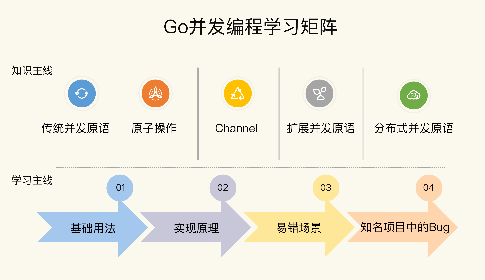
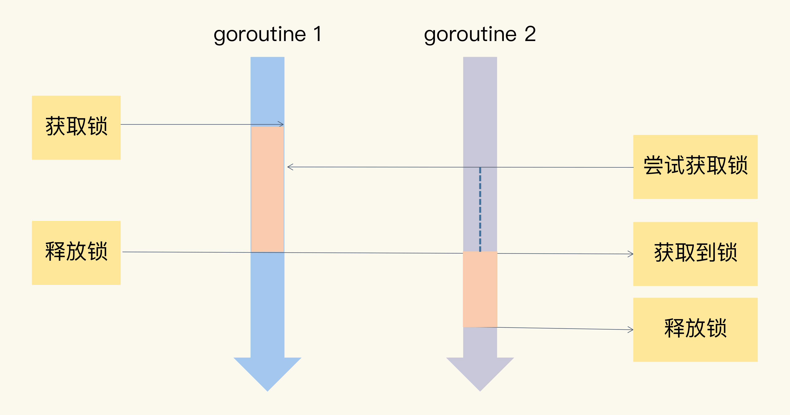
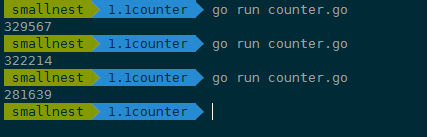
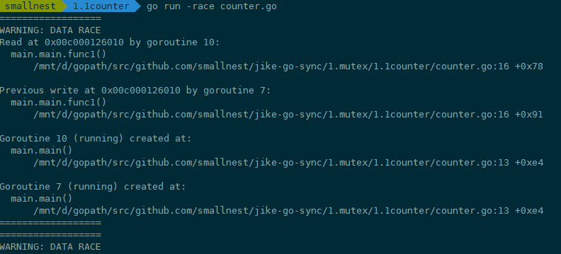
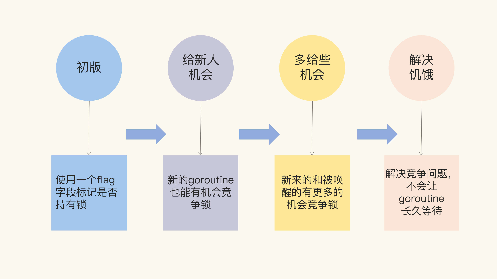
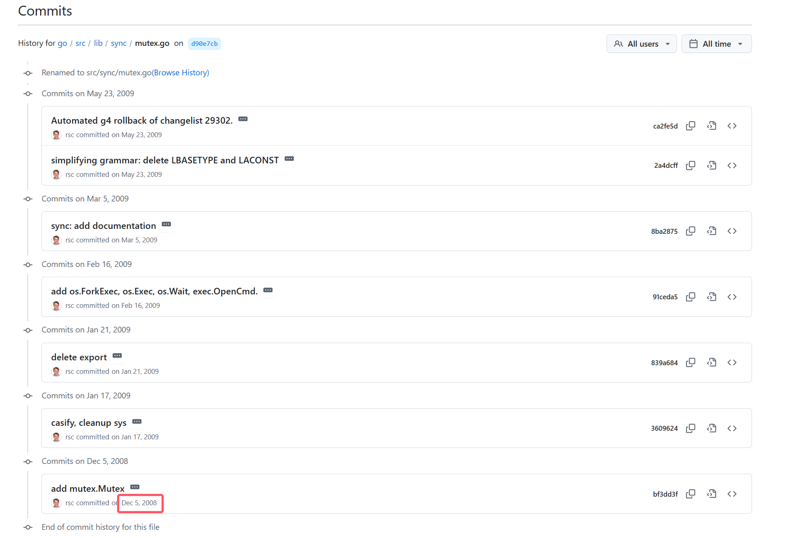
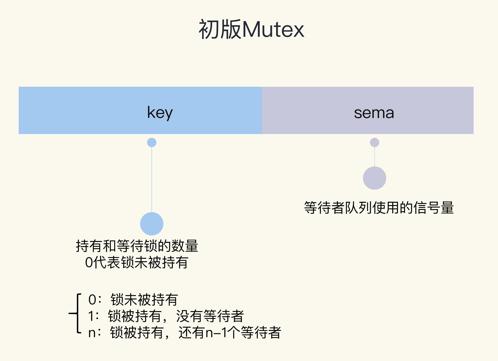
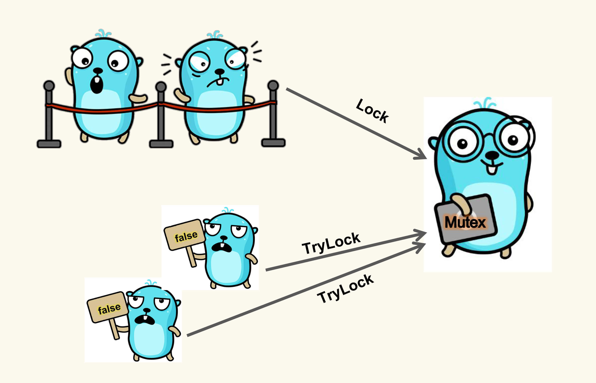

# 课程介绍

> Go并发编程实战课 https://time.geekbang.org/column/intro/100061801




## 课程模块设计

课程分为 5 大模块。

- **基本并发原语**：从标准库中的基本并发原语入手，详细介绍互斥锁 Mutex、RWMutex、Waitgroup、Cond、Pool、Context 等的实现机制和使用技巧，带你搞定并发编程中的常用类型。
- **原子操作：**具体介绍标准库中的原子操作，这是其它并发原语的基础。学会了这部分内容，就可以自己创造新的并发原语。
- **Channel**：Channel 类型是 Go 语言独特的类型，不仅会介绍它的基本用法，而且还会详解它的处理场景和应用模式，帮你规避陷阱。
- **扩展并发原语**：目前来看，Go 开发组不准备在标准库中扩充并发原语了，但是还有一些并发原语应用得非常广泛。课程会重点讲解信号量、SingleFlight、循环栅栏、ErrGroup 等，让你能在处理一些并发问题时事半功倍。
- **分布式并发原语**：分布式并发原语是应对大规模的应用程序中并发问题的并发类型，主要会介绍使用 etcd 实现的一些分布式并发原语，比如 Leader 选举、分布式互斥锁、分布式读写锁、分布式队列等，带你攻克分布式场景中的并发难题。


## 目录

```
# 开篇词
开篇词 | 想吃透Go并发编程，你得这样学！ 12分钟

# 基本并发原语
01 | Mutex：如何解决资源并发访问问题？16分钟
02 | Mutex：庖丁解牛看实现 28分钟
03｜Mutex：4种易错场景大盘点 26分钟
04｜ Mutex：骇客编程，如何拓展额外功能？11分钟
05｜ RWMutex：读写锁的实现原理及避坑指南 26分钟
06 | WaitGroup：协同等待，任务编排利器 20分钟
07 | Cond：条件变量的实现机制及避坑指南 17分钟
08 | Once：一个简约而不简单的并发原语 15分钟
09 | map：如何实现线程安全的map类型？ 21分钟
10 | Pool：性能提升大杀器 28分钟
11 | Context：信息穿透上下文 19分钟


# 原子操作
12 | atomic：要保证原子操作，一定要使用这几种方法 21分钟


# Channel
13 | Channel：另辟蹊径，解决并发问题 26分钟
14 | Channel：透过代码看典型的应用模式 20分钟
15 | 内存模型：Go如何保证并发读写的顺序？23分钟


# 扩展并发原语
16 | Semaphore：一篇文章搞懂信号量 16分钟
17 | SingleFlight 和 CyclicBarrier：请求合并和循环栅栏该怎么用？ 16分钟
18 | 分组操作：处理一组子任务，该用什么并发原语？ 23分钟


# 分布式并发原语
19 | 在分布式环境中，Leader选举、互斥锁和读写锁该如何实现？12分钟
20 | 在分布式环境中，队列、栅栏和STM该如何实现？14分钟


# 结束语
结束语 | 再聊Go并发编程的价值和精进之路 10分钟

```


# 开篇词

想吃透Go并发编程，你得这样学！


# 基本并发原语


## 01 | Mutex：如何解决资源并发访问问题？

说起并发访问问题，真是太常见了，比如多个 goroutine 并发更新同一个资源，像计数器；同时更新用户的账户信息；秒杀系统；往同一个 buffer 中并发写入数据等等。如果没有互斥控制，就会出现一些异常情况，比如计数器的计数不准确、用户的账户可能出现透支、秒杀系统出现超卖、buffer 中的数据混乱，等等，后果都很严重。


这些问题怎么解决呢？对，用互斥锁，那在 Go 语言里，就是 **Mutex。**


这节课，我会带你详细了解互斥锁的实现机制，以及 Go 标准库的互斥锁 Mutex 的基本使用方法。在后面的 3 节课里，我还会讲解 Mutex 的具体实现原理、易错场景和一些拓展用法。


### 互斥锁的实现机制

互斥锁是并发控制的一个基本手段，是为了避免竞争而建立的一种并发控制机制。在学习它的具体实现原理前，我们要先搞懂一个概念，就是**临界区**。


在并发编程中，如果程序中的一部分会被并发访问或修改，那么，为了避免并发访问导致的意想不到的结果，这部分程序需要被保护起来，这部分被保护起来的程序，就叫做临界区。


可以说，临界区就是一个被共享的资源，或者说是一个整体的一组共享资源，比如**对数据库的访问、对某一个共享数据结构的操作、对一个 I/O 设备的使用、对一个连接池中的连接的调用**，等等。


如果很多线程同步访问临界区，就会造成访问或操作错误，这当然不是我们希望看到的结果。所以，我们可以**使用互斥锁，限定临界区只能同时由一个线程持有**。


当临界区由一个线程持有的时候，其它线程如果想进入这个临界区，就会返回失败，或者是等待。直到持有的线程退出临界区，这些等待线程中的某一个才有机会接着持有这个临界区。



你看，互斥锁就很好地解决了资源竞争问题，有人也把互斥锁叫做排它锁。那在 Go 标准库中，它提供了 Mutex 来实现互斥锁这个功能。


根据 2019 年第一篇全面分析 Go 并发 Bug 的论文[Understanding Real-World Concurrency Bugs in Go](https://songlh.github.io/paper/go-study.pdf)，**Mutex 是使用最广泛的同步原语**（Synchronization primitives，有人也叫做**并发原语**。我们在这个课程中根据英文直译优先用同步原语，但是并发原语的指代范围更大，还可以包括任务编排的类型，所以后面我们讲 Channel 或者扩展类型时也会用并发原语）。关于同步原语，并没有一个严格的定义，你可以把它看作解决并发问题的一个基础的数据结构。


在这门课的前两个模块，我会和你讲互斥锁 Mutex、读写锁 RWMutex、并发编排 WaitGroup、条件变量 Cond、Channel 等同步原语。所以，在这里，我先和你说一下同步原语的适用场景。


- 共享资源。并发地读写共享资源，会出现数据竞争（data race）的问题，所以需要 Mutex、RWMutex 这样的并发原语来保护。
- 任务编排。需要 goroutine 按照一定的规律执行，而 goroutine 之间有相互等待或者依赖的顺序关系，我们常常使用 WaitGroup 或者 Channel 来实现。
- 消息传递。信息交流以及不同的 goroutine 之间的线程安全的数据交流，常常使用 Channel 来实现。


今天这一讲，咱们就从公认的使用最广泛的 Mutex 开始学习吧。是骡子是马咱得拉出来遛遛，看看我们到底可以怎么使用 Mutex。


### Mutex 的基本使用方法

在正式看 Mutex 用法之前呢，我想先给你交代一件事：Locker 接口。


在 Go 的标准库中，package sync 提供了锁相关的一系列同步原语，这个 package 还定义了一个 Locker 的接口，Mutex 就实现了这个接口。

Locker 的接口定义了锁同步原语的方法集：

```go
type Locker interface {
    Lock()
    Unlock()
}
```


可以看到，Go 定义的锁接口的方法集很简单，就是请求锁（Lock）和释放锁（Unlock）这两个方法，秉承了 Go 语言一贯的简洁风格。


但是，这个接口在实际项目应用得不多，因为我们一般会直接使用具体的同步原语，而不是通过接口。


我们这一讲介绍的 Mutex 以及后面会介绍的读写锁 RWMutex 都实现了 Locker 接口，所以首先我把这个接口介绍了，让你做到心中有数。


下面我们直接看 Mutex。


简单来说，**互斥锁 Mutex 就提供两个方法 Lock 和 Unlock：进入临界区之前调用 Lock 方法，退出临界区的时候调用 Unlock 方法**：

```
  func(m *Mutex)Lock()
  func(m *Mutex)Unlock()
```

**当一个 goroutine 通过调用 Lock 方法获得了这个锁的拥有权后， 其它请求锁的 goroutine 就会阻塞在 Lock 方法的调用上，直到锁被释放并且自己获取到了这个锁的拥有权。**


看到这儿，你可能会问，为啥一定要加锁呢？别急，我带你来看一个并发访问场景中不使用锁的例子，看看实现起来会出现什么状况。

在这个例子中，我们创建了 10 个 goroutine，同时不断地对一个变量（count）进行加 1 操作，每个 goroutine 负责执行 10 万次的加 1 操作，我们期望的最后计数的结果是 10 * 100000 = 1000000 (一百万)。

```go
 import (
        "fmt"
        "sync"
    )
    
    func main() {
        var count = 0
        // 使用WaitGroup等待10个goroutine完成
        var wg sync.WaitGroup
        wg.Add(10)
        for i := 0; i < 10; i++ {
            go func() {
                defer wg.Done()
                // 对变量count执行10次加1
                for j := 0; j < 100000; j++ {
                    count++
                }
            }()
        }
        // 等待10个goroutine完成
        wg.Wait()
        fmt.Println(count)
    }
```

在这段代码中，我们使用 sync.WaitGroup 来等待所有的 goroutine 执行完毕后，再输出最终的结果。sync.WaitGroup 这个同步原语我会在后面的课程中具体介绍，现在你只需要知道，我们使用它来控制等待一组 goroutine 全部做完任务。


但是，每次运行，你都可能得到不同的结果，基本上不会得到理想中的一百万的结果。




这是为什么呢？


其实，这是因为，**count++** 不是一个原子操作，它至少包含几个步骤，比如读取变量 count 的当前值，对这个值加 1，把结果再保存到 count 中。因为不是原子操作，就可能有并发的问题。


比如，10 个 goroutine 同时读取到 count 的值为 9527，接着各自按照自己的逻辑加 1，值变成了 9528，然后把这个结果再写回到 count 变量。但是，实际上，此时我们增加的总数应该是 10 才对，这里却只增加了 1，好多计数都被“吞”掉了。这是并发访问共享数据的常见错误。

```
 // count++操作的汇编代码
    MOVQ    "".count(SB), AX
    LEAQ    1(AX), CX
    MOVQ    CX, "".count(SB)
```


#### 检查Data race

这个问题，有经验的开发人员还是比较容易发现的，但是，很多时候，并发问题隐藏得非常深，即使是有经验的人，也不太容易发现或者 Debug 出来。

针对这个问题，Go 提供了一个检测并发访问共享资源是否有问题的工具： [race detector](https://blog.golang.org/race-detector)，它可以帮助我们自动发现程序有没有 data race 的问题。

**Go race detector** 是基于 Google 的 C/C++ [sanitizers](https://github.com/google/sanitizers) 技术实现的，编译器通过探测所有的内存访问，加入代码能监视对这些内存地址的访问（读还是写）。在代码运行的时候，**race detector 就能监控到对共享变量的非同步访问**，出现 race 的时候，就会打印出警告信息。


这个技术在 Google 内部帮了大忙，探测出了 Chromium 等代码的大量并发问题。Go 1.1 中就引入了这种技术，并且一下子就发现了标准库中的 42 个并发问题。现在，race detector 已经成了 Go 持续集成过程中的一部分。


我们来看看这个工具怎么用。


在编译（compile）、测试（test）或者运行（run）Go 代码的时候，加上 **race** 参数，就有可能发现并发问题。比如在上面的例子中，我们可以加上 race 参数运行，检测一下是不是有并发问题。如果你 go run -race counter.go，就会输出警告信息。





这个警告不但会告诉你有并发问题，而且还会告诉你哪个 goroutine 在哪一行对哪个变量有写操作，同时，哪个 goroutine 在哪一行对哪个变量有读操作，就是这些并发的读写访问，引起了 data race。


例子中的 goroutine 10 对内存地址 0x00c000126010 有读的操作（counter.go 文件第 16 行），同时，goroutine 7 对内存地址 0x00c000126010 有写的操作（counter.go 文件第 16 行）。而且还可能有多个 goroutine 在同时进行读写，所以，警告信息可能会很长。


虽然这个工具使用起来很方便，但是，因为它的实现方式，只能通过真正对实际地址进行读写访问的时候才能探测，所以它并不能在编译的时候发现 data race 的问题。而且，在运行的时候，只有在触发了 data race 之后，才能检测到，如果碰巧没有触发（比如一个 data race 问题只能在 2 月 14 号零点或者 11 月 11 号零点才出现），是检测不出来的。


而且，把开启了 race 的程序部署在线上，还是比较影响性能的。**运行 go tool compile -race -S counter.go，可以查看计数器例子的代码**，重点关注一下 count++ 前后的编译后的代码：

```
0x002a 00042 (counter.go:13)    CALL    runtime.racefuncenter(SB)
       ......
        0x0061 00097 (counter.go:14)    JMP     173
        0x0063 00099 (counter.go:15)    MOVQ    AX, "".j+8(SP)
        0x0068 00104 (counter.go:16)    PCDATA  $0, $1
        0x0068 00104 (counter.go:16)    MOVQ    "".&count+128(SP), AX
        0x0070 00112 (counter.go:16)    PCDATA  $0, $0
        0x0070 00112 (counter.go:16)    MOVQ    AX, (SP)
        0x0074 00116 (counter.go:16)    CALL    runtime.raceread(SB)
        0x0079 00121 (counter.go:16)    PCDATA  $0, $1
        0x0079 00121 (counter.go:16)    MOVQ    "".&count+128(SP), AX
        0x0081 00129 (counter.go:16)    MOVQ    (AX), CX
        0x0084 00132 (counter.go:16)    MOVQ    CX, ""..autotmp_8+16(SP)
        0x0089 00137 (counter.go:16)    PCDATA  $0, $0
        0x0089 00137 (counter.go:16)    MOVQ    AX, (SP)
        0x008d 00141 (counter.go:16)    CALL    runtime.racewrite(SB)
        0x0092 00146 (counter.go:16)    MOVQ    ""..autotmp_8+16(SP), AX
       ......
        0x00b6 00182 (counter.go:18)    CALL    runtime.deferreturn(SB)
        0x00bb 00187 (counter.go:18)    CALL    runtime.racefuncexit(SB)
        0x00c0 00192 (counter.go:18)    MOVQ    104(SP), BP
        0x00c5 00197 (counter.go:18)    ADDQ    $112, SP

```


在编译的代码中，增加了 runtime.racefuncenter、runtime.raceread、runtime.racewrite、runtime.racefuncexit 等检测 data race 的方法。通过这些插入的指令，Go race detector 工具就能够成功地检测出 data race 问题了。

总结一下，通过在编译的时候插入一些指令，在运行时通过这些插入的指令检测并发读写从而发现 data race 问题，就是这个工具的实现机制。


既然这个例子存在 data race 问题，我们就要想办法来解决它。这个时候，我们这节课的主角 Mutex 就要登场了，它可以轻松地消除掉 data race。


#### 优化

具体怎么做呢？下面，我就结合这个例子，来具体给你讲一讲 Mutex 的基本用法。


我们知道，这里的共享资源是 count 变量，临界区是 count++，只要在临界区前面获取锁，在离开临界区的时候释放锁，就能完美地解决 data race 的问题了。

```go
package main


    import (
        "fmt"
        "sync"
    )


    func main() {
        // 互斥锁保护计数器
        var mu sync.Mutex
        // 计数器的值
        var count = 0
        
        // 辅助变量，用来确认所有的goroutine都完成
        var wg sync.WaitGroup
        wg.Add(10)

        // 启动10个gourontine
        for i := 0; i < 10; i++ {
            go func() {
                defer wg.Done()
                // 累加10万次
                for j := 0; j < 100000; j++ {
                    mu.Lock()
                    count++
                    mu.Unlock()
                }
            }()
        }
        wg.Wait()
        fmt.Println(count)
    }

```

如果你再运行一下程序，就会发现，data race 警告没有了，系统干脆地输出了 1000000：


怎么样，使用 Mutex 是不是非常高效？效果很惊喜。


这里有一点需要注意：Mutex 的零值是还没有 goroutine 等待的未加锁的状态，所以你不需要额外的初始化，直接声明变量（如 var mu sync.Mutex）即可。


那 Mutex 还有哪些用法呢？


很多情况下，**Mutex 会嵌入到其它 struct 中使用**，比如下面的方式：

```
type Counter struct {
    mu    sync.Mutex
    Count uint64
}
```

在**初始化嵌入的 struct 时，也不必初始化这个 Mutex 字段**，不会因为没有初始化出现空指针或者是无法获取到锁的情况。

有时候，我们还可以**采用嵌入字段的方式**。通过嵌入字段，你可以在这个 struct 上直接调用 Lock/Unlock 方法。

```go
func main() {
    var counter Counter
    var wg sync.WaitGroup
    wg.Add(10)
    for i := 0; i < 10; i++ {
        go func() {
            defer wg.Done()
            for j := 0; j < 100000; j++ {
                counter.Lock()
                counter.Count++
                counter.Unlock()
            }
        }()
    }
    wg.Wait()
    fmt.Println(counter.Count)
}


type Counter struct {
    sync.Mutex
    Count uint64
}

```

**如果嵌入的 struct 有多个字段，我们一般会把 Mutex 放在要控制的字段上面，然后使用空格把字段分隔开来。**即使你不这样做，代码也可以正常编译，只不过，用这种风格去写的话，逻辑会更清晰，也更易于维护。

甚至，你还可以**把获取锁、释放锁、计数加一的逻辑封装成一个方法**，对外不需要暴露锁等逻辑：

```go
func main() {
    // 封装好的计数器
    var counter Counter

    var wg sync.WaitGroup
    wg.Add(10)

    // 启动10个goroutine
    for i := 0; i < 10; i++ {
        go func() {
            defer wg.Done()
            // 执行10万次累加
            for j := 0; j < 100000; j++ {
                counter.Incr() // 受到锁保护的方法
            }
        }()
    }
    wg.Wait()
    fmt.Println(counter.Count())
}

// 线程安全的计数器类型
type Counter struct {
    CounterType int
    Name        string

    mu    sync.Mutex
    count uint64
}

// 加1的方法，内部使用互斥锁保护
func (c *Counter) Incr() {
    c.mu.Lock()
    c.count++
    c.mu.Unlock()
}

// 得到计数器的值，也需要锁保护
func (c *Counter) Count() uint64 {
    c.mu.Lock()
    defer c.mu.Unlock()
    return c.count
}

```


### 总结

这节课，我介绍了并发问题的背景知识、标准库中 Mutex 的使用和最佳实践、通过 race detector 工具发现计数器程序的问题以及修复方法。相信你已经大致了解了 Mutex 这个同步原语。


在项目开发的初始阶段，我们可能并没有仔细地考虑资源的并发问题，因为在初始阶段，我们还不确定这个资源是否被共享。经过更加深入的设计，或者新功能的增加、代码的完善，这个时候，我们就需要考虑共享资源的并发问题了。当然，如果你能在初始阶段预见到资源会被共享并发访问就更好了。


意识到共享资源的并发访问的早晚不重要，重要的是，一旦你意识到这个问题，你就要及时通过互斥锁等手段去解决。

比如 Docker issue [37583](https://github.com/moby/moby/pull/37583)、[35517](https://github.com/moby/moby/pull/35517)、[32826](https://github.com/moby/moby/pull/32826)、[30696](https://github.com/moby/moby/pull/30696)等、kubernetes issue [72361](https://github.com/kubernetes/kubernetes/pull/72361)、[71617](https://github.com/kubernetes/kubernetes/pull/71617)等，都是后来发现的 data race 而采用互斥锁 Mutex 进行修复的。


### 思考题

你已经知道，如果 Mutex 已经被一个 goroutine 获取了锁，其它等待中的 goroutine 们只能一直等待。那么，等这个锁释放后，等待中的 goroutine 中哪一个会优先获取 Mutex 呢？


## 02 | Mutex：庖丁解牛看实现（原理）

上一讲我们一起体验了 Mutex 的使用，竟是那么简单，只有简简单单两个方法，Lock 和 Unlock，进入临界区之前调用 Lock 方法，退出临界区的时候调用 Unlock 方法。这个时候，你一定会有一丝好奇：“它的实现是不是也很简单呢？”


其实不是的。如果你阅读 Go 标准库里 Mutex 的源代码，并且追溯 Mutex 的演进历史，你会发现，从一个简单易于理解的互斥锁的实现，到一个非常复杂的数据结构，这是一个逐步完善的过程。Go 开发者们做了种种努力，精心设计。我自己每次看，都会被这种匠心和精益求精的精神打动。


所以，今天我就想带着你一起去探索 Mutex 的实现及演进之路，希望你能和我一样体验到这种技术追求的美妙。我们从 Mutex 的一个简单实现开始，看看它是怎样逐步提升性能和公平性的。在这个过程中，我们可以学习如何逐步设计一个完善的同步原语，并能对复杂度、性能、结构设计的权衡考量有新的认识。经过这样一个学习，我们不仅能通透掌握 Mutex，更好地使用这个工具，同时，对我们自己设计并发数据接口也非常有帮助。


那具体怎么来讲呢？我把 Mutex 的架构演进分成了四个阶段，下面给你画了一张图来说明。



“**初版**”的 Mutex 使用一个 flag 来表示锁是否被持有，实现比较简单；后来照顾到新来的 goroutine，所以会让新的 goroutine 也尽可能地先获取到锁，这是第二个阶段，我把它叫作“**给新人机会**”；那么，接下来就是第三阶段“**多给些机会**”，照顾新来的和被唤醒的 goroutine；但是这样会带来饥饿问题，所以目前又加入了饥饿的解决方案，也就是第四阶段“**解决饥饿**”。

有了这四个阶段，我们学习的路径就清晰了，那接下来我会从代码层面带你领略 Go 开发者这些大牛们是如何逐步解决这些问题的。

> mutex.go 提交历史 https://github.com/golang/go/commits/master/src/sync/mutex.go



### 初版的互斥锁

我们先来看怎么实现一个最简单的互斥锁。在开始之前，你可以先想一想，如果是你，你会怎么设计呢？


你可能会想到，可以通过一个 flag 变量，标记当前的锁是否被某个 goroutine 持有。如果这个 flag 的值是 1，就代表锁已经被持有，那么，其它竞争的 goroutine 只能等待；如果这个 flag 的值是 0，就可以通过 CAS（compare-and-swap，或者 compare-and-set）将这个 flag 设置为 1，标识锁被当前的这个 goroutine 持有了。


实际上，Russ Cox 在 2008 年提交的第一版 Mutex 就是这样实现的。

```go
   // CAS操作，当时还没有抽象出atomic包
    func cas(val *int32, old, new int32) bool
    func semacquire(*int32)
    func semrelease(*int32)
    // 互斥锁的结构，包含两个字段
    type Mutex struct {
        key  int32 // 锁是否被持有的标识
        sema int32 // 信号量专用，用以阻塞/唤醒goroutine
    }
    
    // 保证成功在val上增加delta的值
    func xadd(val *int32, delta int32) (new int32) {
        for {
            v := *val
            if cas(val, v, v+delta) {
                return v + delta
            }
        }
        panic("unreached")
    }
    
    // 请求锁
    func (m *Mutex) Lock() {
        if xadd(&m.key, 1) == 1 { //标识加1，如果等于1，成功获取到锁
            return
        }
        semacquire(&m.sema) // 否则阻塞等待
    }
    
    func (m *Mutex) Unlock() {
        if xadd(&m.key, -1) == 0 { // 将标识减去1，如果等于0，则没有其它等待者
            return
        }
        semrelease(&m.sema) // 唤醒其它阻塞的goroutine
    }    

```

这里呢，我先简单补充介绍下刚刚提到的 CAS。


CAS 指令将**给定的值**和**一个内存地址中的值**进行比较，如果它们是同一个值，就使用新值替换内存地址中的值，这个操作是原子性的。那啥是原子性呢？如果你还不太理解这个概念，那么在这里只需要明确一点就行了，那就是**原子性保证这个指令总是基于最新的值进行计算，如果同时有其它线程已经修改了这个值，那么，CAS 会返回失败**。


CAS 是实现互斥锁和同步原语的基础，我们很有必要掌握它。


好了，我们继续来分析下刚才的这段代码。


虽然当时的 Go 语法和现在的稍微有些不同，而且标准库的布局、实现和现在的也有很大的差异，但是，这些差异不会影响我们对代码的理解，因为最核心的结构体（struct）和函数、方法的定义几乎是一样的。


Mutex 结构体包含两个字段：

- **字段 key：**是一个 flag，用来标识这个排外锁是否被某个 goroutine 所持有，如果 key 大于等于 1，说明这个排外锁已经被持有；
- **字段 sema：**是个信号量变量，用来控制等待 goroutine 的阻塞休眠和唤醒。




调用 Lock 请求锁的时候，通过 xadd 方法进行 CAS 操作（第 24 行），xadd 方法通过循环执行 CAS 操作直到成功，保证对 key 加 1 的操作成功完成。如果比较幸运，锁没有被别的 goroutine 持有，那么，Lock 方法成功地将 key 设置为 1，这个 goroutine 就持有了这个锁；如果锁已经被别的 goroutine 持有了，那么，当前的 goroutine 会把 key 加 1，而且还会调用 semacquire 方法（第 27 行），使用信号量将自己休眠，等锁释放的时候，信号量会将它唤醒。


持有锁的 goroutine 调用 Unlock 释放锁时，它会将 key 减 1（第 31 行）。如果当前没有其它等待这个锁的 goroutine，这个方法就返回了。但是，如果还有等待此锁的其它 goroutine，那么，它会调用 semrelease 方法（第 34 行），利用信号量唤醒等待锁的其它 goroutine 中的一个。


所以，到这里，我们就知道了，初版的 Mutex 利用 CAS 原子操作，对 key 这个标志量进行设置。key 不仅仅标识了锁是否被 goroutine 所持有，还记录了当前持有和等待获取锁的 goroutine 的数量。


Mutex 的整体设计非常简洁，学习起来一点也没有障碍。但是，注意，我要划重点了。


**Unlock 方法可以被任意的 goroutine 调用释放锁，即使是没持有这个互斥锁的 goroutine，也可以进行这个操作。这是因为，Mutex 本身并没有包含持有这把锁的 goroutine 的信息，所以，Unlock 也不会对此进行检查。Mutex 的这个设计一直保持至今。**


这就带来了一个有趣而危险的功能。为什么这么说呢？


你看，其它 goroutine 可以强制释放锁，这是一个非常危险的操作，因为在临界区的 goroutine 可能不知道锁已经被释放了，还会继续执行临界区的业务操作，这可能会带来意想不到的结果，因为这个 goroutine 还以为自己持有锁呢，有可能导致 data race 问题。

所以，我们在使用 Mutex 的时候，必须要保证 goroutine 尽可能不去释放自己未持有的锁，一定要遵循“**谁申请，谁释放**”的原则。在真实的实践中，我们使用互斥锁的时候，很少在一个方法中单独申请锁，而在另外一个方法中单独释放锁，一般都会在同一个方法中获取锁和释放锁。

如果你接触过其它语言（比如 Java 语言）的互斥锁的实现，就会发现这一点和其它语言的互斥锁不同，所以，如果是从其它语言转到 Go 语言开发的同学，一定要注意。


以前，我们经常会基于性能的考虑，及时释放掉锁，所以在一些 if-else 分支中加上释放锁的代码，代码看起来很臃肿。而且，在重构的时候，也很容易因为误删或者是漏掉而出现死锁的现象。

```
type Foo struct {
    mu    sync.Mutex
    count int
}

func (f *Foo) Bar() {
    f.mu.Lock()

    if f.count < 1000 {
        f.count += 3
        f.mu.Unlock() // 此处释放锁
        return
    }

    f.count++
    f.mu.Unlock() // 此处释放锁
    return
}

```


从 1.14 版本起，Go 对 defer 做了优化，采用更有效的内联方式，取代之前的生成 defer 对象到 defer chain 中，defer 对耗时的影响微乎其微了，所以基本上修改成下面简洁的写法也没问题：

```
func (f *Foo) Bar() {
    f.mu.Lock()
    defer f.mu.Unlock()


    if f.count < 1000 {
        f.count += 3
        return
    }


    f.count++
    return
}

```

这样做的好处就是 Lock/Unlock 总是成对紧凑出现，不会遗漏或者多调用，代码更少。


但是，如果临界区只是方法中的一部分，为了尽快释放锁，还是应该第一时间调用 Unlock，而不是一直等到方法返回时才释放。


初版的 Mutex 实现之后，Go 开发组又对 Mutex 做了一些微调，比如把字段类型变成了 uint32 类型；调用 Unlock 方法会做检查；使用 atomic 包的同步原语执行原子操作等等，这些小的改动，都不是核心功能，你简单知道就行了，我就不详细介绍了。


但是，初版的 Mutex 实现有一个问题：请求锁的 goroutine 会排队等待获取互斥锁。虽然这貌似很公平，但是从性能上来看，却不是最优的。因为如果我们能够把锁交给正在占用 CPU 时间片的 goroutine 的话，那就不需要做上下文的切换，在高并发的情况下，可能会有更好的性能。


接下来，我们就继续探索 Go 开发者是怎么解决这个问题的。


## 04｜ Mutex：骇客编程，如何拓展额外功能？

前面三讲，我们学习了互斥锁 Mutex 的基本用法、实现原理以及易错场景，可以说是涵盖了互斥锁的方方面面。如果你能熟练掌握这些内容，那么，在大多数的开发场景中，你都可以得心应手。


但是，在一些特定的场景中，这些基础功能是不足以应对的。这个时候，我们就需要开发一些扩展功能了。我来举几个例子。


比如说，我们知道，如果互斥锁被某个 goroutine 获取了，而且还没有释放，那么，其他请求这把锁的 goroutine，就会阻塞等待，直到有机会获得这把锁。有时候阻塞并不是一个很好的主意，比如你请求锁更新一个计数器，如果获取不到锁的话没必要等待，大不了这次不更新，我下次更新就好了，如果阻塞的话会导致业务处理能力的下降。


再比如，如果我们要监控锁的竞争情况，一个监控指标就是，等待这把锁的 goroutine 数量。我们可以把这个指标推送到时间序列数据库中，再通过一些监控系统（比如 Grafana）展示出来。要知道，**锁是性能下降的“罪魁祸首”之一，所以，有效地降低锁的竞争，就能够很好地提高性能。因此，监控关键互斥锁上等待的 goroutine 的数量，是我们分析锁竞争的激烈程度的一个重要指标**。


实际上，不论是不希望锁的 goroutine 继续等待，还是想监控锁，我们都可以基于标准库中 Mutex 的实现，通过 **==Hacker 的方式==**，为 Mutex 增加一些额外的功能。这节课，我就来教你实现几个扩展功能，包括实现 TryLock，获取等待者的数量等指标，以及实现一个线程安全的队列。


### TryLock

我们可以为 Mutex 添加一个 TryLock 的方法，也就是尝试获取排外锁。PS：在 Go 1.18 官方标准库中，已经为 Mutex/RWMutex 增加了 TryLock 方法。


这个方法具体是什么意思呢？我来解释一下这里的逻辑。当一个 goroutine 调用这个 TryLock 方法请求锁的时候，如果这把锁没有被其他 goroutine 所持有，那么，这个 goroutine 就持有了这把锁，并返回 true；如果这把锁已经被其他 goroutine 所持有，或者是正在准备交给某个被唤醒的 goroutine，那么，这个请求锁的 goroutine 就直接返回 false，不会阻塞在方法调用上。


如下图所示，如果 Mutex 已经被一个 goroutine 持有，调用 Lock 的 goroutine 阻塞排队等待，调用 TryLock 的 goroutine 直接得到一个 false 返回。



在实际开发中，如果要更新配置数据，我们通常需要加锁，这样可以避免同时有多个 goroutine 并发修改数据。有的时候，我们也会使用 TryLock。这样一来，当某个 goroutine 想要更改配置数据时，如果发现已经有 goroutine 在更改了，其他的 goroutine 调用 TryLock，返回了 false，这个 goroutine 就会放弃更改。


很多语言（比如 Java）都为锁提供了 TryLock 的方法，但是，Go 官方[issue 6123](https://github.com/golang/go/issues/6123)有一个讨论（后来一些 issue 中也提到过），标准库的 Mutex 不会添加 TryLock 方法。虽然通过 Go 的 Channel 我们也可以实现 TryLock 的功能，但是基于 Channel 的实现我们会放在 Channel 那一讲中去介绍，这一次我们还是基于 Mutex 去实现，毕竟大部分的程序员还是熟悉传统的同步原语，而且传统的同步原语也不容易出错。所以这节课，还是希望带你掌握基于 Mutex 实现的方法。


那怎么实现一个扩展 TryLock 方法的 Mutex 呢？我们直接来看代码。


```go
// 复制Mutex定义的常量
const (
    mutexLocked = 1 << iota // 加锁标识位置
    mutexWoken              // 唤醒标识位置
    mutexStarving           // 锁饥饿标识位置
    mutexWaiterShift = iota // 标识waiter的起始bit位置
)

// 扩展一个Mutex结构
type Mutex struct {
    sync.Mutex
}

// 尝试获取锁
func (m *Mutex) TryLock() bool {
    // 如果能成功抢到锁
    if atomic.CompareAndSwapInt32((*int32)(unsafe.Pointer(&m.Mutex)), 0, mutexLocked) {
        return true
    }

    // 如果处于唤醒、加锁或者饥饿状态，这次请求就不参与竞争了，返回false
    old := atomic.LoadInt32((*int32)(unsafe.Pointer(&m.Mutex)))
    if old&(mutexLocked|mutexStarving|mutexWoken) != 0 {
        return false
    }

    // 尝试在竞争的状态下请求锁
    new := old | mutexLocked
    return atomic.CompareAndSwapInt32((*int32)(unsafe.Pointer(&m.Mutex)), old, new)
}

```


第 17 行是一个 fast path，如果幸运，没有其他 goroutine 争这把锁，那么，这把锁就会被这个请求的 goroutine 获取，直接返回。

如果锁已经被其他 goroutine 所持有，或者被其他唤醒的 goroutine 准备持有，那么，就直接返回 false，不再请求，代码逻辑在第 23 行。


如果没有被持有，也没有其它唤醒的 goroutine 来竞争锁，锁也不处于饥饿状态，就尝试获取这把锁（第 29 行），不论是否成功都将结果返回。因为，这个时候，可能还有其他的 goroutine 也在竞争这把锁，所以，不能保证成功获取这把锁。


我们可以写一个简单的测试程序，来测试我们的 TryLock 的机制是否工作。


这个测试程序的工作机制是这样子的：程序运行时会启动一个 goroutine 持有这把我们自己实现的锁，经过随机的时间才释放。主 goroutine 会尝试获取这把锁。如果前一个 goroutine 一秒内释放了这把锁，那么，主 goroutine 就有可能获取到这把锁了，输出“got the lock”，否则没有获取到也不会被阻塞，会直接输出“`can't get the lock`”。


### 获取等待者的数量等指标


## 11 | Context：信息穿透上下文

在这节课正式开始之前，我想先带你看一个工作中的场景。


假设有一天你进入办公室，突然同事们都围住你，然后大喊“小王小王你最帅”，此时你可能一头雾水，只能尴尬地笑笑。为啥呢？因为你缺少上下文的信息，不知道之前发生了什么。


但是，如果同事告诉你，由于你业绩突出，一天之内就把云服务化的主要架构写好了，因此被评为 9 月份的工作之星，总经理还特意给你发 1 万元的奖金，那么，你心里就很清楚了，原来同事恭喜你，是因为你的工作被表扬了，还获得了奖金。同事告诉你的这些前因后果，就是上下文信息，他把上下文传递给你，你接收后，就可以获取之前不了解的信息。


你看，上下文（Context）就是这么重要。在我们的开发场景中，上下文也是不可或缺的，缺少了它，我们就不能获取完整的程序信息。那到底啥是上下文呢？其实，这就是指，在 API 之间或者方法调用之间，所传递的除了业务参数之外的额外信息。


比如，服务端接收到客户端的 HTTP 请求之后，可以把客户端的 IP 地址和端口、客户端的身份信息、请求接收的时间、Trace ID 等信息放入到上下文中，这个上下文可以在后端的方法调用中传递，后端的业务方法除了利用正常的参数做一些业务处理（如订单处理）之外，还可以从上下文读取到消息请求的时间、Trace  ID 等信息，把服务处理的时间推送到 Trace 服务中。Trace 服务可以把同一 Trace ID 的不同方法的调用顺序和调用时间展示成流程图，方便跟踪。


不过，Go 标准库中的 Context 功能还不止于此（**携带上下文信息**），它还提供了**超时（Timeout）和取消（Cancel）的机制**，下面就让我一一道来。


### Context 的来历

在学习 Context 的功能之前呢，我先带你了解下它的来历。毕竟，知道了它的来龙去脉，我们才能应用得更加得心应手一些。


Go 在 1.7 的版本中才正式把 Context 加入到标准库中。在这之前，很多 Web 框架在定义自己的 handler 时，都会传递一个自定义的 Context，把客户端的信息和客户端的请求信息放入到 Context 中。Go 最初提供了 golang.org/x/**net**/context 库用来提供上下文信息，最终还是在 Go1.7 中把此库提升到标准库 context 包中。


为啥呢？这是因为，在 Go1.7 之前，有很多库都依赖 golang.org/x/net/context 中的 Context 实现，这就导致 Go 1.7 发布之后，出现了标准库 Context 和 golang.org/x/net/context 并存的状况。新的代码使用标准库 Context 的时候，没有办法使用这个标准库的 Context 去调用旧有的使用 x/net/context 实现的方法。


所以，在 Go1.9 中，还专门实现了一个叫做 type alias 的新特性，然后把 x/net/context 中的 Context 定义成标准库 Context 的别名，以解决新旧 Context 类型冲突问题，你可以看一下下面这段代码：

```go
  // +build go1.9   x/net/context 
  package context
  
  import "context"
  
  type Context = context.Context
  type CancelFunc = context.CancelFunc

```


Go 标准库的 Context 不仅提供了上下文传递的信息，还提供了 cancel、timeout 等其它信息，这些信息貌似和 context 这个包名没关系，但是还是得到了广泛的应用。所以，你看，context 包中的 Context 不仅仅传递上下文信息，还有 timeout 等其它功能，是不是“名不副实”呢？


其实啊，这也是这个 Context 的一个问题，比较容易误导人，Go 布道师 Dave Cheney 还专门写了一篇文章讲述这个问题：[Context isn’t for cancellation](https://dave.cheney.net/2017/08/20/context-isnt-for-cancellation)。


同时，也有一些批评者针对 Context 提出了批评：[Context should go away for Go 2](https://faiface.github.io/post/context-should-go-away-go2/)，这篇文章把 Context 比作病毒，病毒会传染，结果把所有的方法都传染上了病毒（加上 Context 参数），绝对是视觉污染。


Go 的开发者也注意到了“关于 Context，存在一些争议”这件事儿，所以，Go 核心开发者 Ian Lance Taylor 专门开了一个[issue 28342](https://github.com/golang/go/issues/28342)，用来记录当前的 Context 的问题：

- Context 包名导致使用的时候重复 ctx context.Context；
- Context.WithValue 可以接受任何类型的值，非类型安全；
- Context 包名容易误导人，实际上，Context 最主要的功能是取消 goroutine 的执行；
- Context 漫天飞，函数污染。


尽管有很多的争议，但是，在很多场景下，使用 Context 其实会很方便，所以现在它已经在 Go 生态圈中传播开来了，包括很多的 Web 应用框架，都切换成了标准库的 Context。标准库中的 database/sql、os/exec、net、net/http 等包中都使用到了 Context。而且，如果我们遇到了下面的一些场景，也可以考虑使用 Context：

- 上下文信息传递 （request-scoped），比如处理 http 请求、在请求处理链路上传递信息；
- 控制子 goroutine 的运行；
- 超时控制的方法调用；
- 可以取消的方法调用。


所以，我们需要掌握 Context 的具体用法，这样才能在不影响主要业务流程实现的时候，实现一些通用的信息传递，或者是能够和其它 goroutine 协同工作，提供 timeout、cancel 等机制。


### Context 基本使用方法
