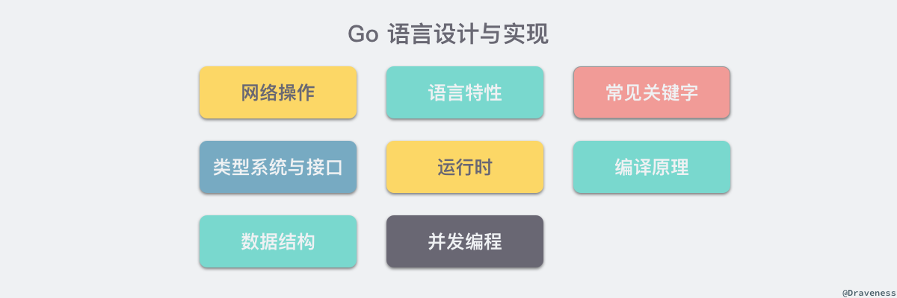

# 介绍

来源：https://www.bookstack.cn/read/draveness-golang/cd9337bf6625a2e8.md

# 第一章 介绍

## Go 语言设计与实现

Go 语言是 Google 在 **2009 年 12 月**发布的编程语言，目前的 Go 语言在国内外的社区都非常热门，很多著名的开源框架 Kubernetes、etcd 和 prometheus 等都使用 Go 语言进行开发，近年来热门的微服务架构和云原生技术也为 Go 语言社区带来了非常多的活力。

作者目前也使用 Go 语言作为日常开发的主要语言，虽然 Go 语言没有 Lisp 系语言的开发效率和强大表达能力，但是却是一门非常容易使用并且大规模运用的工程语言，这也是作者学习和使用 Go 语言的主要原因。

> 补充：Lisp（List Processing）是一种编程语言家族，最早由约翰·麦卡锡（John McCarthy）在1958年开发。Lisp 系语言以其强大的元编程能力和函数式编程风格而闻名。
>
> Lisp 系语言的特点包括：
>
> 1. 基于列表的数据结构：Lisp 系语言使用列表（List）作为主要的数据结构，列表中的元素可以是其他列表，这种嵌套的结构使得 Lisp 系语言非常灵活。
> 2. 函数式编程：Lisp 系语言鼓励使用函数式编程的风格，函数是一等公民，可以作为参数传递、返回值返回，以及存储在变量中。这种编程风格强调不可变性和无副作用，使得代码更加清晰、可维护和可测试。
> 3. 元编程能力：Lisp 系语言具有强大的元编程能力，可以在运行时操作和修改程序的结构。这使得开发者可以编写高度抽象和灵活的代码，甚至可以编写自定义的语言扩展。
> 4. 动态类型系统：Lisp 系语言通常使用动态类型系统，变量的类型在运行时确定。这种灵活性使得开发者可以更快地进行迭代和开发，但也需要更多的测试和错误处理。
>
> Lisp 系语言的代表性成员包括 Common Lisp、Scheme 和 Clojure。它们在语法和特性上有所不同，但都继承了 Lisp 的核心思想和特点。


## 关于本书

这本书介绍的主要内容其实就是 **Go 语言内部的实现原理**，目前的大纲包含以下的八个章节，在编写的过程中还是会对内容的编排顺序和方式进行修改：



虽然文章的目录结构可能会改变，但是你一定会通过这本书了解到 Go 语言相关的以下内容：

- 从词法语法解析、类型检查、中间代码生成以及机器码生成的**编译**相关全链路；
- 数组、哈希表和字符串等数据结构的表示以及基本操作的实现原理；
- 理解 Go 语言中的函数、方法、闭包和上下文等语言特性；
- 常见**并发编程**使用的 WaitGroup、Once 以及互斥锁等结构的实现；
- 语言中的**万能类型 interface** 的实现原理；
- 各种关键字 make、new、defer、select 以及 for 循环的处理过程；
- Goroutine 和 Channel 相关的结构、调度策略以及原理；
- …

> TBD：书中的内容将会有不少于 60% 的章节将以公开的形式发布，剩余最多 40% 的内容将通过其他的渠道收费进行发布，不过在 Go 语言的主要版本更新时，会对文章的内容进行整理和更新，历史的章节会在网站中以公开形式发布，最新的章节仍然会通过不同渠道推送给付费的订阅者。

## 其他

无论你是对目前书中不包含的 Go 语言特性的实现原理感兴趣，还是有其他的建议都可以在下面留言，欢迎持续关注本书的进展，谢谢。


本作品采用[知识共享署名-非商业性使用-禁止演绎 4.0 国际许可协议](http://creativecommons.org/licenses/by-nc-nd/4.0/)进行许可。


# 第二章 编译原理

## 2.1 概述

Go 语言是一门需要编译才能运行的编程语言，也就是说代码在运行之前**需要通过编译器生成二进制机器码**，包含二进制机器码的文件才能在目标机器上运行，如果我们想要了解 Go 语言的实现原理，理解它的编译过程就是一个没有办法绕过的事情。


这一节会先对 Go 语言编译的过程进行概述，从顶层介绍编译器执行的几个步骤，随后的几节会分别剖析各个步骤完成的工作和实现原理，同时也会对一些需要预先掌握的知识进行介绍，确保后面的章节能够被更好的理解。

### 2.1.1 预备知识

想要深入了解 Go 语言的编译过程，需要提前了解一下编译过程中涉及的一些术语和专业知识。这些知识其实在我们的日常工作和学习中比较难用到，但是对于理解编译的过程和原理还是非常重要的。这一小节会简单挑选几个常见并且重要的概念提前进行介绍，减少后面章节的理解压力。

#### 抽象语法树

[抽象语法树](https://en.wikipedia.org/wiki/Abstract_syntax_tree)（AST），是源代码语法的结构的一种抽象表示，它**用树状的方式表示编程语言的语法结构**[1](https://www.bookstack.cn/read/draveness-golang/9e405d643b49d00e.md#fn:1)。抽象语法树中的每一个节点都表示源代码中的一个元素，每一颗子树都表示一个语法元素，例如一个 if else 语句，我们可以从 `2 * 3 + 7` 这一表达式中解析出下图所示的抽象语法树。


**图 2-1 简单表达式的抽象语法树**

作为编译器常用的数据结构，抽象语法树抹去了源代码中不重要的一些字符 - 空格、分号或者括号等等。编译器在执行完语法分析之后会输出一个抽象语法树，这个抽象语法树会辅助编译器进行语义分析，我们可以用它来确定语法正确的程序是否存在一些类型不匹配或不一致的问题。


#### 静态单赋值

[静态单赋值](https://en.wikipedia.org/wiki/Static_single_assignment_form)（Static Single Assigment, **SSA**）是中间代码的一个特性，如果一个中间代码具有静态单赋值的特性，那么每个变量就只会被赋值一次[2](https://www.bookstack.cn/read/draveness-golang/9e405d643b49d00e.md#fn:2)。在实践中我们通常会用添加下标的方式实现每个变量只能被赋值一次的特性，这里以下面的代码举个例子：

```
x := 1
x := 2
y := x
```

根据分析，我们其实能够发现上述的代码其实并不需要第一个将 `1` 赋值给 `x` 的表达式，也就是 `x := 1` 这一表达式在上述的代码片段中是没有作用的。

```
x1 := 1
x2 := 2
y1 := x2
```

当我们使用具有 SSA 特性的中间代码时，就可以非常清晰地发现变量 `y1` 的值和 `x1` 是完全没有任何关系的，所以在机器码生成时其实就可以省略第一步，这样就能减少需要执行的指令来优化这一段代码。(语法优化)


在中间代码中使用 SSA 的特性能够为整个程序实现以下的优化：

- 常数传播（constant propagation）
- 值域传播（value range propagation）
- 稀疏有条件的常数传播（sparse conditional constant propagation）
- 消除无用的程式码（dead code elimination）
- 全域数值编号（global value numbering）
- 消除部分的冗余（partial redundancy elimination）
- 强度折减（strength reduction）
- 寄存器分配（register allocation）因为 SSA 的主要作用是对代码进行优化，所以它是编译器后端[3](https://www.bookstack.cn/read/draveness-golang/9e405d643b49d00e.md#fn:3)的一部分；当然代码编译领域除了 SSA 还有很多中间代码的优化方法，编译器生成代码的优化也是一个非常古老并且复杂的领域，这里就不会展开介绍了。

#### 指令集

最后要介绍的一个预备知识就是[指令集](https://en.wikipedia.org/wiki/Instruction_set_architecture)-[4](https://www.bookstack.cn/read/draveness-golang/9e405d643b49d00e.md#fn:4)了，很多开发者都会遇到在生产环境运行的结果和本地不同的问题，导致这种情况的原因其实非常复杂，不同机器使用不同的指令也是可能的原因之一。

我们大多数开发者都会使用 x86_64 的 Macbook 作为工作上主要使用的硬件，在命令行中输入 `uname -m` 就能够获得当前机器上硬件的信息：

```
$ uname -m
x86_64
```

x86 是目前比较常见的指令集，除了 x86 之外，还有很多其他的指令集，不同的处理器使用了不同的架构和机器语言，所以很多编程语言为了在不同的机器上运行需要将源代码根据架构翻译成不同的机器代码。

复杂指令集计算机（Complex Instruction Set Computer，CISC）和精简指令集计算机（Reduced Instruction Set Computer，RISC）是目前的两种 CPU 区别，它们的在设计理念上会有一些不同，从名字我们就能看出来这两种不同的设计有什么区别：

- 复杂指令集通过增加指令的数量（复杂度）减少需要执行的指令数；
- 精简指令集能使用更少的指令完成目标的计算任务；

早期的 CPU 为了减少机器语言指令的（使用？）数量使用复杂指令集完成计算任务，这两者其实并没有绝对的好坏，它们只是在一些设计上的选择不同以达到不同的目的，我们会在后面的[机器码生成](https://www.bookstack.cn/read/draveness-golang/100aabc3275d17e5.md)一节中详细介绍指令集架构，不过各位读者也可以主动了解相关的内容。


### 2.1.2 编译原理

Go 语言编译器的源代码在 [`src/cmd/compile`](https://github.com/golang/go/tree/master/src/cmd/compile) 目录中，目录下的文件共同组成了 Go 语言的编译器。

```bash
# ll src/cmd/compile/
total 68
-rw-r--r--.  1 root root 39969 Nov 30  2023 abi-internal.md
-rw-r--r--.  1 root root 10303 Nov 30  2023 doc.go
drwxr-xr-x. 45 root root  4096 Nov 30  2023 internal
-rw-r--r--.  1 root root  1357 Nov 30  2023 main.go
-rw-r--r--.  1 root root  7076 Nov 30  2023 README.md
```

学过编译原理的人可能听说过编译器的前端和后端，**编译器的前端一般承担着词法分析、语法分析、类型检查和中间代码生成几部分工作**，而编译器**后端主要负责目标代码的生成和优化**，也就是将中间代码翻译成目标机器能够运行的二进制机器码。


**图 2-2 编译原理的核心过程**

> lexical analysis:词法分析（Lexical Analysis），也称为扫描（Scanning），是编译器中的一个阶段，它负责将源代码分割成一个个的词法单元（Token）。词法单元是编程语言中的最小语法单位，例如关键字、标识符、运算符、常量等。
>
> syntax analysis:语法分析（Syntax Analysis），也称为解析（Parsing），是编译器中的一个阶段，它负责根据词法分析器生成的词法单元流（Token Stream）来分析源代码的语法结构，并构建相应的语法树（Syntax Tree）或抽象语法树（Abstract Syntax Tree）。
>
> semantic analysis：语义分析（Semantic Analysis）/类型检查是编译器中的一个重要阶段，它负责对源代码进行语义检查和语义解释。语义分析的目标是确保程序在语义上是正确的，并生成中间表示（如抽象语法树、符号表等）以供后续阶段使用。
>
> IR generation :R 生成（IR Generation）是编译器中的一个阶段，它负责将源代码转换为中间表示（Intermediate Representation，简称 IR）。中间表示是一种介于源代码和目标代码之间的抽象表示形式，它捕捉了源代码的语义和结构，方便后续的优化和代码生成。
>
> code optimization：代码优化
>
> machine code generation：机器码生成


Go 的编译器在逻辑上可以被分成四个阶段：词法与语法分析、类型检查和 AST 转换、通用 SSA 生成和最后的机器代码生成，在这一节我们会使用比较少的篇幅分别介绍这四个阶段做的工作，后面的章节会具体介绍每一个阶段的具体内容。


#### 词法与语法分析

所有的编译过程其实都是从解析代码的源文件开始的，

词法分析的作用就是解析源代码文件，它**将文件中的字符串序列转换成 Token 序列**，方便后面的处理和解析，我们一般会把执行词法分析的程序称为词法解析器（lexer）。

而**语法分析的输入就是词法分析器输出的 Token 序列，这些序列会按照顺序被语法分析器进行解**析，语法的解析过程就是将词法分析生成的 Token 按照语言定义好的文法（Grammar）自下而上或者自上而下的进行规约，每一个 Go 的源代码文件最终会被归纳成一个 [`SourceFile`](https://golang.org/ref/spec#Source_file_organization) 结构[5](https://www.bookstack.cn/read/draveness-golang/9e405d643b49d00e.md#fn:5)：

```
SourceFile = PackageClause ";" { ImportDecl ";" } { TopLevelDecl ";" } .
```

词法分析会返回一个不包含空格、换行等字符的 Token 序列，例如：`package`, `json`, `import`, `(`, `io`, `)`, …，而语法分析会把 Token 序列转换成有意义的结构体，也就是语法树：

```
"json.go": SourceFile {
    PackageName: "json",
    ImportDecl: []Import{
        "io",
    },
    TopLevelDecl: ...
}
```

将 Token 转换成上述『语法树』就会使用语法解析器，语法解析的结果其实就是上面介绍过的抽象语法树（AST），每一个 AST 都对应着一个单独的 Go 语言文件，这个抽象语法树中包括当前文件属于的包名、定义的常量、结构体和函数等。

> Go 语言的语法解析器使用的就是 LALR(1)[6](https://www.bookstack.cn/read/draveness-golang/9e405d643b49d00e.md#fn:6) 的文法，对解析器文法感兴趣的读者可以在推荐阅读中找到编译器文法的相关资料。


**图 2-3 从源文件到语法树**

如果在语法解析的过程中发生了任何语法错误，都会被语法解析器发现并将消息打印到标准输出上，整个编译过程也会随着错误的出现而被中止。[词法与语法分析](https://www.bookstack.cn/read/draveness-golang/a81e1b5a6b7b28bc.md)一节会详细介绍 Go 语言的文法、词法解析和语法解析过程。


#### 类型检查

当拿到一组文件的抽象语法树之后，Go 语言的编译器会对语法树中定义和使用的类型进行检查，**类型检查分别会按照以下的顺序对不同类型的节点进行验证和处理**：

- 常量、类型和函数名及类型；
- 变量的赋值和初始化；
- 函数和闭包的主体；
- 哈希键值对的类型；
- 导入函数体；
- 外部的声明；通过对整颗抽象语法树的遍历，我们在每一个节点上都会对当前子树的类型进行验证，以保证当前节点上不会出现类型错误的问题，所有的类型错误和不匹配都会在这一个阶段被发现和暴露出来，结构体是否实现了某些接口也会在这一阶段被检查出来。

类型检查阶段不止会对**节点的类型**进行验证，还会展开和改写一些内建的函数，例如 `make` 关键字在这个阶段会根据子树的结构被替换成 `makeslice` 或者 `makechan` 等函数。


**图 2-4 类型检查阶段对 make 进行改写**

类型检查这一过程在整个编译流程中还是非常重要的，Go 语言的很多关键字都依赖类型检查期间的展开和改写，后面的章节[类型检查](https://www.bookstack.cn/read/draveness-golang/7ab240185c175c73.md)会详细介绍这一步骤。


#### 中间代码生成

当我们将源文件转换成了抽象语法树、对整棵树的语法进行解析并进行类型检查之后，就可以认为当前文件中的代码不存在语法错误和类型错误的问题了，Go 语言的编译器就会将输入的抽象语法树转换成中间代码。

在类型检查之后，就会通过一个名为 `compileFunctions` 的函数开始对整个 Go 语言项目中的全部函数进行编译，这些函数会在一个编译队列中等待几个后端工作协程的消费（MQ)，这些并发执行的 Goroutine 会将所有函数对应的抽象语法树转换成中间代码。


**图 2-5 并发编译过程**

由于 Go 语言编译器的中间代码使用了 SSA 的特性，所以在这一阶段我们就能够分析出代码中的无用变量和片段并对代码进行优化，在[中间代码生成](https://www.bookstack.cn/read/draveness-golang/5a89e04c79706261.md)这一节会详细介绍中间代码的生成过程并简单介绍 Go 语言是如何在中间代码中使用 SSA 特性的。


#### 机器码生成

Go 语言源代码的 [`src/cmd/compile/internal`](https://github.com/golang/go/tree/master/src/cmd/compile/internal) 目录中包含了很多机器码生成相关的包，不同类型的 CPU 分别使用了不同的包生成机器码，其中包括 amd64、arm、arm64、mips、mips64、ppc64、s390x、x86 和 wasm

```bash
# ll src/cmd/compile/internal/
total 172
drwxr-xr-x. 2 root root 4096 Nov 30  2023 abi
drwxr-xr-x. 2 root root 4096 Nov 30  2023 abt
drwxr-xr-x. 2 root root 4096 Nov 30  2023 amd64
drwxr-xr-x. 2 root root 4096 Nov 30  2023 arm
drwxr-xr-x. 2 root root 4096 Nov 30  2023 arm64
drwxr-xr-x. 2 root root 4096 Nov 30  2023 base
drwxr-xr-x. 2 root root 4096 Nov 30  2023 bitvec
drwxr-xr-x. 2 root root 4096 Nov 30  2023 compare
.....
```

其中比较有趣的就是 WebAssembly（Wasm）[7](https://www.bookstack.cn/read/draveness-golang/9e405d643b49d00e.md#fn:7)了。作为一种在栈虚拟机上使用的二进制指令格式，它的设计的主要目标就是在 Web 浏览器上提供一种具有高可移植性的目标语言。Go 语言的编译器既然能够生成 Wasm 格式的指令，那么就能够运行在常见的主流浏览器中。

```
$ GOARCH=wasm GOOS=js go build -o lib.wasm main.go
```

我们可以使用上述的命令将 Go 的源代码编译成能够在浏览器上运行 WebAssembly 文件，当然除了这种新兴的二进制指令格式之外，Go 语言经过编译还可以运行在几乎全部的主流机器上，不过对于除了 Linux 和 Darwin 之外的机器上兼容性上可能还是有一些问题，例如：Go Plugin 至今仍然不支持 Windows[8](https://www.bookstack.cn/read/draveness-golang/9e405d643b49d00e.md#fn:8)。


**图 2-6 Go 语言支持的架构**

[机器码生成](https://www.bookstack.cn/read/draveness-golang/100aabc3275d17e5.md)一节会详细介绍将中间代码翻译到不同目标机器的过程，在这个章节中也会简单介绍不同的指令集架构的区别。


### 2.1.3 编译器入口

Go 语言的编译器入口在 [`src/cmd/compile/internal/gc/main.go`](https://github.com/golang/go/blob/master/src/cmd/compile/internal/gc/main.go) 文件中，这个 600 多行的 [`Main`](https://github.com/golang/go/blob/4d5bb9c60905b162da8b767a8a133f6b4edcaa65/src/cmd/compile/internal/gc/main.go#L144-L796) 函数就是 Go 语言编译器的主程序，该函数会先获取命令行传入的参数并更新编译选项和配置，随后就会开始运行 `parseFiles` 函数对输入的所有文件进行词法与语法分析得到文件对应的抽象语法树：

```
func Main(archInit func(*Arch)) {    ...    lines := parseFiles(flag.Args())
```

接下来就会分九个阶段对抽象语法树进行更新和编译，就像我们在上面介绍的，整个过程会经历类型检查、SSA 中间代码生成以及机器码生成三个部分：

- 检查常量、类型和函数的类型；
- 处理变量的赋值；
- 对函数的主体进行类型检查；
- 决定如何捕获变量；
- 检查内联函数的类型；
- 进行逃逸分析；
- 将闭包的主体转换成引用的捕获变量；
- 编译顶层函数；
- 检查外部依赖的声明；对整个编译过程有一个顶层的认识之后，我们重新回到词法和语法分析后的具体流程，在这里编译器会对生成语法树中的节点执行类型检查，除了常量、类型和函数这些顶层声明之外，它还会对变量的赋值语句、函数主体等结构进行检查：
