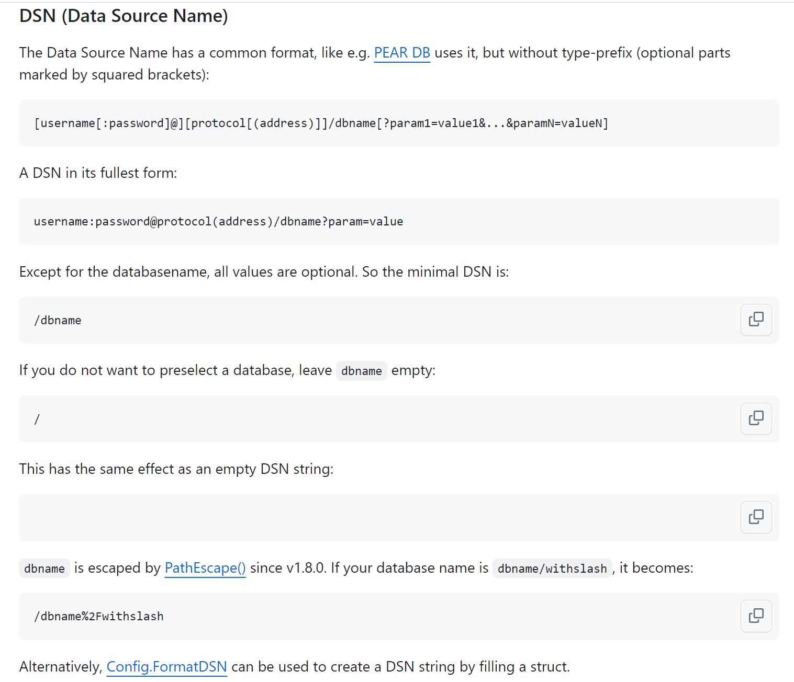

``` bash
gorm库    gorm.io/gorm
对应的github地址：https://github.com/go-gorm/gorm
==》
GORM Guides https://gorm.io
Gen Guides https://gorm.io/gen/index.html 代码生成
==》官方文档 https://gorm.io/zh_CN/docs/index.html
```

GORM 指南


# 入门指南

The fantastic ORM library for Golang aims to be developer friendly.

## 概述

### 特性

- 全功能 ORM
- 关联 (Has One，Has Many，Belongs To，Many To Many，多态，单表继承)
- Create，Save，Update，Delete，Find 中钩子方法
- 支持 `Preload`、`Joins` 的预加载 【？】
- 事务，嵌套事务，Save Point，Rollback To Saved Point
- **Context**、预编译模式、DryRun 模式
- 批量插入，FindInBatches，Find/Create with Map，使用 SQL 表达式、Context Valuer 进行 CRUD
- SQL 构建器，**Upsert**，数据库锁，Optimizer/Index/Comment Hint，命名参数，子查询
- 复合主键，索引，约束
- Auto Migration （自动切换/迁移）
- 自定义 Logger
- ==灵活的可扩展插件== API：Database Resolver（多数据库，读写分离）、Prometheus…
- 每个特性都经过了测试的重重考验
- 开发者友好


### 安装

``` 
go get -u gorm.io/gorm
go get -u gorm.io/driver/sqlite
```


## 声明模型

### 模型定义

模型是标准的 struct，由 Go 的基本数据类型、实现了 [Scanner](https://pkg.go.dev/database/sql/?tab=doc#Scanner) 和 [Valuer](https://pkg.go.dev/database/sql/driver#Valuer) 接口的自定义类型及其指针或别名组成.

其实就是表结构

例如：

``` 
type User struct {
  ID           uint
  Name         string
  Email        *string
  Age          uint8
  Birthday     *time.Time
  MemberNumber sql.NullString
  ActivatedAt  sql.NullTime
  CreatedAt    time.Time
  UpdatedAt    time.Time
}
```


### 约定

GORM 倾向于**约定优于配置（convention over configuration）** 

默认情况下，GORM 使用 `ID` 作为主键：

``` go
type User struct {
  ID   string // 默认情况下，名为 `ID` 的字段会作为表的主键
  Name string
}

//你可以通过标签 primaryKey 将其它字段设为主键
// 将 `UUID` 设为主键
type Animal struct {
  ID     int64
  UUID   string `gorm:"primaryKey"`
  Name   string
  Age    int64
}
```

使用结构体名的 `蛇形复数` 作为表名(对于结构体 `User`，根据约定，其表名为 `users`),结构体-字段名的 `蛇形（如cGame）` 作为列名：

``` go
type User struct {
  ID        uint      // 列名是 `id`
  Name      string    // 列名是 `name`
  Birthday  time.Time // 列名是 `birthday`
  CreatedAt time.Time // 列名是 `created_at`
}
```

使用 `CreatedAt`、`UpdatedAt` 字段追踪创建、更新时间:

``` 
//建表时
  `createAt` datetime NOT NULL DEFAULT current_timestamp,
```


如果您遵循 GORM 的约定，您就可以少写的配置、代码。 如果约定不符合您的实际要求，[GORM 允许你配置它们](https://gorm.io/zh_CN/docs/conventions.html)


## 连接到数据库

GORM 官方支持的数据库类型有：MySQL, PostgreSQL, SQLite, SQL Server 和 TiDB

### MySQL

``` go
import (
  "gorm.io/driver/mysql"
  "gorm.io/gorm"
)

func main() {
  // 参考 https://github.com/go-sql-driver/mysql#dsn-data-source-name 获取详情,parseTime=True可以正确的处理 time.Time
  dsn := "user:pass@tcp(127.0.0.1:3306)/dbname?charset=utf8mb4&parseTime=True&loc=Local"
  db, err := gorm.Open(mysql.Open(dsn), &gorm.Config{})
}
```

dsn：




MySQL 驱动程序提供了 [一些高级配置](https://github.com/go-gorm/mysql) 可以在初始化过程中使用，例如：

```go
db, err := gorm.Open(mysql.New(mysql.Config{
  DSN: "gorm:gorm@tcp(127.0.0.1:3306)/gorm?charset=utf8&parseTime=True&loc=Local", // DSN data source name
  DefaultStringSize: 256, // string 类型字段的默认长度
  DisableDatetimePrecision: true, // 禁用 datetime 精度，MySQL 5.6 之前的数据库不支持
  DontSupportRenameIndex: true, // 重命名索引时采用删除并新建的方式，MySQL 5.7 之前的数据库和 MariaDB 不支持重命名索引
  DontSupportRenameColumn: true, // 用 `change` 重命名列，MySQL 8 之前的数据库和 MariaDB 不支持重命名列
  SkipInitializeWithVersion: false, // 根据当前 MySQL 版本自动配置
}), &gorm.Config{})
```


### 自定义驱动

GORM 允许通过 `DriverName` 选项自定义 MySQL 驱动，例如：

```go
import (
  _ "example.com/my_mysql_driver"
  "gorm.io/driver/mysql"
  "gorm.io/gorm"
)

db, err := gorm.Open(mysql.New(mysql.Config{
  DriverName: "my_mysql_driver",
  DSN: "gorm:gorm@tcp(localhost:9910)/gorm?charset=utf8&parseTime=True&loc=Local", // data source name, 详情参考：https://github.com/go-sql-driver/mysql#dsn-data-source-name
}), &gorm.Config{})
```

### 现有的数据库连接

GORM 允许通过一个现有的数据库连接来初始化 `*gorm.DB`

```go
import (
  "database/sql"
  "gorm.io/driver/mysql"
  "gorm.io/gorm"
)

sqlDB, err := sql.Open("mysql", "mydb_dsn")
gormDB, err := gorm.Open(mysql.New(mysql.Config{
  Conn: sqlDB,
}), &gorm.Config{})
```


