# 介绍

来源：https://www.bookstack.cn/read/draveness-golang/cd9337bf6625a2e8.md

# 第一章 介绍

## Go 语言设计与实现

Go 语言是 Google 在 **2009 年 12 月**发布的编程语言，目前的 Go 语言在国内外的社区都非常热门，很多著名的开源框架 Kubernetes、etcd 和 prometheus 等都使用 Go 语言进行开发，近年来热门的微服务架构和云原生技术也为 Go 语言社区带来了非常多的活力。

作者目前也使用 Go 语言作为日常开发的主要语言，虽然 Go 语言没有 Lisp 系语言的开发效率和强大表达能力，但是却是一门非常容易使用并且大规模运用的工程语言，这也是作者学习和使用 Go 语言的主要原因。

> 补充：Lisp（List Processing）是一种编程语言家族，最早由约翰·麦卡锡（John McCarthy）在1958年开发。Lisp 系语言以其强大的元编程能力和函数式编程风格而闻名。
>
> Lisp 系语言的特点包括：
>
> 1. 基于列表的数据结构：Lisp 系语言使用列表（List）作为主要的数据结构，列表中的元素可以是其他列表，这种嵌套的结构使得 Lisp 系语言非常灵活。
> 2. 函数式编程：Lisp 系语言鼓励使用函数式编程的风格，函数是一等公民，可以作为参数传递、返回值返回，以及存储在变量中。这种编程风格强调不可变性和无副作用，使得代码更加清晰、可维护和可测试。
> 3. 元编程能力：Lisp 系语言具有强大的元编程能力，可以在运行时操作和修改程序的结构。这使得开发者可以编写高度抽象和灵活的代码，甚至可以编写自定义的语言扩展。
> 4. 动态类型系统：Lisp 系语言通常使用动态类型系统，变量的类型在运行时确定。这种灵活性使得开发者可以更快地进行迭代和开发，但也需要更多的测试和错误处理。
>
> Lisp 系语言的代表性成员包括 Common Lisp、Scheme 和 Clojure。它们在语法和特性上有所不同，但都继承了 Lisp 的核心思想和特点。


## 关于本书

这本书介绍的主要内容其实就是 **Go 语言内部的实现原理**，目前的大纲包含以下的八个章节，在编写的过程中还是会对内容的编排顺序和方式进行修改：

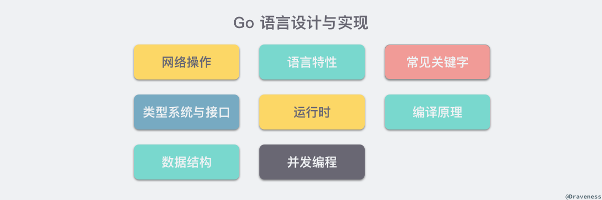

虽然文章的目录结构可能会改变，但是你一定会通过这本书了解到 Go 语言相关的以下内容：

- 从词法语法解析、类型检查、中间代码生成以及机器码生成的**编译**相关全链路；
- 数组、哈希表和字符串等数据结构的表示以及基本操作的实现原理；
- 理解 Go 语言中的函数、方法、闭包和上下文等语言特性；
- 常见**并发编程**使用的 WaitGroup、Once 以及互斥锁等结构的实现；
- 语言中的**万能类型 interface** 的实现原理；
- 各种关键字 make、new、defer、select 以及 for 循环的处理过程；
- Goroutine 和 Channel 相关的结构、调度策略以及原理；
- …

> TBD：书中的内容将会有不少于 60% 的章节将以公开的形式发布，剩余最多 40% 的内容将通过其他的渠道收费进行发布，不过在 Go 语言的主要版本更新时，会对文章的内容进行整理和更新，历史的章节会在网站中以公开形式发布，最新的章节仍然会通过不同渠道推送给付费的订阅者。

## 其他

无论你是对目前书中不包含的 Go 语言特性的实现原理感兴趣，还是有其他的建议都可以在下面留言，欢迎持续关注本书的进展，谢谢。


本作品采用[知识共享署名-非商业性使用-禁止演绎 4.0 国际许可协议](http://creativecommons.org/licenses/by-nc-nd/4.0/)进行许可。


# 第二章 编译原理

## 2.1 概述

Go 语言是一门需要编译才能运行的编程语言，也就是说代码在运行之前**需要通过编译器生成二进制机器码**，包含二进制机器码的文件才能在目标机器上运行，如果我们想要了解 Go 语言的实现原理，理解它的编译过程就是一个没有办法绕过的事情。


这一节会先对 Go 语言编译的过程进行概述，从顶层介绍编译器执行的几个步骤，随后的几节会分别剖析各个步骤完成的工作和实现原理，同时也会对一些需要预先掌握的知识进行介绍，确保后面的章节能够被更好的理解。

### 2.1.1 预备知识

想要深入了解 Go 语言的编译过程，需要提前了解一下编译过程中涉及的一些术语和专业知识。这些知识其实在我们的日常工作和学习中比较难用到，但是对于理解编译的过程和原理还是非常重要的。这一小节会简单挑选几个常见并且重要的概念提前进行介绍，减少后面章节的理解压力。

#### 抽象语法树

[抽象语法树](https://en.wikipedia.org/wiki/Abstract_syntax_tree)（AST），是源代码语法的结构的一种抽象表示，它**用树状的方式表示编程语言的语法结构**[1](https://www.bookstack.cn/read/draveness-golang/9e405d643b49d00e.md#fn:1)。抽象语法树中的每一个节点都表示源代码中的一个元素，每一颗子树都表示一个语法元素，例如一个 if else 语句，我们可以从 `2 * 3 + 7` 这一表达式中解析出下图所示的抽象语法树。


**图 2-1 简单表达式的抽象语法树**

作为编译器常用的数据结构，抽象语法树抹去了源代码中不重要的一些字符 - 空格、分号或者括号等等。编译器在执行完语法分析之后会输出一个抽象语法树，这个抽象语法树会辅助编译器进行语义分析，我们可以用它来确定语法正确的程序是否存在一些类型不匹配或不一致的问题。


#### 静态单赋值

[静态单赋值](https://en.wikipedia.org/wiki/Static_single_assignment_form)（Static Single Assigment, **SSA**）是中间代码的一个特性，如果一个中间代码具有静态单赋值的特性，那么每个变量就只会被赋值一次[2](https://www.bookstack.cn/read/draveness-golang/9e405d643b49d00e.md#fn:2)。在实践中我们通常会用添加下标的方式实现每个变量只能被赋值一次的特性，这里以下面的代码举个例子：

```
x := 1
x := 2
y := x
```

根据分析，我们其实能够发现上述的代码其实并不需要第一个将 `1` 赋值给 `x` 的表达式，也就是 `x := 1` 这一表达式在上述的代码片段中是没有作用的。

```
x1 := 1
x2 := 2
y1 := x2
```

当我们使用具有 SSA 特性的中间代码时，就可以非常清晰地发现变量 `y1` 的值和 `x1` 是完全没有任何关系的，所以在机器码生成时其实就可以省略第一步，这样就能减少需要执行的指令来优化这一段代码。(语法优化)


在中间代码中使用 SSA 的特性能够为整个程序实现以下的优化：

- 常数传播（constant propagation）
- 值域传播（value range propagation）
- 稀疏有条件的常数传播（sparse conditional constant propagation）
- 消除无用的程式码（dead code elimination）
- 全域数值编号（global value numbering）
- 消除部分的冗余（partial redundancy elimination）
- 强度折减（strength reduction）
- 寄存器分配（register allocation）因为 SSA 的主要作用是对代码进行优化，所以它是编译器后端[3](https://www.bookstack.cn/read/draveness-golang/9e405d643b49d00e.md#fn:3)的一部分；当然代码编译领域除了 SSA 还有很多中间代码的优化方法，编译器生成代码的优化也是一个非常古老并且复杂的领域，这里就不会展开介绍了。

#### 指令集

最后要介绍的一个预备知识就是[指令集](https://en.wikipedia.org/wiki/Instruction_set_architecture)-[4](https://www.bookstack.cn/read/draveness-golang/9e405d643b49d00e.md#fn:4)了，很多开发者都会遇到在生产环境运行的结果和本地不同的问题，导致这种情况的原因其实非常复杂，不同机器使用不同的指令也是可能的原因之一。

我们大多数开发者都会使用 x86_64 的 Macbook 作为工作上主要使用的硬件，在命令行中输入 `uname -m` 就能够获得当前机器上硬件的信息：

```
$ uname -m
x86_64
```

x86 是目前比较常见的指令集，除了 x86 之外，还有很多其他的指令集，不同的处理器使用了不同的架构和机器语言，所以很多编程语言为了在不同的机器上运行需要将源代码根据架构翻译成不同的机器代码。

复杂指令集计算机（Complex Instruction Set Computer，CISC）和精简指令集计算机（Reduced Instruction Set Computer，RISC）是目前的两种 CPU 区别，它们的在设计理念上会有一些不同，从名字我们就能看出来这两种不同的设计有什么区别：

- 复杂指令集通过增加指令的数量（复杂度）减少需要执行的指令数；
- 精简指令集能使用更少的指令完成目标的计算任务；

早期的 CPU 为了减少机器语言指令的（使用？）数量使用复杂指令集完成计算任务，这两者其实并没有绝对的好坏，它们只是在一些设计上的选择不同以达到不同的目的，我们会在后面的[机器码生成](https://www.bookstack.cn/read/draveness-golang/100aabc3275d17e5.md)一节中详细介绍指令集架构，不过各位读者也可以主动了解相关的内容。


### 2.1.2 编译原理

Go 语言编译器的源代码在 [`src/cmd/compile`](https://github.com/golang/go/tree/master/src/cmd/compile) 目录中，目录下的文件共同组成了 Go 语言的编译器。

```bash
# ll src/cmd/compile/
total 68
-rw-r--r--.  1 root root 39969 Nov 30  2023 abi-internal.md
-rw-r--r--.  1 root root 10303 Nov 30  2023 doc.go
drwxr-xr-x. 45 root root  4096 Nov 30  2023 internal
-rw-r--r--.  1 root root  1357 Nov 30  2023 main.go
-rw-r--r--.  1 root root  7076 Nov 30  2023 README.md
```

学过编译原理的人可能听说过编译器的前端和后端，**编译器的前端一般承担着词法分析、语法分析、类型检查和中间代码生成几部分工作**，而编译器**后端主要负责目标代码的生成和优化**，也就是将中间代码翻译成目标机器能够运行的二进制机器码。

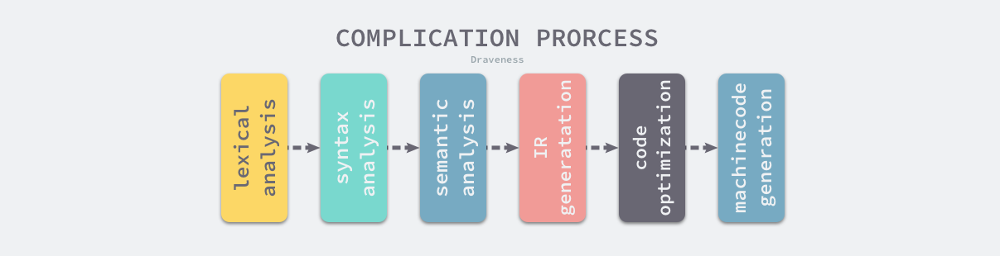

**图 2-2 编译原理的核心过程**

> lexical analysis:词法分析（Lexical Analysis），也称为扫描（Scanning），是编译器中的一个阶段，它负责将源代码分割成一个个的词法单元（Token）。词法单元是编程语言中的最小语法单位，例如关键字、标识符、运算符、常量等。
>
> syntax analysis:语法分析（Syntax Analysis），也称为解析（Parsing），是编译器中的一个阶段，它负责根据词法分析器生成的词法单元流（Token Stream）来分析源代码的语法结构，并构建相应的语法树（Syntax Tree）或抽象语法树（Abstract Syntax Tree）。
>
> semantic analysis：语义分析（Semantic Analysis）/类型检查是编译器中的一个重要阶段，它负责对源代码进行语义检查和语义解释。语义分析的目标是确保程序在语义上是正确的，并生成中间表示（如抽象语法树、符号表等）以供后续阶段使用。
>
> IR generation :R 生成（IR Generation）是编译器中的一个阶段，它负责将源代码转换为中间表示（Intermediate Representation，简称 IR）。中间表示是一种介于源代码和目标代码之间的抽象表示形式，它捕捉了源代码的语义和结构，方便后续的优化和代码生成。
>
> code optimization：代码优化
>
> machine code generation：机器码生成


Go 的编译器在逻辑上可以被分成四个阶段：词法与语法分析、类型检查和 AST 转换、通用 SSA 生成和最后的机器代码生成，在这一节我们会使用比较少的篇幅分别介绍这四个阶段做的工作，后面的章节会具体介绍每一个阶段的具体内容。


#### 词法与语法分析

所有的编译过程其实都是从解析代码的源文件开始的，

词法分析的作用就是解析源代码文件，它**将文件中的字符串序列转换成 Token 序列**，方便后面的处理和解析，我们一般会把执行词法分析的程序称为词法解析器（lexer）。

而**语法分析的输入就是词法分析器输出的 Token 序列，这些序列会按照顺序被语法分析器进行解**析，语法的解析过程就是将词法分析生成的 Token 按照语言定义好的文法（Grammar）自下而上或者自上而下的进行规约，每一个 Go 的源代码文件最终会被归纳成一个 [`SourceFile`](https://golang.org/ref/spec#Source_file_organization) 结构[5](https://www.bookstack.cn/read/draveness-golang/9e405d643b49d00e.md#fn:5)：

```
SourceFile = PackageClause ";" { ImportDecl ";" } { TopLevelDecl ";" } .
```

词法分析会返回一个不包含空格、换行等字符的 Token 序列，例如：`package`, `json`, `import`, `(`, `io`, `)`, …，而语法分析会把 Token 序列转换成有意义的结构体，也就是语法树：

```
"json.go": SourceFile {
    PackageName: "json",
    ImportDecl: []Import{
        "io",
    },
    TopLevelDecl: ...
}
```

将 Token 转换成上述『语法树』就会使用语法解析器，语法解析的结果其实就是上面介绍过的抽象语法树（AST），每一个 AST 都对应着一个单独的 Go 语言文件，这个抽象语法树中包括当前文件属于的包名、定义的常量、结构体和函数等。

> Go 语言的语法解析器使用的就是 LALR(1)[6](https://www.bookstack.cn/read/draveness-golang/9e405d643b49d00e.md#fn:6) 的文法，对解析器文法感兴趣的读者可以在推荐阅读中找到编译器文法的相关资料。


**图 2-3 从源文件到语法树**

如果在语法解析的过程中发生了任何语法错误，都会被语法解析器发现并将消息打印到标准输出上，整个编译过程也会随着错误的出现而被中止。[词法与语法分析](https://www.bookstack.cn/read/draveness-golang/a81e1b5a6b7b28bc.md)一节会详细介绍 Go 语言的文法、词法解析和语法解析过程。


#### 类型检查

当拿到一组文件的抽象语法树之后，Go 语言的编译器会对语法树中定义和使用的类型进行检查，**类型检查分别会按照以下的顺序对不同类型的节点进行验证和处理**：

- 常量、类型和函数名及类型；
- 变量的赋值和初始化；
- 函数和闭包的主体；
- 哈希键值对的类型；
- 导入函数体；
- 外部的声明；通过对整颗抽象语法树的遍历，我们在每一个节点上都会对当前子树的类型进行验证，以保证当前节点上不会出现类型错误的问题，所有的类型错误和不匹配都会在这一个阶段被发现和暴露出来，结构体是否实现了某些接口也会在这一阶段被检查出来。

类型检查阶段不止会对**节点的类型**进行验证，还会展开和改写一些内建的函数，例如 `make` 关键字在这个阶段会根据子树的结构被替换成 `makeslice` 或者 `makechan` 等函数。


**图 2-4 类型检查阶段对 make 进行改写**

类型检查这一过程在整个编译流程中还是非常重要的，Go 语言的很多关键字都依赖类型检查期间的展开和改写，后面的章节[类型检查](https://www.bookstack.cn/read/draveness-golang/7ab240185c175c73.md)会详细介绍这一步骤。


#### 中间代码生成

当我们将源文件转换成了抽象语法树、对整棵树的语法进行解析并进行类型检查之后，就可以认为当前文件中的代码不存在语法错误和类型错误的问题了，Go 语言的编译器就会将输入的抽象语法树转换成中间代码。

在类型检查之后，就会通过一个名为 `compileFunctions` 的函数开始对整个 Go 语言项目中的全部函数进行编译，这些函数会在一个编译队列中等待几个后端工作协程的消费（MQ)，这些并发执行的 Goroutine 会将所有函数对应的抽象语法树转换成中间代码。

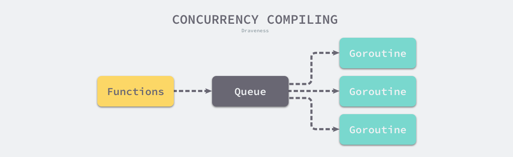

**图 2-5 并发编译过程**

由于 Go 语言编译器的中间代码使用了 SSA 的特性，所以在这一阶段我们就能够分析出代码中的无用变量和片段并对代码进行优化，在[中间代码生成](https://www.bookstack.cn/read/draveness-golang/5a89e04c79706261.md)这一节会详细介绍中间代码的生成过程并简单介绍 Go 语言是如何在中间代码中使用 SSA 特性的。


#### 机器码生成

Go 语言源代码的 [`src/cmd/compile/internal`](https://github.com/golang/go/tree/master/src/cmd/compile/internal) 目录中包含了很多机器码生成相关的包，不同类型的 CPU 分别使用了不同的包生成机器码，其中包括 amd64、arm、arm64、mips、mips64、ppc64、s390x、x86 和 wasm

```bash
# ll src/cmd/compile/internal/
total 172
drwxr-xr-x. 2 root root 4096 Nov 30  2023 abi
drwxr-xr-x. 2 root root 4096 Nov 30  2023 abt
drwxr-xr-x. 2 root root 4096 Nov 30  2023 amd64
drwxr-xr-x. 2 root root 4096 Nov 30  2023 arm
drwxr-xr-x. 2 root root 4096 Nov 30  2023 arm64
drwxr-xr-x. 2 root root 4096 Nov 30  2023 base
drwxr-xr-x. 2 root root 4096 Nov 30  2023 bitvec
drwxr-xr-x. 2 root root 4096 Nov 30  2023 compare
.....
```

其中比较有趣的就是 WebAssembly（Wasm）[7](https://www.bookstack.cn/read/draveness-golang/9e405d643b49d00e.md#fn:7)了。作为一种在栈虚拟机上使用的二进制指令格式，它的设计的主要目标就是在 Web 浏览器上提供一种具有高可移植性的目标语言。Go 语言的编译器既然能够生成 Wasm 格式的指令，那么就能够运行在常见的主流浏览器中。

```
$ GOARCH=wasm GOOS=js go build -o lib.wasm main.go
```

我们可以使用上述的命令将 Go 的源代码编译成能够在浏览器上运行 WebAssembly 文件，当然除了这种新兴的二进制指令格式之外，Go 语言经过编译还可以运行在几乎全部的主流机器上，不过对于除了 Linux 和 Darwin 之外的机器上兼容性上可能还是有一些问题，例如：Go Plugin 至今仍然不支持 Windows[8](https://www.bookstack.cn/read/draveness-golang/9e405d643b49d00e.md#fn:8)。

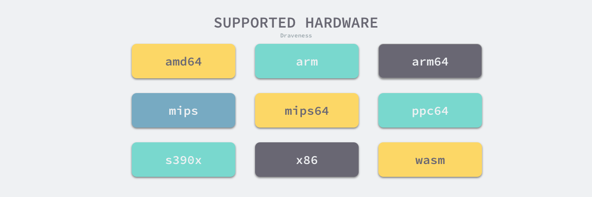


**图 2-6 Go 语言支持的架构**

[机器码生成](https://www.bookstack.cn/read/draveness-golang/100aabc3275d17e5.md)一节会详细介绍将中间代码翻译到不同目标机器的过程，在这个章节中也会简单介绍不同的指令集架构的区别。


### 2.1.3 编译器入口

Go 语言的编译器入口在 [`src/cmd/compile/internal/gc/main.go`](https://github.com/golang/go/blob/master/src/cmd/compile/internal/gc/main.go) 文件中，这个 600 多行的 [`Main`](https://github.com/golang/go/blob/4d5bb9c60905b162da8b767a8a133f6b4edcaa65/src/cmd/compile/internal/gc/main.go#L144-L796) 函数就是 Go 语言编译器的主程序，该函数会先获取命令行传入的参数并更新编译选项和配置，随后就会开始运行 `parseFiles` 函数对输入的所有文件进行词法与语法分析得到文件对应的抽象语法树：

```
func Main(archInit func(*Arch)) {    ...    lines := parseFiles(flag.Args())
```

接下来就会分九个阶段对抽象语法树进行更新和编译，就像我们在上面介绍的，整个过程会经历类型检查、SSA 中间代码生成以及机器码生成三个部分：

- 检查常量、类型和函数的类型；
- 处理变量的赋值；
- 对函数的主体进行类型检查；
- 决定如何捕获变量；
- 检查内联函数的类型；
- 进行逃逸分析；
- 将闭包的主体转换成引用的捕获变量；
- 编译顶层函数；
- 检查外部依赖的声明；对整个编译过程有一个顶层的认识之后，我们重新回到词法和语法分析后的具体流程，在这里编译器会对生成语法树中的节点执行类型检查，除了常量、类型和函数这些顶层声明之外，它还会对变量的赋值语句、函数主体等结构进行检查：

```go
    for i := 0; i < len(xtop); i++ {
        n := xtop[i]
        if op := n.Op; op != ODCL && op != OAS && op != OAS2 && (op != ODCLTYPE || !n.Left.Name.Param.Alias) {
            xtop[i] = typecheck(n, ctxStmt)
        }
    }
    for i := 0; i < len(xtop); i++ {
        n := xtop[i]
        if op := n.Op; op == ODCL || op == OAS || op == OAS2 || op == ODCLTYPE && n.Left.Name.Param.Alias {
            xtop[i] = typecheck(n, ctxStmt)
        }
    }
    ...
```

类型检查会对遍历传入节点的全部子节点，这个过程会对 `make` 等关键字进行展开和重写，在类型检查会改变语法树中的一些节点，不会生成新的变量或者语法树，这个过程的结束也意味着源代码中已经不存在语法错误和类型错误，中间代码和机器码都可以根据抽象语法树正常生成了。

```go
    initssaconfig()
    peekitabs()
    for i := 0; i < len(xtop); i++ {
        n := xtop[i]
        if n.Op == ODCLFUNC {
            funccompile(n)
        }
    }
    compileFunctions()
    for i, n := range externdcl {
        if n.Op == ONAME {
            externdcl[i] = typecheck(externdcl[i], ctxExpr)
        }
    }
    checkMapKeys()
}
```

在主程序运行的最后，会将顶层的函数编译成中间代码并根据目标的 CPU 架构生成机器码，不过在这一阶段也有可能会再次对外部依赖进行类型检查以验证正确性。

### 2.1.4 小结

Go 语言的编译过程其实是非常有趣并且值得学习的，通过对 Go 语言四个编译阶段的分析和对编译器主函数的梳理，我们能够对 Go 语言的实现有一些基本的理解，掌握编译的过程之后，Go 语言对于我们来讲也不再是一个黑盒，所以学习其编译原理的过程还是非常让人着迷的。

- 抽象语法树 https://en.wikipedia.org/wiki/Abstract_syntax_tree[↩︎](https://www.bookstack.cn/read/draveness-golang/9e405d643b49d00e.md#fnref:1)
- 静态单赋值 https://en.wikipedia.org/wiki/Static_single_assignment_form[↩︎](https://www.bookstack.cn/read/draveness-golang/9e405d643b49d00e.md#fnref:2)
- 编译器一般分为前端和后端，其中前端的主要工作是将源代码编程语言无关的中间表示，而后端主要负责目标代码的优化和生成。 [↩︎](https://www.bookstack.cn/read/draveness-golang/9e405d643b49d00e.md#fnref:3)
- 指令集架构是计算机的抽象模型，也被称作架构或者计算架架构 https://en.wikipedia.org/wiki/Instruction_set_architecture[↩︎](https://www.bookstack.cn/read/draveness-golang/9e405d643b49d00e.md#fnref:4)
- `SourceFile` 表示一个 Go 语言源文件，它由 `package` 定义、多个 `import` 语句以及顶层的声明组成 https://golang.org/ref/spec#Source_file_organization[↩︎](https://www.bookstack.cn/read/draveness-golang/9e405d643b49d00e.md#fnref:5)
- 关于 Go 语言文法的是不是 LALR(1) 的讨论 https://groups.google.com/forum/#!msg/golang-nuts/jVjbH2-emMQ/UdZlSNhd3DwJ

LALR 的全称是 Look-Ahead LR，大多数的通用编程语言都会使用 LALR 的文法 https://en.wikipedia.org/wiki/LALR_parser[↩︎](https://www.bookstack.cn/read/draveness-golang/9e405d643b49d00e.md#fnref:6)

- WebAssembly 是基于栈的虚拟机的二进制指令，简称 Wasm https://webassembly.org/[↩︎](https://www.bookstack.cn/read/draveness-golang/9e405d643b49d00e.md#fnref:7)
- plugin: add Windows support #19282 https://github.com/golang/go/issues/19282[↩︎](https://www.bookstack.cn/read/draveness-golang/9e405d643b49d00e.md#fnref:8)


## 2.2 词法和语法分析

当使用[通用编程语言](https://en.wikipedia.org/wiki/General-purpose_programming_language)[1](https://www.bookstack.cn/read/draveness-golang/a81e1b5a6b7b28bc.md#fn:1)进行编写代码时，我们一定要知道代码是写给人看的，只是恰好可以被机器编译和执行，而很难被人理解的代码是非常糟糕并且不容易维护的。代码其实就是按照约定格式编写的一堆字符串，经过训练的软件工程师可以在脑内对语言的源代码进行编译并运行目标程序，我们能对本来无意义的字符串进行分组和分析，按照约定的语法来理解源代码。

既然工程师能够按照一定的方式理解和编译 Go 语言的源代码，那么我们如何模拟人理解源代码的方式构建一个能够分析编程语言代码的程序呢。我们在这一节中将介绍词法分析和语法分析这两个重要的编译过程，这两个过程能将原本机器看来无序意义的源文件转换成更容易理解、分析并且结构化的抽象语法树，接下来我们就看一看解析器眼中的 Go 语言是什么样的。


### 2.2.1 词法分析

源代码在编译器眼中其实就是一团乱麻，一个由『无实际意义』字符组成的、无法被理解的字符串，所有的字符在编译器看来并没有什么区别，为了理解这些字符我们需要做的第一件事情就是**将字符串分组**，这样能够降低理解字符串的成本，简化分析源代码的过程。

```
make(chan int)
```

一个不懂编程的人看到上述文本的的第一反应就是将上述字符串分成几个部分 - `make`、`chan`、`int` 和括号，这个凭直觉分解文本的过程其实就是[词法分析](https://en.wikipedia.org/wiki/Lexical_analysis)，

词法分析是计算机科学中将字符序列转换为标记（token）序列的过程[2](https://www.bookstack.cn/read/draveness-golang/a81e1b5a6b7b28bc.md#fn:2)。

#### lex

[lex](http://dinosaur.compilertools.net/lex/index.html)[3](https://www.bookstack.cn/read/draveness-golang/a81e1b5a6b7b28bc.md#fn:3) 是用于生成词法分析器的工具，lex 生成的代码能够将一个文件中的字符分解成 Token 序列，很多语言在设计早期都会使用它快速设计出原型。词法分析作为具有固定模式的任务，出现这种更抽象的工具其实是必然的，lex 作为一个代码生成器，使用了类似 C 语言的语法，我们可以理解成 lex 使用正则匹配对输入的字符流进行扫描，下面是一个 lex 文件的示例(simplego.l)：

```
%{
#include <stdio.h>
%}
%%
package      printf("PACKAGE ");
import       printf("IMPORT ");
\.           printf("DOT ");
\{           printf("LBRACE ");
\}           printf("RBRACE ");
\(           printf("LPAREN ");
\)           printf("RPAREN ");
\"           printf("QUOTE ");
\n           printf("\n");
[0-9]+       printf("NUMBER ");
[a-zA-Z_]+   printf("IDENT ");
%%
```

这个定义好的文件能够解析 `package` 和 `import` 关键字、常见的特殊字符、数字以及标识符，虽然这里的规则可能有一些简陋和不完善，但是如果用来解析下面的这一段代码还是比较轻松的：

```
package main
import (
    "fmt"
)
func main() {
    fmt.Println("Hello")
}
```

`.l` 结尾的 lex 代码并不能直接运行，首先需要通过 `lex` 命令将上面的 `simplego.l` **『展开』成 C 语言代码**，这里可以直接执行如下的命令编译并打印当前文件中的内容：

```bash
$ lex simplego.l
$ cat lex.yy.c
...
int yylex (void) {
    ...
    while ( 1 ) {
        ...
yy_match:
        do {
            register YY_CHAR yy_c = yy_ec[YY_SC_TO_UI(*yy_cp)];
            if ( yy_accept[yy_current_state] ) {
                (yy_last_accepting_state) = yy_current_state;
                (yy_last_accepting_cpos) = yy_cp;
            }
            while ( yy_chk[yy_base[yy_current_state] + yy_c] != yy_current_state ) {
                yy_current_state = (int) yy_def[yy_current_state];
                if ( yy_current_state >= 30 )
                    yy_c = yy_meta[(unsigned int) yy_c];
                }
            yy_current_state = yy_nxt[yy_base[yy_current_state] + (unsigned int) yy_c];
            ++yy_cp;
        } while ( yy_base[yy_current_state] != 37 );
        ...
do_action:
        switch ( yy_act )
            case 0:
                ...
            case 1:
                YY_RULE_SETUP
                printf("PACKAGE ");
                YY_BREAK
            ...
}
```

[lex.yy.c](https://gist.github.com/draveness/85db6ec4a4088b63ccccf7f09424f474)[4](https://www.bookstack.cn/read/draveness-golang/a81e1b5a6b7b28bc.md#fn:4) 的前 600 行基本都是宏和函数的声明和定义，后面生成的代码大都是为 `yylex` 这个函数服务的，这个函数使用[有限自动机（DFA）](https://en.wikipedia.org/wiki/Deterministic_finite_automaton)[5](https://www.bookstack.cn/read/draveness-golang/a81e1b5a6b7b28bc.md#fn:5)的程序结构来分析输入的字符流，上述代码中 `while` 循环就是这个有限自动机的主体，你如果仔细看这个文件生成的代码会发现当前的文件中并不存在 `main` 函数，`main` 函数其实是在 liblex 这个库中定义的，所以在编译时其实需要添加额外的 `-ll` 选项：

```
$ cc lex.yy.c -o simplego -ll
$ cat main.go | ./simplego
```

当我们将 C 语言代码通过 **gcc 编译**成二进制代码之后，就可以使用管道将上面提到的 Go 语言代码作为输入传递到生成的词法分析器中，这个词法分析器会打印出如下的内容：

```
PACKAGE  IDENT
IMPORT  LPAREN
    QUOTE IDENT QUOTE
RPAREN
IDENT  IDENT LPAREN RPAREN  LBRACE
    IDENT DOT IDENT LPAREN QUOTE IDENT QUOTE RPAREN
RBRACE
```

从上面的输出我们能够看到 Go 源代码的影子，lex 生成的词法分析器 lexer 通过正则匹配的方式将机器原本很难理解的字符串进行分解成很多的 Token，有利于后面的继续处理。


**图 2-7 从 .l 文件到二进制**

如上图所示，到这里我们已经为各位读者展示了从定义 `.l` 文件，使用 `lex` 将 `.l` 文件编译成 C 语言代码到编译成二进制的全过程，而最后生成的词法分析器也能够将简单的 Go 语言代码进行分组，`lex` 的使用还是比较简单的，我们可以使用它快速实现词法分析器，相信各位读者对这个工具也有了一定的了解。


#### Go

> scanner

Go 语言的词法解析是通过 [`src/cmd/compile/internal/syntax/scanner.go`](https://github.com/golang/go/tree/master/src/cmd/compile/internal/syntax/scanner.go)[6](https://www.bookstack.cn/read/draveness-golang/a81e1b5a6b7b28bc.md#fn:6) 文件中的 `scanner` 结构体实现的，这个结构体会持有当前扫描的数据源文件、启用的模式和当前被扫描到的 Token：

```go
type scanner struct {
    source
    mode   uint
    nlsemi bool
    // current token, valid after calling next()
    line, col uint
    tok       token
    lit       string
    kind      LitKind
    op        Operator
    prec      int
}
```

[`src/cmd/compile/internal/syntax/tokens.go`](https://github.com/golang/go/tree/master/src/cmd/compile/internal/syntax/tokens.go)[7](https://www.bookstack.cn/read/draveness-golang/a81e1b5a6b7b28bc.md#fn:7) 文件中定义了 Go 语言中支持的全部 Token 类型，所有的 `token` 类型都是正整数，你可以在这个文件中找到一些常见 Token 的定义，例如：操作符、括号和关键字等：

```go
const (
    _    token = iota
    _EOF       // EOF
    // operators and operations
    _Operator // op
    // ...
    // delimiters
    _Lparen    // (
    _Lbrack    // [
    // ...
    // keywords
    _Break       // break
    // ...
    _Type        // type
    _Var         // var
    tokenCount //
)
```

从 Go 语言中定义的 Token 类型，我们可以将语言中的元素分成几个不同的类别，分别是名称和字面量、操作符、分隔符和关键字。词法分析主要是由 `scanner` 这个结构体中的 `next` 方法驱动，这个 250 行函数的主体就是一个 `switch/case` 结构：

```go
func (s *scanner) next() {
    c := s.getr()
    for c == ' ' || c == '\t' || c == '\n' || c == '\r' {
        c = s.getr()
    }
    s.line, s.col = s.source.line0, s.source.col0
    if isLetter(c) || c >= utf8.RuneSelf && s.isIdentRune(c, true) {
        s.ident()
        return
    }
    switch c {
    case -1:
        s.tok = _EOF
    case '0', '1', '2', '3', '4', '5', '6', '7', '8', '9':
        s.number(c)
    // ...
    }
}
```

`scanner` 每次都会通过 `getr` 函数获取文件中最近的未被解析的字符，然后根据当前字符的不同执行不同的 case，如果遇到了空格和换行符这些空白字符会直接跳过，如果当前字符是 `0` 就会执行 `number` 方法尝试匹配一个数字。

```
func (s *scanner) number(c rune) {
    s.startLit()
    s.kind = IntLit
    for isDigit(c) {
        c = s.getr()
    }
    s.ungetr()
    s.nlsemi = true
    s.lit = string(s.stopLit())
    s.tok = _Literal
}
```


上述的 `number` 方法省略了很多的代码，包括如何匹配浮点数、指数和复数，我们只是简单看一下词法分析匹配的逻辑。

- 在开始具体匹配之前调用 `startLit` 记录一下当前 Token 的开始位置；
- 在 for 循环中不断获取最新的字符，将字符追加到 `scanner` 持有的缓冲区中；
- 方法返回之前会通过 `ungetr` 撤销最近获取的错误字符（非数字）并将字面量和 Token 的类型传递回 `scanner`；当前包中的词法分析器 `scanner` 也只是为上层提供了 `next` 方法，词法解析的过程都是惰性的，只有在上层的解析器需要时才会调用 `next` 获取最新的 Token。

Go 语言的词法元素相对来说还是比较简单，使用这种巨大的 switch/case 进行词法解析也比较方便和顺手，早期的 Go 语言虽然使用 lex 这种工具来生成词法解析器，但是最后还是使用 Go 来实现词法分析器，用自己写的词法分析器来解析自己[8](https://www.bookstack.cn/read/draveness-golang/a81e1b5a6b7b28bc.md#fn:8)。


### 2.2.2 语法分析

说完了编译最开始的词法分析过程，接下来就到了语法分析，[语法分析](https://en.wikipedia.org/wiki/Parsing)是根据某种特定的形式文法（Grammar）对 Token 序列构成的输入文本进行分析并确定其语法结构的一种过程[9](https://www.bookstack.cn/read/draveness-golang/a81e1b5a6b7b28bc.md#fn:9)。

从上面的定义来看，词法分析器输出的结果 — Token 序列就是语法分析器的输入。

在语法分析的过程会使用**自顶向下**或者**自底向上**的方式进行推导，在介绍 Go 语言的语法分析的实现原理之前，我们会先来介绍语法分析中的文法和分析方法。

#### 文法

[上下文无关文法](https://en.wikipedia.org/wiki/Context-free_grammar)是用来对某种编程语言进行形式化的、精确的描述工具，我们能够通过文法定义一种语言的语法，它主要包含了一系列用于转换字符串的生产规则（production rule）[10](https://www.bookstack.cn/read/draveness-golang/a81e1b5a6b7b28bc.md#fn:10)。上下文无关文法中的每一个生产规则都会将规则左侧的非终结符转换成右侧的字符串，文法都由以下的四个部分组成：

> 终结符是文法中无法再被展开的符号，而非终结符与之相反，还可以通过生产规则进行展开，例如 “id”、“123” 等标识或者字面量[11](https://www.bookstack.cn/read/draveness-golang/a81e1b5a6b7b28bc.md#fn:11)。

- $N$ 有限个非终结符的集合；
- $\Sigma$ 有限个终结符的集合；
- $P$ 有限个生产规则[12](https://www.bookstack.cn/read/draveness-golang/a81e1b5a6b7b28bc.md#fn:12)的集合；
- $S$ 非终结符集合中唯一的开始符号；

文法被定义成一个**四元组** $(N, \Sigma, P, S)$，这个元组中的几部分就是上面提到的四个符号，其中最为重要的就是生产规则了，每一个生产规则都会包含非终结符、终结符或者开始符号，我们在这里可以举一个简单的例子：

- $S \rightarrow aSb $
- $S \rightarrow ab $上述规则构成的文法就能够表示 `ab`、`aabb` 以及 `aaa..bbb` 等字符串，编程语言的文法就是由这一系列的生产规则表示的，在这里我们可以从 [`src/cmd/compile/internal/syntax/parser.go`](https://github.com/golang/go/blob/master/src/cmd/compile/internal/syntax/parser.go)[13](https://www.bookstack.cn/read/draveness-golang/a81e1b5a6b7b28bc.md#fn:13) 文件中摘抄一些 Go 语言文法的生产规则：

```go
SourceFile = PackageClause ";" { ImportDecl ";" } { TopLevelDecl ";" } .
PackageClause  = "package" PackageName .
PackageName    = identifier .

ImportDecl       = "import" ( ImportSpec | "(" { ImportSpec ";" } ")" ) .
ImportSpec       = [ "." | PackageName ] ImportPath .
ImportPath       = string_lit .

TopLevelDecl  = Declaration | FunctionDecl | MethodDecl .
Declaration   = ConstDecl | TypeDecl | VarDecl .
```

> Go 语言更详细的文法可以从 [Language Specification](https://golang.org/ref/spec)[14](https://www.bookstack.cn/read/draveness-golang/a81e1b5a6b7b28bc.md#fn:14) 中找到，这里不仅包含语言的文法，还包含词法元素、内置函数等信息。

因为**每个 Go 源代码文件最终都会被解析成一个独立的抽象语法树**，所以语法树最顶层的结构或者开始符号其实就是 `SourceFile`：

```
SourceFile = PackageClause ";" { ImportDecl ";" } { TopLevelDecl ";" } .
```

从 `SourceFile` 相关的生产规则我们可以看出，每一个文件都包含一个 `package` 的定义以及可选的 `import` 声明和其他的顶层声明（TopLevelDecl），每一个 `SourceFile` 在编译器中都对应一个 `File` 结构体，你能从它们的定义中轻松找到两者的联系：

```
type File struct {    PkgName  *Name    DeclList []Decl    Lines    uint    node}
```

顶层声明有五大类型，分别是常量、类型、变量、函数和方法，你可以在文件 [`src/cmd/compile/internal/syntax/parser.go`](https://github.com/golang/go/blob/master/src/cmd/compile/internal/syntax/parser.go) 中找到这五大类型的定义。

```go 
ConstDecl = "const" ( ConstSpec | "(" { ConstSpec ";" } ")" ) .
ConstSpec = IdentifierList [ [ Type ] "=" ExpressionList ] .

TypeDecl  = "type" ( TypeSpec | "(" { TypeSpec ";" } ")" ) .
TypeSpec  = AliasDecl | TypeDef .
AliasDecl = identifier "=" Type .
TypeDef   = identifier Type .

VarDecl = "var" ( VarSpec | "(" { VarSpec ";" } ")" ) .
VarSpec = IdentifierList ( Type [ "=" ExpressionList ] | "=" ExpressionList ) .
```

上述的文法分别定义了 Go 语言中常量、类型和变量三种常见的结构，从文法中可以看到语言中的很多关键字 `const`、`type` 和 `var`，稍微回想一下我们日常接触的 Go 语言代码就能验证这里文法的正确性。

除了三种简单的语法结构之外，函数和方法的定义就更加复杂，从下面的文法我们可以看到 `Statement` 总共可以转换成 15 种不同的语法结构，这些语法结构就包括我们经常使用的 switch/case、if/else、for 循环以及 select 等语句：

```
FunctionDecl = "func" FunctionName Signature [ FunctionBody ] .
FunctionName = identifier .
FunctionBody = Block .
MethodDecl = "func" Receiver MethodName Signature [ FunctionBody ] .
Receiver   = Parameters .
Block = "{" StatementList "}" .
StatementList = { Statement ";" } .
Statement =
    Declaration | LabeledStmt | SimpleStmt |
    GoStmt | ReturnStmt | BreakStmt | ContinueStmt | GotoStmt |
    FallthroughStmt | Block | IfStmt | SwitchStmt | SelectStmt | ForStmt |
    DeferStmt .
SimpleStmt = EmptyStmt | ExpressionStmt | SendStmt | IncDecStmt | Assignment | ShortVarDecl .
```


这些不同的语法结构共同定义了 Go 语言中能够使用的语法结构和表达式，对于 `Statement` 展开的更多内容这篇文章就不会详细介绍了，感兴趣的读者可以直接查看 [Go 语言说明书](https://golang.org/ref/spec#Statement)或者直接从 [`src/cmd/compile/internal/syntax/parser.go`](https://github.com/golang/go/blob/master/src/cmd/compile/internal/syntax/parser.go) 文件中找到想要的答案。

#### 分析方法

语法分析的分析方法一般分为自顶向下和自底向上两种，这两种方式会使用不同的方式对输入的 Token 序列进行推导：

- [自顶向下分析](https://en.wikipedia.org/wiki/Top-down_parsing)：可以被看作找到当前输入流最左推导的过程，对于任意一个输入流，根据当前的输入符号，确定一个生产规则，使用生产规则右侧的符号替代相应的非终结符向下推导[15](https://www.bookstack.cn/read/draveness-golang/a81e1b5a6b7b28bc.md#fn:15)；
- [自底向上分析](https://en.wikipedia.org/wiki/Bottom-up_parsing)：语法分析器从输入流开始，每次都尝试重写最右侧的多个符号，这其实就是说解析器会从最简单的符号进行推导，在解析的最后合并成开始符号[16](https://www.bookstack.cn/read/draveness-golang/a81e1b5a6b7b28bc.md#fn:16)；

如果读者无法理解上述的定义也没有关系，我们会在这一节的剩余部分介绍两种不同的分析方法以及它们的具体分析过程。

##### 自顶向下

[LL 文法](https://en.wikipedia.org/wiki/LL_grammar)[17](https://www.bookstack.cn/read/draveness-golang/a81e1b5a6b7b28bc.md#fn:17)就是一种使用自顶向上分析方法的文法，下面给出了一个常见的 LL 文法：

- $S \rightarrow aS_1$
- $S_1 \rightarrow bS_1 $
- $S_1 \rightarrow \epsilon$假设我们存在以上的生产规则和输入流 `abb`，如果这里使用自顶向上的方式进行语法分析，我们可以理解为每次解析器会通过新加入的字符判断应该使用什么方式展开当前的输入流：
- $S$ （开始符号）
- $aS_1$（规则 1)
- $abS_1$（规则 2)
- $abbS_1$（规则 2)
- $abb$（规则 3)这种分析方法一定会从开始符号分析，通过下一个即将入栈的符号判断应该如何对当前堆栈中最右侧的非终结符（$S$ 或 $S_1$）进行展开，直到整个字符串中不存在任何的非终结符，整个解析过程才会结束。

##### 自底向上

但是如果我们使用自底向上的方式对输入流进行分析时，处理过程就会完全不同了，常见的四种文法 LR(0)、SLR、LR(1) 和 LALR(1) 使用了自底向上的处理方式[18](https://www.bookstack.cn/read/draveness-golang/a81e1b5a6b7b28bc.md#fn:18)，我们可以简单写一个与上一节中效果相同的 LR(0) 文法：

- $S \rightarrow S_1 $
- $S_1 \rightarrow S_1b $
- $S_1 \rightarrow a $使用上述等效的文法处理同样地输入流 `abb` 会使用完全不同的过程对输入流进行展开：
- $a$（入栈）
- $S_1$（规则 3）
- $S_1b$（入栈）
- $S_1$（规则 2）
- $S_1b$（入栈）
- $S_1$（规则 2）
- $S$（规则 1）自底向上的分析过程会维护一个堆栈用于存储未被归约的符号，在整个过程中会执行两种不同的操作，一种叫做入栈（shift），也就是将下一个符号入栈，另一种叫做归约（reduce），也就是对最右侧的字符串按照生产规则进行合并。

上述的分析过程和自顶向上的分析方法完全不同，这两种不同的分析方法其实也代表了计算机科学中两种不同的思想 — 从抽象到具体和从具体到抽象。

##### Lookahead

在语法分析中除了 LL 和 LR 这两种不同类型的语法分析方法之外，还存在另一个非常重要的概念，就是[向前查看（Lookahead）](https://en.wikipedia.org/wiki/Lookahead)，在不同生产规则发生冲突时，当前解析器需要通过预读一些 Token 判断当前应该用什么生产规则对输入流进行展开或者归约[19](https://www.bookstack.cn/read/draveness-golang/a81e1b5a6b7b28bc.md#fn:19)，例如在 LALR(1) 文法中，就需要预读一个 Token 保证出现冲突的生产规则能够被正确处理。


#### Go

Go 语言的解析器就使用了 LALR(1) 的文法来解析词法分析过程中输出的 Token 序列[20](https://www.bookstack.cn/read/draveness-golang/a81e1b5a6b7b28bc.md#fn:20)，最右推导加向前查看构成了 Go 语言解析器的最基本原理，也是大多数编程语言的选择。

我们在[概述](https://www.bookstack.cn/read/draveness-golang/9e405d643b49d00e.md)中已经介绍了编译器的主函数，该函数调用的 `parseFiles` 就会对使用多个 Goroutine 来解析源文件，解析的过程就会使用 [`Parse`](https://github.com/golang/go/blob/4d5bb9c60905b162da8b767a8a133f6b4edcaa65/src/cmd/compile/internal/syntax/syntax.go#L58-L73) 函数，该函数初始化了一个新的 `parser` 结构体并通过 `fileOrNil` 方法开启对当前文件的词法和语法解析：

```
func Parse(base *PosBase, src io.Reader, errh ErrorHandler, pragh PragmaHandler, mode Mode) (_ *File, first error) {
    var p parser
    p.init(base, src, errh, pragh, mode)
    p.next()
    return p.fileOrNil(), p.first
}
```

[`fileOrNil`](https://github.com/golang/go/blob/4d5bb9c60905b162da8b767a8a133f6b4edcaa65/src/cmd/compile/internal/syntax/parser.go#L352-L425) 方法其实就是对上面介绍的 Go 语言文法的实现，该方法首先会解析文件开头的 `package` 定义：

```
// SourceFile = PackageClause ";" { ImportDecl ";" } { TopLevelDecl ";" } .
func (p *parser) fileOrNil() *File {
    f := new(File)
    f.pos = p.pos()
    if !p.got(_Package) {
        p.syntaxError("package statement must be first")
        return nil
    }
    f.PkgName = p.name()
    p.want(_Semi)
```

从上面的这一段方法中我们可以看出，当前方法会通过 `got` 来判断下一个 Token 是不是 `package` 关键字，如果是 `package` 关键字，就会执行 `name` 来匹配一个包名并将结果保存到返回的文件结构体中。

```
    for p.got(_Import) {
        f.DeclList = p.appendGroup(f.DeclList, p.importDecl)
        p.want(_Semi)
    }
```

确定了当前文件的包名之后，就开始解析可选的 `import` 声明，每一个 `import` 在解析器看来都是一个声明语句，这些声明语句都会被加入到文件的 `DeclList` 列表中。

在这之后就会根据编译器获取的关键字进入 switch 的不同分支，这些分支调用 `appendGroup` 方法并在方法中传入用于处理对应类型语句的 `constDecl`、`typeDecl` 函数。

```
    for p.tok != _EOF {
        switch p.tok {
        case _Const:
            p.next()
            f.DeclList = p.appendGroup(f.DeclList, p.constDecl)
        case _Type:
            p.next()
            f.DeclList = p.appendGroup(f.DeclList, p.typeDecl)
        case _Var:
            p.next()
            f.DeclList = p.appendGroup(f.DeclList, p.varDecl)
        case _Func:
            p.next()
            if d := p.funcDeclOrNil(); d != nil {
                f.DeclList = append(f.DeclList, d)
            }
        }
    }
    f.Lines = p.source.line
    return f
}
```

`fileOrNil` 方法使用了非常多的子方法对输入的文件进行语法分析，并在最后会返回文件最开始创建的 `File` 结构体。

读到这里的人可能会有一些疑惑，为什么没有看到词法分析的代码，这是因为词法分析器 `scanner` 作为结构体被嵌入到了 `parser` 中，所以这个方法中的 `p.next()` 实际上调用的是 `scanner` 的 `next` 方法，它会直接获取文件中的下一个 Token，所以词法分析和语法分析其实是一起进行的。

`fileOrNil` 与在这个方法中执行的其他子方法共同构成了一颗树，这棵树根节点就是 `fileOrNil`，子节点就是 `importDecl`、`constDecl` 等方法，它们与 Go 语言文法中的生产规则一一对应。


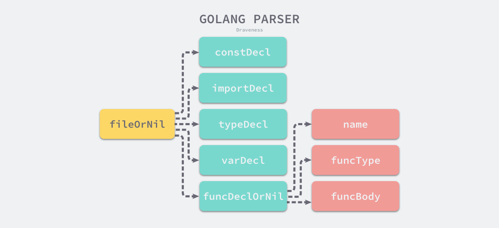

**图 2-8 Go 语言解析器的方法**

`fileOrNil`、`constDecl` 等方法对应了一个 Go 语言中的生产规则，例如 `fileOrNil` 实现的就是：

```
SourceFile = PackageClause ";" { ImportDecl ";" } { TopLevelDecl ";" } .
```

我们根据这个规则就能很好地理解语法分析器 `parser` 的实现原理 - 将编程语言的所有生产规则映射到对应的方法上，这些方法构成的树形结构最终会返回一个抽象语法树。

因为大多数方法的实现都非常相似，所以这里就仅介绍 `fileOrNil` 方法的实现了，想要了解其他方法的实现原理，读者可以自行查看 [`src/cmd/compile/internal/syntax/parser.go`](https://github.com/golang/go/blob/master/src/cmd/compile/internal/syntax/parser.go) 文件，该文件包含了语法分析阶段的全部方法。


##### 辅助方法

虽然这里不会展开介绍其他类似方法的实现，但是解析器运行过程中有几个辅助方法我们还是要简单说明一下，首先就是 [`got`](https://github.com/golang/go/blob/4d5bb9c60905b162da8b767a8a133f6b4edcaa65/src/cmd/compile/internal/syntax/parser.go#L158-L164) 和 [`want`](https://github.com/golang/go/blob/4d5bb9c60905b162da8b767a8a133f6b4edcaa65/src/cmd/compile/internal/syntax/parser.go#L166-L171) 这两个常见的方法：

```
func (p *parser) got(tok token) bool {
    if p.tok == tok {
        p.next()
        return true
    }
    return false
}
func (p *parser) want(tok token) {
    if !p.got(tok) {
        p.syntaxError("expecting " + tokstring(tok))
        p.advance()
    }
}
```


`got` 其实只是用于快速判断一些语句中的关键字，如果当前解析器中的 Token 是传入的 Token 就会直接跳过该 Token 并返回 `true`；而 `want` 就是对 `got` 的简单封装了，如果当前的 Token 不是我们期望的，就会立刻返回语法错误并结束这次编译。

这两个方法的引入能够帮助工程师在上层减少判断关键字的大量重复逻辑，让上层语法分析过程的实现更加清晰。

另一个方法 [`appendGroup`](https://github.com/golang/go/blob/4d5bb9c60905b162da8b767a8a133f6b4edcaa65/src/cmd/compile/internal/syntax/parser.go#L469-L489) 的实现就稍微复杂了一点，它的主要作用就是找出批量的定义，我们可以简单举一个例子：

```
var (
   a int
   b int 
)
```

这两个变量其实属于同一个组（Group），各种顶层定义的结构体 `ConstDecl`、`VarDecl` 在进行语法分析时有一个额外的参数 `Group`，这个参数就是通过 [`appendGroup`](https://github.com/golang/go/blob/4d5bb9c60905b162da8b767a8a133f6b4edcaa65/src/cmd/compile/internal/syntax/parser.go#L469-L489) 方法传递进去的：

```
func (p *parser) appendGroup(list []Decl, f func(*Group) Decl) []Decl {
    if p.tok == _Lparen {
        g := new(Group)
        p.list(_Lparen, _Semi, _Rparen, func() bool {
            list = append(list, f(g))
            return false
        })
    } else {
        list = append(list, f(nil))
    }
    return list
}
```

`appendGroup` 方法会调用传入的 `f` 方法对输入流进行匹配并将匹配的结果追加到另一个参数 `File` 结构体中的 `DeclList` 数组中，`import`、`const`、`var`、`type` 和 `func` 声明语句都是调用 `appendGroup` 方法进行解析的。

##### 节点

语法分析器最终会使用不同的结构体来构建抽象语法树中的节点，其中根节点 `File` 我们已经在上面介绍过了，其中包含了当前文件的包名、所有声明结构的列表和文件的行数：

```
type File struct {
    PkgName  *Name
    DeclList []Decl
    Lines    uint
    node
}
```

其他节点的结构体也都在 [`src/cmd/compile/internal/syntax/nodes.go`](https://github.com/golang/go/blob/master/src/cmd/compile/internal/syntax/nodes.go) 文件中定义了，文件中定义了全部声明类型的结构体，在这里简单看一下函数声明的结构：

```

type (
    Decl interface {
        Node
        aDecl()
    }
    FuncDecl struct {
        Attr   map[string]bool
        Recv   *Field
        Name   *Name
        Type   *FuncType
        Body   *BlockStmt
        Pragma Pragma
        decl
    }
}
```

从函数定义中我们可以看出，函数在语法结构上主要由接受者、函数名、函数类型和函数体几个部分组成，函数体 `BlockStmt` 是由一系列的表达式组成的，这些表达式共同组成了函数的主体：

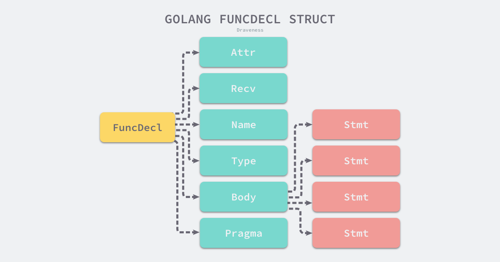

**图 2-9 Go 语言函数定义的结构体**

函数的主体其实就是一个 `Stmt` 数组，`Stmt` 是一个接口，实现该接口的类型其实也非常多，总共有 14 种不同类型的 `Stmt` 实现：

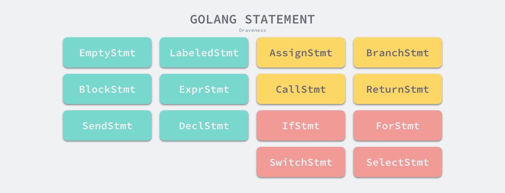

**图 2-9 Go 语言的 14 种声明**

这些不同类型的 `Stmt` 构成了全部命令式的 Go 语言代码，从中我们可以看到非常多熟悉的控制结构，例如 `if`、`for`、`switch` 和 `select`，这些命令式的结构在其他的编程语言中也非常常见。


### 2.2.3 小结

这一节介绍了 Go 语言的词法分析和语法分析过程，我们不仅从理论的层面介绍了词法和语法分析的原理，还从 Golang 的源代码出发详细分析 Go 语言的编译器是如何在底层实现词法和语法解析功能的。

了解 Go 语言的词法分析器 `scanner` 和语法分析器 `parser` 让我们对解析器处理源代码的过程有着比较清楚的认识，同时我们也在 Go 语言的文法和语法分析器中找到了熟悉的关键字和语法结构，加深了对 Go 语言的理解。


- 通用编程语言 General-purpose programming language https://en.wikipedia.org/wiki/General-purpose_programming_language[↩︎](https://www.bookstack.cn/read/draveness-golang/a81e1b5a6b7b28bc.md#fnref:1)
- 词法分析 Lexical analysis https://en.wikipedia.org/wiki/Lexical_analysis[↩︎](https://www.bookstack.cn/read/draveness-golang/a81e1b5a6b7b28bc.md#fnref:2)
- 词法分析生成器 http://dinosaur.compilertools.net/lex/index.html[↩︎](https://www.bookstack.cn/read/draveness-golang/a81e1b5a6b7b28bc.md#fnref:3)
- 生成的 simplego.lex.c 文件 https://gist.github.com/draveness/85db6ec4a4088b63ccccf7f09424f474[↩︎](https://www.bookstack.cn/read/draveness-golang/a81e1b5a6b7b28bc.md#fnref:4)
- 有限自动机 DFA https://en.wikipedia.org/wiki/Deterministic_finite_automaton[↩︎](https://www.bookstack.cn/read/draveness-golang/a81e1b5a6b7b28bc.md#fnref:5)
- https://github.com/golang/go/tree/master/src/cmd/compile/internal/syntax/scanner.go[↩︎](https://www.bookstack.cn/read/draveness-golang/a81e1b5a6b7b28bc.md#fnref:6)
- https://github.com/golang/go/tree/master/src/cmd/compile/internal/syntax/tokens.go[↩︎](https://www.bookstack.cn/read/draveness-golang/a81e1b5a6b7b28bc.md#fnref:7)
- Go 1.5 Bootstrap Plan https://docs.google.com/document/d/1OaatvGhEAq7VseQ9kkavxKNAfepWy2yhPUBs96FGV28/edit[↩︎](https://www.bookstack.cn/read/draveness-golang/a81e1b5a6b7b28bc.md#fnref:8)
- 语法分析 Syntactic analysis https://en.wikipedia.org/wiki/Parsing[↩︎](https://www.bookstack.cn/read/draveness-golang/a81e1b5a6b7b28bc.md#fnref:9)
- https://en.wikipedia.org/wiki/Context-free_grammar[↩︎](https://www.bookstack.cn/read/draveness-golang/a81e1b5a6b7b28bc.md#fnref:10)
- 终结符和非终结符 https://en.wikipedia.org/wiki/Terminal_and_nonterminal_symbols[↩︎](https://www.bookstack.cn/read/draveness-golang/a81e1b5a6b7b28bc.md#fnref:11)
- 生产规则在计算机科学领域是符号替换的重写规则，S -> aSb 就是可以用右侧的 aSb 将左侧的符号进行展开 [https://en.wikipedia.org/wiki/Production_(computer_science)](https://en.wikipedia.org/wiki/Production_(computer_science))[↩︎](https://www.bookstack.cn/read/draveness-golang/a81e1b5a6b7b28bc.md#fnref:12)
- https://github.com/golang/go/blob/master/src/cmd/compile/internal/syntax/parser.go[↩︎](https://www.bookstack.cn/read/draveness-golang/a81e1b5a6b7b28bc.md#fnref:13)
- The Go Programming Language Specification https://golang.org/ref/spec[↩︎](https://www.bookstack.cn/read/draveness-golang/a81e1b5a6b7b28bc.md#fnref:14)
- 自顶向下解析 https://en.wikipedia.org/wiki/Top-down_parsing[↩︎](https://www.bookstack.cn/read/draveness-golang/a81e1b5a6b7b28bc.md#fnref:15)
- 自底向上解析 https://en.wikipedia.org/wiki/Bottom-up_parsing[↩︎](https://www.bookstack.cn/read/draveness-golang/a81e1b5a6b7b28bc.md#fnref:16)
- LL 文法是一种上下文无关文法，可以使用 LL 解析器解析 https://en.wikipedia.org/wiki/LL_grammar[↩︎](https://www.bookstack.cn/read/draveness-golang/a81e1b5a6b7b28bc.md#fnref:17)
- LR 解析器是一种自底向上的解析器，它有很多 SLR、LALR、等变种 https://en.wikipedia.org/wiki/LR_parser[↩︎](https://www.bookstack.cn/read/draveness-golang/a81e1b5a6b7b28bc.md#fnref:18)
- https://en.wikipedia.org/wiki/Lookahead[↩︎](https://www.bookstack.cn/read/draveness-golang/a81e1b5a6b7b28bc.md#fnref:19)
- 关于 Go 语言文法的讨论 https://groups.google.com/forum/#!msg/golang-nuts/jVjbH2-emMQ/UdZlSNhd3DwJ [↩︎](https://www.bookstack.cn/read/draveness-golang/a81e1b5a6b7b28bc.md#fnref:20)


## 2.3 类型检查

我们在上一节中介绍了 Golang 的第一个编译阶段 — 通过[词法和语法分析器](https://www.bookstack.cn/read/draveness-golang/a81e1b5a6b7b28bc.md)的解析得到了抽象语法树，在这里就会继续介绍编译器执行的下一个过程 — 类型检查。

提到类型检查和编程语言的类型系统，很多人都会想到几个非常模糊并且难以区分和理解的术语：强类型、弱类型、静态类型和动态类型。这几个术语有的可能在并没有被广泛认同的明确定义，但是我们既然即将谈到 Go 语言编译器的类型检查过程，就不得不讨论一下这些『类型』的含义与异同。


### 2.3.1 强弱类型

[强类型和弱类型](https://en.wikipedia.org/wiki/Strong_and_weak_typing)[1](https://www.bookstack.cn/read/draveness-golang/7ab240185c175c73.md#fn:1)经常会被放在一起讨论，然而这两者并没有一个学术上的严格定义，作者以前也尝试对强弱类型这两个概念进行理解，但是查阅了很多资料之后却发现理解编程语言的类型系统反而更加困难，很多资料都是相互矛盾的、用词含糊不清，也没有足够权威的资料。


**图 2-10 强类型和弱类型**

由于权威的定义的缺失，对于强弱类型来说，我们很多时候也只能根据现象和特性从直觉上进行判断 —— 强类型的编程语言在编译期间会有着更严格的类型限制，也就是编译器会在编译期间发现变量赋值、返回值和函数调用时的类型错误，而弱类型的语言在出现类型错误时可能会在运行时进行隐式的类型转换，在类型转换时可能会造成运行错误[2](https://www.bookstack.cn/read/draveness-golang/7ab240185c175c73.md#fn:2)。

假如我们从上面的定义出发，我们就可以认为 Java、C# 等在编译期间进行类型检查的编程语言往往都是强类型的，同样地按照这个标准，Go 语言因为会在编译期间发现类型错误，所以也应该是强类型的编程语言。

理解强弱类型这两个具有非常明确歧义并且定义不严格的概念是没有太多实际价值的，作为一种抽象的定义，我们使用它更多的时候是为了方便沟通和分类，这对于我们真正使用和理解编程语言可能没有什么帮助，相比没有明确定义的强弱类型，更应该被关注的应该是下面的这些问题：

- 类型的转换是显式的还是隐式的？
- 编译器会帮助我们推断变量的类型么？这些具体的问题在这种语境下其实更有价值，也希望各位读者能够减少和避免对强弱类型的争执。


### 2.3.2 静态与动态类型

静态类型和动态类型的编程语言其实也是两个不精确的表述，它们应该被称为使用[静态类型检查](https://en.wikipedia.org/wiki/Type_system#Static_type_checking)和[动态类型检查](https://en.wikipedia.org/wiki/Type_system#Dynamic_type_checking_and_runtime_type_information)的编程语言，这一小节会分别介绍两种类型检查的特点以及它们的区别。

> 静态类型检查

静态类型检查是基于对源代码的分析来确定运行程序类型安全的过程[3](https://www.bookstack.cn/read/draveness-golang/7ab240185c175c73.md#fn:3)，如果我们的代码能够通过静态类型检查，那么当前程序在一定程度上就满足了类型安全的要求，它也可以被看作是一种代码优化的方式，能够减少程序在运行时的类型检查。

作为一个开发者来说，静态类型检查能够帮助我们在编译期间发现程序中出现的类型错误，一些动态类型的编程语言都会有社区提供的工具为这些编程语言加入静态类型检查，例如 JavaScript 的 [Flow](https://flow.org/)[4](https://www.bookstack.cn/read/draveness-golang/7ab240185c175c73.md#fn:4)，这些工具能够在编译期间发现代码中的类型错误。

相信很多读者也都听过『动态类型一时爽，代码重构火葬场』[5](https://www.bookstack.cn/read/draveness-golang/7ab240185c175c73.md#fn:5)，使用很多编程语言的开发者一定对这句话深有体会，静态类型为代码在编译期间提供了一种约束，如果代码没有满足这种约束就没有办法通过编译器的检查。

在重构时这种静态的类型检查能够帮助我们节省大量的时间并且避免一些遗漏的错误，但是对于仅使用动态类型检查的语言，就需要额外写大量的测试用例保证重构不会出现类型错误了，当然在这里并不是说测试不重要，我们写的**任何代码都应该有良好的测试**，这与语言没有太多的关系。

> 动态类型检查

动态类型检查就是在运行时确定程序类型安全的过程，**这个过程需要编程语言在编译时为所有的对象加入类型标签和信息，运行时就可以使用这些存储的类型信息来实现动态派发、向下转型、反射以及其他特性[6](https://www.bookstack.cn/read/draveness-golang/7ab240185c175c73.md#fn:6)。**

这种类型检查的方式能够为工程师提供更多的操作空间，让我们能在运行时获取一些类型相关的上下文并根据对象的类型完成一些动态操作。

只使用动态类型检查的编程语言就叫做动态类型编程语言，常见的动态类型编程语言就包括 JavaScript、Ruby 和 PHP，这些编程语言在使用上非常灵活也不需要经过编译器的编译，但是有问题的代码该出错还是出错并不会因为更加灵活就会减少错误。

> 小结

静态类型检查和动态类型检查其实并不是两种完全冲突和对立的特点，很多编程语言都会同时使用两种类型检查，Java 就同时使用了这两种检查的方法，不仅在编译期间对类型提前检查发现类型错误，还为对象添加了类型信息，这样能够在运行时使用反射根据对象的类型动态地执行方法减少了冗余代码。


### 2.3.3 执行过程

Go 语言的编译器不仅使用静态类型检查来保证程序运行的类型安全，还会在编程期引入类型信息，让工程师能够使用反射来判断参数和变量的类型，当我们想要将 `interface` 转换成具体类型时就会进行动态类型检查，如果无法发生转换就可能会造成程序崩溃。

我们在这里还是会重点介绍编译期间的静态类型检查，在 [2.1 概述](https://www.bookstack.cn/read/draveness-golang/9e405d643b49d00e.md)中，我们曾经介绍过 Go 语言编译器主程序中的 [`Main`](https://github.com/golang/go/blob/4d5bb9c60905b162da8b767a8a133f6b4edcaa65/src/cmd/compile/internal/gc/main.go#L144-L796) 函数，其中有一段是这样的：

```go
    for i := 0; i < len(xtop); i++ {
        n := xtop[i]
        if op := n.Op; op != ODCL && op != OAS && op != OAS2 && (op != ODCLTYPE || !n.Left.Name.Param.Alias) {
            xtop[i] = typecheck(n, ctxStmt)
        }
    }
    for i := 0; i < len(xtop); i++ {
        n := xtop[i]
        if op := n.Op; op == ODCL || op == OAS || op == OAS2 || op == ODCLTYPE && n.Left.Name.Param.Alias {
            xtop[i] = typecheck(n, ctxStmt)
        }
    }
    ...
    checkMapKeys()
```


这段代码的执行过程可以分成两个部分，首先通过 [`src/cmd/compile/internal/gc/typecheck.go`](https://github.com/golang/go/blob/master/src/cmd/compile/internal/gc/typecheck.go) 文件中的 `typecheck` 函数检查常量、类型、函数声明以及变量赋值语句的类型，然后使用 `checkMapKeys` 检查哈希中键的类型，我们会分几个部分对上述代码的实现原理进行分析。

编译器类型检查的主要逻辑都在 `typecheck` 和 `typecheck1` 这两个函数中，其中 `typecheck` 中逻辑不是特别多，它的主要作用就做一些类型检查之前的准备工作。而核心的类型检查逻辑都在 [typecheck1](https://github.com/golang/go/blob/4d5bb9c60905b162da8b767a8a133f6b4edcaa65/src/cmd/compile/internal/gc/typecheck.go#L327-L2081) 函数中，这是由一个巨大的 switch/case 构成的 2000 行函数：

```
func typecheck1(n *Node, top int) (res *Node) {
    switch n.Op {
    case OTARRAY:
        ...
    case OTMAP:
        ...
    case OTCHAN:
        ...
    }
    ...    
    return n
}
```

`typecheck1` 根据传入节点操作 `Op` 的不同，进入不同的分支，其中 `Op` 包括加减乘数等操作符、函数调用、方法调用等 150 多种，所有的节点操作 `Op` 都定义在 [`src/cmd/compile/internal/gc/syntax.go`](https://github.com/golang/go/blob/4d5bb9c60905b162da8b767a8a133f6b4edcaa65/src/cmd/compile/internal/gc/syntax.go#L613-L800) 这个文件中，不过由于它的种类确实非常多，所以我们在这里只节选几个比较重要的案例深入分析一下。


#### 切片 OTARRAY

如果当前节点的操作类型是 `OTARRAY`，那么这个分支首先会对右节点，也就是切片或者数组中元素的类型进行类型检查：

```
    case OTARRAY:
        r := typecheck(n.Right, Etype)
        if r.Type == nil {
            n.Type = nil
            return n
        }
```

然后该分支会根据当前节点的左节点不同，分三种不同的情况更新当前 `Node` 的类型，也就是三种不同的声明方式 `[]int`、`[…]int` 和 `[3]int`，第一种相对来说比较简单，这里会直接调用 `NewSlice` 函数：

```
        if n.Left == nil {
            t = types.NewSlice(r.Type)
```

`NewSlice` 函数直接返回了一个 `TSLICE` 类型的结构体，中元素的类型信息 `r.Type` 也会存储在结构体中。当遇到 `[…]int` 这种形式的数组类型时，就会使用 `NewDDDArray` 函数创建一个存储着 `&Array{Elem: elem, Bound: -1}` 结构的 `TARRAY` 类型，`-1` 就代表当前的数组类型的大小需要进行推导：

```
        } else if n.Left.Op == ODDD {
            if top&ctxCompLit == 0 {
                if !n.Diag() {
                    n.SetDiag(true)
                    yyerror("use of [...] array outside of array literal")
                }
                n.Type = nil
                return n
            }
            // t.Extra = &Array{Elem: r.Type, Bound: -1}
            t = types.NewDDDArray(r.Type)
```

在最后，如果源代码中直接包含了数组的大小，就会调用 `NewArray` 函数初始化一个 `TARRAY` 类型的结构体，结构体存储着数组中元素的类型和数组的大小：

```
        } else {
            n.Left = indexlit(typecheck(n.Left, ctxExpr))
            l := n.Left
            v := l.Val()
            bound := v.U.(*Mpint).Int64()
            // t.Extra = &Array{Elem: r.Type, Bound: bound}
            t = types.NewArray(r.Type, bound)        }
        n.Op = OTYPE
        n.Type = t
        n.Left = nil
        n.Right = nil
```

三个不同的分支会分别处理数组和切片声明的不同形式，每一个分支都会更新 `Node` 结构体中存储的类型并修改抽象语法树中的内容。通过对这个片段的分析，我们发现数组的长度是类型检查期间确定的，而 `[…]int` 这种声明形式也只是 Go 语言为我们提供的语法糖。

哈希 OTMAP

对于哈希或者映射来说，编译器会对它的键值类型分别进行检查以验证它们类型的合法性：

```
    case OTMAP:
        n.Left = typecheck(n.Left, Etype)
        n.Right = typecheck(n.Right, Etype)
        l := n.Left
        r := n.Right
        n.Op = OTYPE
        n.Type = types.NewMap(l.Type, r.Type)
        mapqueue = append(mapqueue, n)
        n.Left = nil
        n.Right = nil
```

与处理切片时几乎完全相同，这里会通过 [`NewMap`](https://github.com/golang/go/blob/master/src/cmd/compile/internal/types/type.go#L521-L527) 创建一个新的 `TMAP` 类型并将哈希的键值类型都存储到该结构体中：

```
func NewMap(k, v *Type) *Type {
    t := New(TMAP)
    mt := t.MapType()
    mt.Key = k
    mt.Elem = v
    return t
}
```

代表当前哈希的节点最终也会被加入 `mapqueue` 队列，编译器会在后面的阶段对哈希键的类型进行再次检查，而检查键类型调用的其实就是上面提到的 `checkMapKeys` 函数：

```
func checkMapKeys() {
    for _, n := range mapqueue {
        k := n.Type.MapType().Key
        if !k.Broke() && !IsComparable(k) {
            yyerrorl(n.Pos, "invalid map key type %v", k)
        }
    }
    mapqueue = nil
}
```

该函数会遍历 `mapqueue` 队列中等待检查的节点，判断这些类型能否作为哈希的键，如果当前类型不合法就会在类型检查的阶段直接报错中止整个检查的过程。

#### 关键字 OMAKE

最后要介绍的其实就是 Go 语言中很常见的内置函数 `make`，在类型检查阶段之前，无论是创建切片、哈希还是 Channel 用的都是 `make` 关键字，但是在类型检查阶段就会根据创建的类型将 `make` 替换成本的函数，后面[生成中间代码](https://www.bookstack.cn/read/draveness-golang/5a89e04c79706261.md)的过程就不再会处理 `OMAKE` 类型的节点了，而是会根据这里生成的更加细分的操作类型进行处理：


**图 2-4 类型检查阶段对 make 进行改写**

这里会先对关键字 `make` 的第一个参数，也就是类型进行检查并类型的不同进入不同的分支，切片分支 `TSLICE`、哈希分支 `TMAP` 和 Channel 分支 `TCHAN`：

```
    case OMAKE:
        args := n.List.Slice()
        n.List.Set(nil)
        l := args[0]
        l = typecheck(l, Etype)
        t := l.Type
        i := 1
        switch t.Etype {
        case TSLICE:
            // ...
        case TMAP:
            // ...
        case TCHAN:
            // ...
        }
        n.Type = t
```

如果 `make` 的第一个参数是切片类型，那么就会从参数中获取切片的长度 `len` 和容量 `cap` 并对这两个参数进行校验，其中包括：

- 切片的长度参数是否被传入；
- 切片的长度必须要小于或者等于切片的容量；

```
        case TSLICE:
            if i >= len(args) {
                yyerror("missing len argument to make(%v)", t)
                n.Type = nil
                return n
            }
            l = args[i]
            i++
            l = typecheck(l, ctxExpr)
            var r *Node
            if i < len(args) {
                r = args[i]
                i++
                r = typecheck(r, ctxExpr)
            }
            if Isconst(l, CTINT) && r != nil && Isconst(r, CTINT) && l.Val().U.(*Mpint).Cmp(r.Val().U.(*Mpint)) > 0 {
                yyerror("len larger than cap in make(%v)", t)
                n.Type = nil
                return n
            }
            n.Left = l
            n.Right = r
            n.Op = OMAKESLICE
```

除了对参数的数量和合法性进行校验，这段代码最后会将当前节点的操作 `Op` 改成 `OMAKESLICE`，方便后面编译阶段的处理。

第二种情况就是 `make` 的第一个参数是 `map` 类型，在这种情况下，第二个可选的参数就是哈希的初始大小，在默认情况下它的大小是 0，当前分支最后也会改变当前节点的 `Op` 属性：

```
        case TMAP:
            if i < len(args) {
                l = args[i]
                i++
                l = typecheck(l, ctxExpr)
                l = defaultlit(l, types.Types[TINT])
                if !checkmake(t, "size", l) {
                    n.Type = nil
                    return n
                }
                n.Left = l
            } else {
                n.Left = nodintconst(0)
            }
            n.Op = OMAKEMAP
```


`make` 内置函数能够初始化的最后一种结构就是 [Channel](https://www.bookstack.cn/read/draveness-golang/c666731d5f1a2820.md) 了，从下面的代码我们可以发现第二个参数表示的就是该 Channel 的缓冲区大小，如果不存在第二个参数，那么就会创建缓冲区大小为 0 的 Channel：

```
        case TCHAN:
            l = nil
            if i < len(args) {
                l = args[i]
                i++
                l = typecheck(l, ctxExpr)
                l = defaultlit(l, types.Types[TINT])
                if !checkmake(t, "buffer", l) {
                    n.Type = nil
                    return n
                }
                n.Left = l
            } else {
                n.Left = nodintconst(0)
            }
            n.Op = OMAKECHAN
```

在类型检查的过程中，无论 `make` 的第一个参数是什么类型，都会对当前节点的 `Op` 类型进行修改并且对传入参数的合法性进行一定的验证。


### 2.3.4 小结

类型检查是 Go 语言编译的第二个阶段，在词法和语法分析之后我们得到了每个文件对应的抽象语法树，随后的类型检查会遍历抽象语法树中的节点，对每个节点的类型进行检验，找出其中存在的语法错误，在这个过程中也可能会对抽象语法树进行改写，这不仅能够去除一些不会被执行的代码、对代码进行优化以提高执行效率，而且也会修改 `make`、`new` 等关键字对应节点的操作类型。

`make` 和 `new` 这些内置函数其实并不直接对应某些函数的实现，它们会在编译期间被转换成真正存在的其他函数，我们在下一节[中间代码生成](https://www.bookstack.cn/read/draveness-golang/5a89e04c79706261.md)中会介绍编译器对它们做了什么。

------

- Strong and weak typing https://en.wikipedia.org/wiki/Strong_and_weak_typing[↩︎](https://www.bookstack.cn/read/draveness-golang/7ab240185c175c73.md#fnref:1)
- Weak And Strong Typing https://wiki.c2.com/?WeakAndStrongTyping[↩︎](https://www.bookstack.cn/read/draveness-golang/7ab240185c175c73.md#fnref:2)
- https://en.wikipedia.org/wiki/Type_system#Static_type_checking[↩︎](https://www.bookstack.cn/read/draveness-golang/7ab240185c175c73.md#fnref:3)
- JavaScript 静态检查工具 https://flow.org/[↩︎](https://www.bookstack.cn/read/draveness-golang/7ab240185c175c73.md#fnref:4)
- 为什么说“动态类型一时爽，代码重构火葬场”？ https://www.zhihu.com/question/30072490[↩︎](https://www.bookstack.cn/read/draveness-golang/7ab240185c175c73.md#fnref:5)
- https://en.wikipedia.org/wiki/Type_system#Dynamic_type_checking_and_runtime_type_information[↩︎](https://www.bookstack.cn/read/draveness-golang/7ab240185c175c73.md#fnref:6)


## 2.4 中间代码生成

前两节介绍的[词法与语法分析](https://www.bookstack.cn/read/draveness-golang/a81e1b5a6b7b28bc.md)以及[类型检查](https://www.bookstack.cn/read/draveness-golang/7ab240185c175c73.md)两个部分都属于编译器前端，它们负责对源代码进行分析并检查其中存在的词法和语法错误，经过这两个阶段生成的抽象语法树已经几乎不存在结构上的错误了，从这一节开始就进入了编译器后端的工作 —— 中间代码生成。

### 2.4.1 概述

[中间代码](https://en.wikipedia.org/wiki/Intermediate_representation)是指一种应用于抽象机器的编程语言，它设计的目的，是用来帮助我们分析计算机程序。在编译的过程中，编译器会在将源代码转换成目标机器上机器码的过程中，先把源代码转换成一种中间的表述形式[1](https://www.bookstack.cn/read/draveness-golang/5a89e04c79706261.md#fn:1)。


**图 2-12 源代码、中间代码和机器码**

很多读者可能认为中间代码没有太多价值，我们也可以直接将源代码翻译成目标语言，这样就能省略编译的步骤，这种看起来可行的办法实际上有很多问题，它忽略了编译器需要面对的复杂场景，很多编译器可能需要将一种源代码翻译成多种机器码，想要在高级的编程语言上直接进行翻译是比较困难的，但是我们使用中间代码就可以将我们的问题简化：

- 将编程语言直接翻译成机器码的过程拆成两个简单步骤 —— 中间代码生成和机器码生成；
- 中间代码是一种更接近机器语言的表示形式，对中间代码的优化和分析相比直接分析高级编程语言更容易；Go 语言编译器的中间代码具有静态单赋值（SSA）的特性，我们在介绍 [Go 语言编译过程](https://www.bookstack.cn/read/draveness-golang/9e405d643b49d00e.md)中曾经介绍过静态单赋值，对这个特性不了解的读者可以回到上面的章节阅读相关的内容。

我们再来回忆一下编译阶段入口的主函数 [`Main`](https://github.com/golang/go/blob/4d5bb9c60905b162da8b767a8a133f6b4edcaa65/src/cmd/compile/internal/gc/main.go#L144-L796) 中关于中间代码生成的部分，在这一段代码中会初始化 SSA 生成的配置，在配置初始化结束之后会调用 `funccompile` 对函数进行编译：

```
func Main(archInit func(*Arch)) {
    // ...
    initssaconfig()
    for i := 0; i < len(xtop); i++ {
        n := xtop[i]
        if n.Op == ODCLFUNC {
            funccompile(n)
        }
    }
    compileFunctions()
}
```

这一节将分别介绍配置的初始化以及函数编译两部分内容，我们会以 `initssaconfig` 和 `funccompile` 这两个函数作为入口来分析中间代码生成的具体过程和实现原理。

### 2.4.2 配置初始化

SSA 配置的初始化过程其实就是做中间代码生成之前的准备工作，在这个过程中我们会缓存可能用到的类型指针、初始化 SSA 配置和一些之后会调用的运行时函数，例如：用于处理 `defer` 关键字的 `deferproc`、用于创建 Goroutine 的 `newproc` 和扩容切片的 `growslice` 等，除此之外还会根据当前的目标设备初始化特定的 ABI[2](https://www.bookstack.cn/read/draveness-golang/5a89e04c79706261.md#fn:2)。我们以 [`initssaconfig`](https://github.com/golang/go/blob/4d5bb9c60905b162da8b767a8a133f6b4edcaa65/src/cmd/compile/internal/gc/ssa.go#L39-L172) 作为入口开始分析配置初始化的过程。

```
func initssaconfig() {
    types_ := ssa.NewTypes()
    _ = types.NewPtr(types.Types[TINTER])                             // *interface{}
    _ = types.NewPtr(types.NewPtr(types.Types[TSTRING]))              // **string
    _ = types.NewPtr(types.NewPtr(types.Idealstring))                 // **string
    _ = types.NewPtr(types.NewSlice(types.Types[TINTER]))             // *[]interface{}
    ..
    _ = types.NewPtr(types.Errortype)                                 // *error
```


这个函数的执行过程总共可以被分成三个部分，首先就是调用 [`NewTypes`](https://github.com/golang/go/blob/4d5bb9c60905b162da8b767a8a133f6b4edcaa65/src/cmd/compile/internal/ssa/config.go#L81-L85) 初始化一个新的 `Types` 结构体并调用 `NewPtr` 函数缓存类型的信息，`Types` 结构体中存储了所有 Go 语言中基本类型对应的指针，比如 `Bool`、`Int8`、以及 `String` 等。


**图 2-12 类型和类型指针**

[`NewPtr`](https://github.com/golang/go/blob/4d5bb9c60905b162da8b767a8a133f6b4edcaa65/src/cmd/compile/internal/types/type.go#L535-L555) 函数的主要作用就是根据类型生成指向这些类型的指针，同时它会根据编译器的配置将生成的指针类型缓存在当前类型中，优化类型指针的获取效率：

```
func NewPtr(elem *Type) *Type {
    if t := elem.Cache.ptr; t != nil {
        if t.Elem() != elem {
            Fatalf("NewPtr: elem mismatch")
        }
        return t
    }
    t := New(TPTR)
    t.Extra = Ptr{Elem: elem}
    t.Width = int64(Widthptr)
    t.Align = uint8(Widthptr)
    if NewPtrCacheEnabled {
        elem.Cache.ptr = t
    }
    return t
}
```

配置初始化的第二步就是根据当前的 CPU 架构初始化 SSA 配置 `ssaConfig`，我们会向 `NewConfig` 函数传入目标机器的 CPU 架构、上述代码初始化的 `Types` 结构体、上下文信息和 Debug 配置：

```
    ssaConfig = ssa.NewConfig(thearch.LinkArch.Name, *types_, Ctxt, Debug['N'] == 0)
```

[`NewConfig`](https://github.com/golang/go/blob/4d5bb9c60905b162da8b767a8a133f6b4edcaa65/src/cmd/compile/internal/ssa/config.go#L197-L367) 会根据传入的 CPU 架构设置用于生成中间代码和机器码的函数，当前编译器使用的指针、寄存器大小、可用寄存器列表、掩码等编译选项：

```
func NewConfig(arch string, types Types, ctxt *obj.Link, optimize bool) *Config {
    c := &Config{arch: arch, Types: types}
    c.useAvg = true
    c.useHmul = true
    switch arch {
    case "amd64":
        c.PtrSize = 8
        c.RegSize = 8
        c.lowerBlock = rewriteBlockAMD64
        c.lowerValue = rewriteValueAMD64
        c.registers = registersAMD64[:]
        ...
    case "arm64":
    ...
    case "wasm":
    default:
        ctxt.Diag("arch %s not implemented", arch)
    }
    c.ctxt = ctxt
    c.optimize = optimize
    // ...
    return c
}
```

所有的配置项一旦被创建，在整个编译期间都是只读的并且被全部编译阶段共享，也就是中间代码生成和机器码生成这两部分都会使用这一份配置完成自己的工作。在 `initssaconfig` 方法调用的最后，会初始化一些编译器会用到的 Go 语言运行时的函数：

```
    assertE2I = sysfunc("assertE2I")
    assertE2I2 = sysfunc("assertE2I2")
    assertI2I = sysfunc("assertI2I")
    assertI2I2 = sysfunc("assertI2I2")
    deferproc = sysfunc("deferproc")
    Deferreturn = sysfunc("deferreturn")
    ...
```

这些函数会在对应的 runtime 包结构体 `Pkg` 中创建一个新的符号 `obj.LSym`，表示上述的方法已经被注册到运行时 runtime 包中，我们在后面的中间代码生成中直接使用这些方法，我们在这里看到的 `deferproc` 和 `deferreturn` 就是 Go 语言用于实现 `defer` 关键字的运行时函数，你能在后面的章节 [5.3 defer](https://www.bookstack.cn/read/draveness-golang/f434f07b7b465a9f.md) 中了解更多内容。


### 2.4.3 遍历和替换

在生成中间代码之前，我们还需要对抽象语法树中节点的一些元素进行替换，这个替换的过程就是通过 `walk` 和很多以 `walk` 开头的相关函数实现的，简单展示几个相关函数的签名：

```
func walk(fn *Node)
func walkappend(n *Node, init *Nodes, dst *Node) *Node
...
func walkrange(n *Node) *Node
func walkselect(sel *Node)
func walkselectcases(cases *Nodes) []*Node
func walkstmt(n *Node) *Node
func walkstmtlist(s []*Node)
func walkswitch(sw *Node)
```

**这些用于遍历抽象语法树的函数会将一些关键字和内建函数转换成函数调用**，例如： `panic`、`recover` 这两个内建函数就会被在 `walkXXX` 中被转换成 `gopanic` 和 `gorecover` 两个真正存在的函数，而关键字 `new` 也会在这里被转换成对 `newobject` 函数的调用。


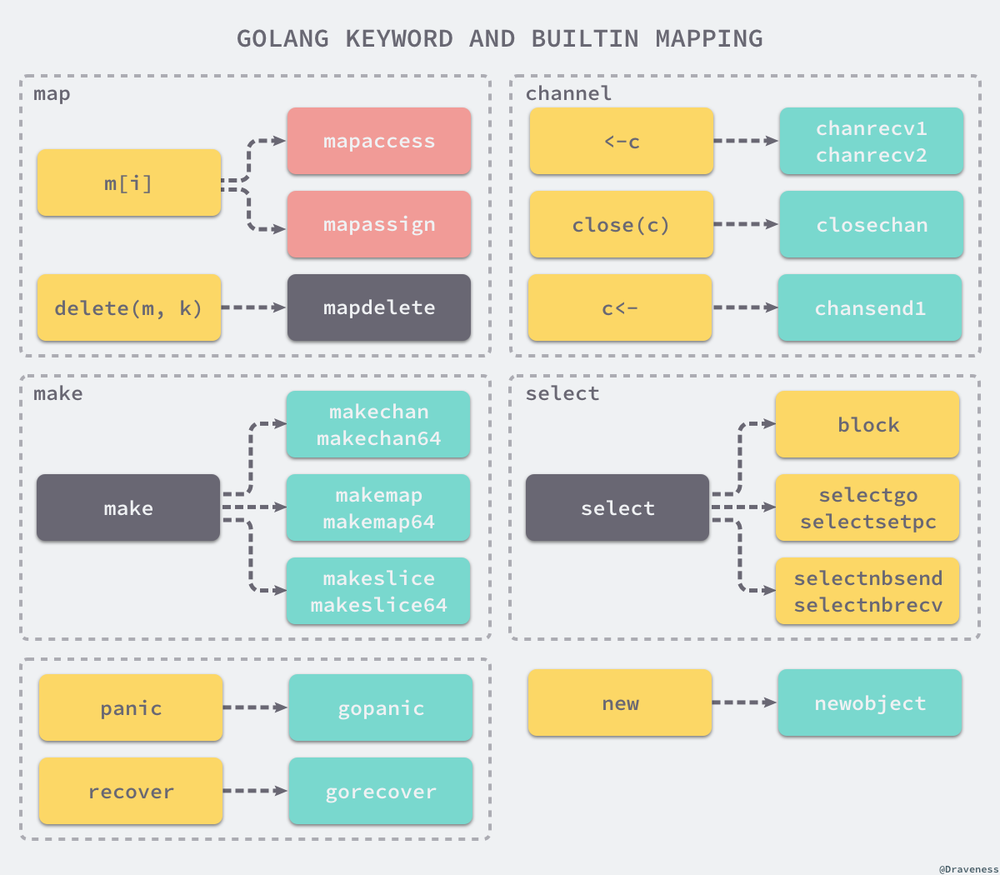

**图 2-13 关键字和操作符和运行时函数的映射**

上图是从关键字或内建函数到其他实际存在的运行时函数的映射，包括 Channel、哈希相关的操作、用于创建结构体对象的 `make`、`new` 关键字以及一些控制流中的关键字 `select` 等。转换后的全部函数都属于运行时 `runtime` 包，我们能在 [`src/cmd/compile/internal/gc/builtin/runtime.go`](https://github.com/golang/go/blob/master/src/cmd/compile/internal/gc/builtin/runtime.go) 文件中找到函数对应的签名和定义。

```
func makemap64(mapType *byte, hint int64, mapbuf *any) (hmap map[any]any)
func makemap(mapType *byte, hint int, mapbuf *any) (hmap map[any]any)
func makemap_small() (hmap map[any]any)
func mapaccess1(mapType *byte, hmap map[any]any, key *any) (val *any)
...
func makechan64(chanType *byte, size int64) (hchan chan any)
func makechan(chanType *byte, size int) (hchan chan any)
...
```

[`src/cmd/compile/internal/gc/builtin/runtime.go`](https://github.com/golang/go/blob/master/src/cmd/compile/internal/gc/builtin/runtime.go) 文件中代码的作用只是让编译器能够找到对应符号的函数定义而已，真正的函数实现都在另一个 [`src/runtime`](https://github.com/golang/go/tree/master/src/runtime) 包中。简单总结一下，编译器会将 Go 语言关键字转换成 `runtime` 包中的函数，也就是说关键字和内置函数的功能是由语言的编译器和运行时共同完成的。

我们简单了解一下遍历节点时几个 Channel 操作是如何转换成运行时对应方法的，首先介绍向 Channel 中发送消息或者从 Channel 中接受消息两个操作，编译器会分别使用 `OSEND` 和 `ORECV` 表示发送和接收消息两个操作，在 [`walkexpr`](https://github.com/golang/go/blob/4d5bb9c60905b162da8b767a8a133f6b4edcaa65/src/cmd/compile/internal/gc/walk.go#L439-L1532) 函数中会根据节点类型的不同进入不同的分支：

```
func walkexpr(n *Node, init *Nodes) *Node {
    ...
    case OSEND:
        n1 := n.Right
        n1 = assignconv(n1, n.Left.Type.Elem(), "chan send")
        n1 = walkexpr(n1, init)
        n1 = nod(OADDR, n1, nil)
        n = mkcall1(chanfn("chansend1", 2, n.Left.Type), nil, init, n.Left, n1)
    ...
}
```

当遇到 `OSEND` 操作时，会使用 `mkcall1` 创建一个操作为 `OCALL` 的节点，这个节点中包含当前调用的函数 `chansend1` 和几个参数，新的 `OCALL` 节点会替换当前的 `OSEND` 节点，这也就完成了对 `OSEND` 子树的改写。


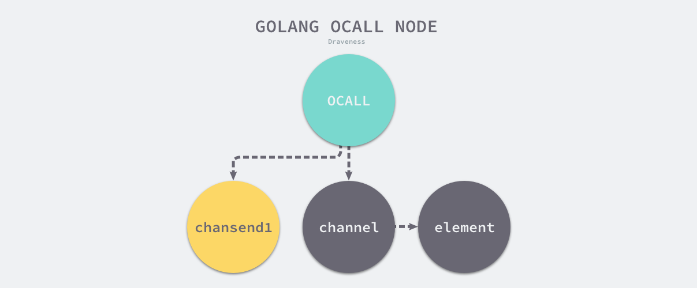

**图 2-14 改写后的 Channel 发送操作**

在中间代码生成的阶段遇到 `ORECV` 操作时，编译器的处理与遇到 `OSEND` 时相差无几，我们也只是将 `chansend1` 换成了 `chanrecv1`，其他的参数没有发生太大的变化：

```
        n = mkcall1(chanfn("chanrecv1", 2, n.Left.Type), nil, &init, n.Left, nodnil())
```

使用 `close` 关键字的 `OCLOSE` 操作也会在 `walkexpr` 函数中被转换成调用 `closechan` 的 `OCALL` 节点：

```
func walkexpr(n *Node, init *Nodes) *Node {
    ...
    case OCLOSE:
        fn := syslook("closechan")
        fn = substArgTypes(fn, n.Left.Type)
        n = mkcall1(fn, nil, init, n.Left)
    ...
}
```


对于 Channel 的这些内置操作都会在编译期间就转换成几个运行时执行的函数，很多人都想要了解 Channel 底层的实现，但是并不知道函数的入口，经过这里的分析我们就知道`chanrecv1`、`chansend1` 和 `closechan` 几个函数分别实现了 Channel 的发送、接受和关闭操作。

2.4.4 SSA 生成

经过 `walk` 系列函数的处理之后，AST 的抽象语法树就不再会改变了，Go 语言的编译器会使用 [`compileSSA`](https://github.com/golang/go/blob/06b12e660c239541c973ea9340f00455b9c5a266/src/cmd/compile/internal/gc/pgen.go#L297-L326) 函数将抽象语法树转换成中间代码，我们可以先看一下该函数的简要实现：

```
func compileSSA(fn *Node, worker int) {
    f := buildssa(fn, worker)
    pp := newProgs(fn, worker)
    genssa(f, pp)
    pp.Flush()
}
```

`buildssa` 就是用来具有 SSA 特性的中间代码的函数，我们可以使用命令行工具来观察当前中间代码的生成过程，假设我们有以下的 Go 语言源代码，其中只包含一个非常简单的 `hello` 函数：

```
package hello
func hello(a int) int {
    c := a + 2
    return c
}
```

我们可以使用 `GOSSAFUNC` 环境变量构建上述代码并获取从源代码到最终的中间代码经历的几十次迭代，所有的数据都被存储到了 `ssa.html` 文件中：

```
$ GOSSAFUNC=hello go build hello.go
# command-line-arguments
dumped SSA to ./ssa.html
```


这个文件中包含源代码对应的抽象语法树、几十个版本的中间代码以及最终生成的 SSA，在这里截取文件中的一部分为大家展示一下，让各位读者对这个文件中的内容有更具体的印象：

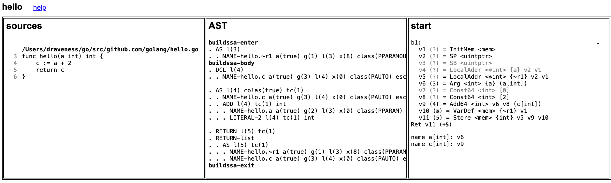

**图 2-15 SSA 中间代码生成过程**

如上图所示，其中最左侧就是源代码，中间是源代码生成的抽象语法树，最右侧是生成的第一轮中间代码，后面还有几十轮，感兴趣的读者可以自己尝试编译一下。`hello` 函数对应的抽象语法树会包含当前函数的 `Enter`、`NBody` 和 `Exit` 三个属性，输出这些属性的工作是由下面的函数 [`buildssa`](https://github.com/golang/go/blob/4d5bb9c60905b162da8b767a8a133f6b4edcaa65/src/cmd/compile/internal/gc/ssa.go#L281-L451) 完成的，你能从这个简化的逻辑中看到上述输出的影子：

```
func buildssa(fn *Node, worker int) *ssa.Func {
    name := fn.funcname()
    var astBuf *bytes.Buffer
    var s state
    fe := ssafn{
        curfn: fn,
        log:   printssa && ssaDumpStdout,
    }
    s.curfn = fn
    s.f = ssa.NewFunc(&fe)
    s.config = ssaConfig
    s.f.Type = fn.Type
    s.f.Config = ssaConfig
    ...
    s.stmtList(fn.Func.Enter)
    s.stmtList(fn.Nbody)
    ssa.Compile(s.f)
    return s.f
}
```

`ssaConfig` 就是我们在这里的第一小节初始化的结构体，其中包含了与 CPU 架构相关的函数和配置，随后的中间代码生成其实也分成两个阶段，第一个阶段是使用 `stmtList` 以及相关函数将抽象语法树转换成中间代码，第二个阶段会调用 [`src/cmd/compile/internal/ssa`](https://github.com/golang/go/tree/master/src/cmd/compile/internal/ssa) 包的 [`Compile`](https://github.com/golang/go/blob/4d5bb9c60905b162da8b767a8a133f6b4edcaa65/src/cmd/compile/internal/ssa/compile.go#L29-L155) 函数对 SSA 中间代码进行多轮的迭代和转换。


#### AST 到 SSA

`stmtList` 方法的主要功能就是为传入数组中的每一个节点调用 [`stmt`](https://github.com/golang/go/blob/4d5bb9c60905b162da8b767a8a133f6b4edcaa65/src/cmd/compile/internal/gc/ssa.go#L1023-L1502) 方法，在这个方法中编译器会根据节点操作符的不同将当前 AST 转换成对应的中间代码：

```
func (s *state) stmt(n *Node) {
    ...
    switch n.Op {
    case OCALLMETH, OCALLINTER:
        s.call(n, callNormal)
        if n.Op == OCALLFUNC && n.Left.Op == ONAME && n.Left.Class() == PFUNC {
            if fn := n.Left.Sym.Name; compiling_runtime && fn == "throw" ||
                n.Left.Sym.Pkg == Runtimepkg && (fn == "throwinit" || fn == "gopanic" || fn == "panicwrap" || fn == "block" || fn == "panicmakeslicelen" || fn == "panicmakeslicecap") {
                m := s.mem()
                b := s.endBlock()
                b.Kind = ssa.BlockExit
                b.SetControl(m)
            }
        }
    case ODEFER:
        s.call(n.Left, callDefer)
    case OGO:
        s.call(n.Left, callGo)
    ...
    }
}
```

从上面节选的代码中我们会发现，在遇到函数调用、方法调用、使用 defer 或者 go 关键字时都会执行 [`call`](https://github.com/golang/go/blob/4d5bb9c60905b162da8b767a8a133f6b4edcaa65/src/cmd/compile/internal/gc/ssa.go#L4324-L4517) 生成调用函数的 SSA 节点，这些在开发者看来不同的概念在编译器中都会被实现成静态的函数调用，上层的关键字和方法其实都是语言为我们提供的**语法糖**：

```
func (s *state) call(n *Node, k callKind) *ssa.Value {
    ...
    var call *ssa.Value
    switch {
    case k == callDefer:
        call = s.newValue1A(ssa.OpStaticCall, types.TypeMem, deferproc, s.mem())
    case k == callGo:
        call = s.newValue1A(ssa.OpStaticCall, types.TypeMem, newproc, s.mem())
    case sym != nil:
        call = s.newValue1A(ssa.OpStaticCall, types.TypeMem, sym.Linksym(), s.mem())
    ..
    }
    ...
}
```

首先，从 AST 到 SSA 的转化过程中，编译器会生成将函数调用的参数放到栈上的中间代码，处理参数之后才会生成一条运行函数的命令 `ssa.OpStaticCall`：

- 如果这里使用的是 defer 关键字，就会插入 `deferproc` 函数；
- 如果使用 go 创建新的 Goroutine 时会插入 `newproc` 函数符号；
- 在遇到其他情况时会插入表示普通函数对应的符号；[`src/cmd/compile/internal/gc/ssa.go`](https://github.com/golang/go/blob/master/src/cmd/compile/internal/gc/ssa.go) 这个拥有将近 7000 行代码的文件包含用于处理不同节点的各种方法，编译器会根据节点类型的不同在一个巨型 switch 语句处理不同的情况，这也是我们在编译器这种独特的场景下才能看到的现象。

```
compiling hello
hello func(int) int
  b1:
    v1 = InitMem <mem>
    v2 = SP <uintptr>
    v3 = SB <uintptr> DEAD
    v4 = LocalAddr <*int> {a} v2 v1 DEAD
    v5 = LocalAddr <*int> {~r1} v2 v1
    v6 = Arg <int> {a}
    v7 = Const64 <int> [0] DEAD
    v8 = Const64 <int> [2]
    v9 = Add64 <int> v6 v8 (c[int])
    v10 = VarDef <mem> {~r1} v1
    v11 = Store <mem> {int} v5 v9 v10
    Ret v11
```

上述代码就是在这个过程生成的，你可以看到中间代码主体中的每一行其实都定义了一个新的变量，这也就是我们在前面提到的具有静态单赋值（SSA）特性的中间代码，如果你使用 `GOSSAFUNC=hello go build hello.go` 命令亲自尝试一下会对这种中间代码有更深的印象。


#### 多轮转换

虽然我们在 `stmt` 以及相关方法中生成了 SSA 中间代码，但是这些中间代码仍然需要编译器进行优化以去掉无用代码并对操作数进行精简，编译器对中间代码的优化过程都是由 [`src/cmd/compile/internal/ssa`](https://github.com/golang/go/tree/master/src/cmd/compile/internal/ssa) 包的 [`Compile`](https://github.com/golang/go/blob/4d5bb9c60905b162da8b767a8a133f6b4edcaa65/src/cmd/compile/internal/ssa/compile.go#L29-L155) 函数执行的：

```
func Compile(f *Func) {
    if f.Log() {
        f.Logf("compiling %s\n", f.Name)
    }
    phaseName := "init"
    for _, p := range passes {
        f.pass = &p
        p.fn(f)
    }
    phaseName = ""
}
```

这是删除了很多打印日志和性能分析功能的 `Compile` 函数，SSA 需要经历的多轮处理也都保存在了 `passes` 变量中，这个变量中存储了每一轮处理的名字、使用的函数以及表示是否必要的 `required` 字段：

```
var passes = [...]pass{
    {name: "number lines", fn: numberLines, required: true},
    {name: "early phielim", fn: phielim},
    {name: "early copyelim", fn: copyelim},
    ...
    {name: "loop rotate", fn: loopRotate},
    {name: "stackframe", fn: stackframe, required: true},
    {name: "trim", fn: trim},
}
```

目前的编译器总共引入了将近 50 个需要执行的过程，我们能在 `GOSSAFUNC=hello go build hello.go` 命令生成的文件中看到每一轮处理后的中间代码，例如最后一个 `trim` 阶段就生成了如下的 SSA 代码：

```
  pass trim begin
  pass trim end [738 ns]
hello func(int) int
  b1:
    v1 = InitMem <mem>
    v10 = VarDef <mem> {~r1} v1
    v2 = SP <uintptr> : SP
    v6 = Arg <int> {a} : a[int]
    v8 = LoadReg <int> v6 : AX
    v9 = ADDQconst <int> [2] v8 : AX (c[int])
    v11 = MOVQstore <mem> {~r1} v2 v9 v10
    Ret v11
```


经过将近 50 轮处理的中间代码相比处理之前已经有了非常大的改变，执行效率会有比较大的提升，多轮的处理已经包含了一些机器特定的修改，包括根据目标架构对代码进行改写，不过这里就不会展开介绍每一轮处理的具体内容了。

### 2.4.5 小结

中间代码的生成过程其实就是从 AST 抽象语法树到 SSA 中间代码的转换过程，在这期间会对语法树中的关键字在进行一次改写，改写后的语法树会经过多轮处理转变成最后的 SSA 中间代码，这里的代码大都是巨型的 switch 语句、复杂的函数以及调用栈，阅读和分析起来也非常困难。

很多 Go 语言中的关键字和内置函数都是在这个阶段被转换成运行时包中方法的，作者在后面的章节会从具体的语言关键字和内置函数的角度介绍一些数据结构和内置函数的实现。

- 中间代码，也被翻译成中间表示，即 Intermediate representation https://en.wikipedia.org/wiki/Intermediate_representation[↩︎](https://www.bookstack.cn/read/draveness-golang/5a89e04c79706261.md#fnref:1)
- 应用程序二进制接口，Application Binary Interface（ABI） https://en.wikipedia.org/wiki/Application_binary_interface[↩︎](https://www.bookstack.cn/read/draveness-golang/5a89e04c79706261.md#fnref:2)


## 2.5 机器码生成

Go 语言编译的最后一个阶段就是根据 SSA 中间代码生成机器码了，这里谈的**机器码就是在目标 CPU 架构上能够运行的二进制代码**，[中间代码生成](https://www.bookstack.cn/read/draveness-golang/5a89e04c79706261.md)一节简单介绍的从抽象语法树到 SSA 中间代码的生成过程，将近 50 个生成中间代码的步骤中有一些过程严格上说是属于机器码生成阶段的。

机器码的生成过程其实就是对 SSA 中间代码的降级（lower）过程，在 SSA 中间代码降级的过程中，编译器将一些值重写成了目标 CPU 架构的特定值，降级的过程处理了所有机器特定的重写规则并对代码进行了一定程度的优化；在 SSA 中间代码生成阶段的最后，Go 函数体的代码会被转换成一系列的 `obj.Prog` 结构体。

### 2.5.1 指令集架构

首先需要介绍的就是指令集架构了，虽然我们在第一节[编译过程概述](https://www.bookstack.cn/read/draveness-golang/9e405d643b49d00e.md)中曾经讲解过指令集架构的相关知识，但是在这里还是需要引入更多的指令集构知识。


**图 2-16 计算机软硬件之间的桥梁**

[指令集架构](https://en.wikipedia.org/wiki/Instruction_set_architecture)是计算机的抽象模型，在很多时候也被称作架构或者计算机架构，它是**计算机软件和硬件之间的接口和桥梁**[1](https://www.bookstack.cn/read/draveness-golang/100aabc3275d17e5.md#fn:1)；

一个为特定指令集架构编写的应用程序能够运行在所有支持这种指令集架构的机器上，也就说如果当前应用程序支持 x86 的指令集，那么就可以运行在所有使用 x86 指令集的机器上，这其实就是抽象层的作用，每一个指令集架构都定义了支持的数据结构、寄存器、管理主内存的硬件支持（例如内存一致、地址模型和虚拟内存）、支持的指令集和 IO 模型，它的引入其实就在软件和硬件之间引入了一个抽象层，让同一个二进制文件能够在不同版本的硬件上运行。

如果一个编程语言想要在所有的机器上运行，它就可以将中间代码转换成使用不同指令集架构的机器码，这可比为不同硬件单独移植要简单的太多了。


**图 2-17 复杂指令集（CISC）和精简指令集（RISC）**

最常见的指令集架构分类方法就是根据指令的复杂度将其分为复杂指令集（CISC）和精简指令集（RISC），复杂指令集架构包含了很多特定的指令，但是其中的一些指令很少会被程序使用，而精简指令集只实现了经常被使用的指令，不常用的操作都会通过组合简单指令来实现。


[复杂指令集](https://en.wikipedia.org/wiki/Complex_instruction_set_computer)的特点就是指令数目多并且复杂，每条指令的字节长度并不相等，**x86 就是常见的复杂指令集处理器**，它的指令长度大小范围非常广，从 1 到 15 字节不等，对于长度不固定的指令，计算机必须额外对指令进行判断，这需要付出额外的性能损失[2](https://www.bookstack.cn/read/draveness-golang/100aabc3275d17e5.md#fn:2)。


而[精简指令集](https://en.wikipedia.org/wiki/Reduced_instruction_set_computer)对指令的数目和寻址方式做了精简，大大减少指令数量的同时更容易实现，指令集中的每一个指令都使用标准的字节长度、执行时间相比复杂指令集会少很多，处理器在处理指令时也可以流水执行，提高了对并行的支持，**作为一种常见的精简指令集处理器，amd 使用 4 个字节作为指令的固定长度**，省略了判断指令的性能损失[3](https://www.bookstack.cn/read/draveness-golang/100aabc3275d17e5.md#fn:3)，精简指令集其实就是利用了我们耳熟能详的 20/80 原则，用 20% 的基础指令和它们的组合来解决问题。


最开始的计算机使用复杂指令集是因为当时计算机的性能和内存比较有限，业界需要尽可能地减少机器需要执行的指令，所以更倾向于高度编码、长度不等以及多操作数的指令，但是随着性能的飞速提升，就出现了精简指令集这种牺牲代码密度换取简单实现的设计，不仅如此，硬件的飞速提升还带来了更多的寄存器和更高的时钟频率，软件开发人员也不再直接接触汇编代码，而是通过编译器和汇编器生成指令，复杂的机器指定对于编译器来说很难利用，所以精简的指令在这种场景下更适合。

复杂指令集和精简指令集的使用其实是一种权衡，经过这么多年的发展，两种指令集也相互借鉴和学习，与最开始刚被设计出来时已经有了较大的差别，对于软件工程师来讲，复杂的硬件设备对于我们来说已经是领域下两层的知识了，其实不太需要掌握太多，但是对指令集架构感兴趣的读者可以简单找一些资料开拓眼界。


### 2.5.2 机器码生成

机器码的生成在 Go 的编译器中主要由两部分协同工作，其中一部分是负责 SSA 中间代码降级和根据目标架构进行特定处理的 [`src/cmd/compile/internal/ssa`](https://github.com/golang/go/tree/master/src/cmd/compile/internal/ssa) 包，另一部分是负责生成机器码的 [`src/cmd/internal/obj`](https://github.com/golang/go/tree/master/src/cmd/internal/obj)[4](https://www.bookstack.cn/read/draveness-golang/100aabc3275d17e5.md#fn:4)：

- [`src/cmd/compile/internal/ssa`](https://github.com/golang/go/tree/master/src/cmd/compile/internal/ssa) 主要负责对 SSA 中间代码进行降级、执行架构特定的优化和重写并生成 `obj.Prog` 指令；
- [`src/cmd/internal/obj`](https://github.com/golang/go/tree/master/src/cmd/internal/obj) 作为一个汇编器会将这些指令最终转换成机器码完成这次的编译；

#### SSA 降级

SSA 的降级是在中间代码生成的过程中完成的，其中将近 50 轮处理的过程中，`lower` 以及后面的阶段都属于 SSA 降级这一过程，这么多轮的处理会将 SSA 转换成机器特定的操作：

```
var passes = [...]pass{
    ...
    {name: "lower", fn: lower, required: true},
    {name: "lowered deadcode for cse", fn: deadcode}, // deadcode immediately before CSE avoids CSE making dead values live again
    {name: "lowered cse", fn: cse},
    ...
    {name: "trim", fn: trim}, // remove empty blocks
}
```

SSA 降级执行的第一个阶段就是 `lower`，该阶段的入口方法就是 [`src/cmd/compile/internal/ssa/lower.go`](https://github.com/golang/go/blob/master/src/cmd/compile/internal/ssa/lower.go) 文件中的 [`lower`](https://github.com/golang/go/blob/c170b14c2c1cfb2fd853a37add92a82fd6eb4318/src/cmd/compile/internal/ssa/lower.go#L8-L11) 函数，它会将 SSA 的中间代码转换成机器特定的指令：

```
func lower(f *Func) {
    applyRewrite(f, f.Config.lowerBlock, f.Config.lowerValue)
}
```

向 `applyRewrite` 传入的两个函数 `lowerBlock` 和 `lowerValue` 是在[中间代码生成](https://www.bookstack.cn/read/draveness-golang/5a89e04c79706261.md)阶段初始化 SSA 配置时确定的，这两个函数会分别转换一个函数中的代码块和代码块中的值。

假设目标机器使用 x86 的架构，最终会调用 [`rewriteBlock386`](https://github.com/golang/go/blob/c170b14c2c1cfb2fd853a37add92a82fd6eb4318/src/cmd/compile/internal/ssa/rewrite386.go#L21977-L23093) 和 [`rewriteValue386`](https://github.com/golang/go/blob/c170b14c2c1cfb2fd853a37add92a82fd6eb4318/src/cmd/compile/internal/ssa/rewrite386.go#L9-L709) 两个函数，这两个函数是两个巨大的 switch/case，前者总共有 2000 多行，后者将近 700 行，用于处理 x86 架构重写的函数总共有将近 30000 行代码，你能在 [`src/cmd/compile/internal/ssa/rewrite386.go`](https://github.com/golang/go/blob/master/src/cmd/compile/internal/ssa/rewrite386.go) 这里找到文件的全部内容，我们只节选其中的一段简单展示一下：

```
func rewriteValue386(v *Value) bool {
    switch v.Op {
    case Op386ADCL:
        return rewriteValue386_Op386ADCL_0(v)
    case Op386ADDL:
        return rewriteValue386_Op386ADDL_0(v) || rewriteValue386_Op386ADDL_10(v) || rewriteValue386_Op386ADDL_20(v)
    ...
    }
}
func rewriteValue386_Op386ADCL_0(v *Value) bool {
    // match: (ADCL x (MOVLconst [c]) f)
    // cond:
    // result: (ADCLconst [c] x f)
    for {
        _ = v.Args[2]
        x := v.Args[0]
        v_1 := v.Args[1]
        if v_1.Op != Op386MOVLconst {
            break
        }
        c := v_1.AuxInt
        f := v.Args[2]
        v.reset(Op386ADCLconst)
        v.AuxInt = c
        v.AddArg(x)
        v.AddArg(f)
        return true
    }
    ...
}
```

重写的过程会将通用的 SSA 中间代码转换成目标架构特定的指令，上述的 `rewriteValue386_Op386ADCL_0` 函数就会使用 `ADCLconst` 替换 `ADCL` 和 `MOVLconst` 两条指令，它能通过对指令的压缩和优化减少在目标硬件上执行所需要的时间和资源。

我们在上一节中间代码生成中已经介绍过 `compileSSA` 中调用 `buildssa` 的执行过程，我们在这里继续介绍 `buildssa` 函数返回之后的逻辑：

```
func compileSSA(fn *Node, worker int) {
    f := buildssa(fn, worker)
    pp := newProgs(fn, worker)
    defer pp.Free()
    genssa(f, pp)
    pp.Flush()
}
```

[`genssa`](https://github.com/golang/go/blob/075c20cea8a1efda0e8d5d33a1995a220ad27b8c/src/cmd/compile/internal/gc/ssa.go#L5899-L6226) 函数会创建一个新的 `obj.Progs` 结构并将生成的 SSA 中间代码都存入新建的结构体中，我们在 2.4.4 SSA 生成中得到的 `ssa.html` 文件中就包含最后生成的中间代码：


**图 2-18 genssa 的执行结果**

上述输出结果跟最后生成的汇编代码其实已经非常相似了，随后调用的 [`Flush`](https://github.com/golang/go/blob/075c20cea8a1efda0e8d5d33a1995a220ad27b8c/src/cmd/compile/internal/gc/gsubr.go#L92-L95) 函数就会使用 [`src/cmd/internal/obj`](https://github.com/golang/go/tree/master/src/cmd/internal/obj) 包中的汇编器将 SSA 转换成汇编代码：

```
func (pp *Progs) Flush() {
    plist := &obj.Plist{Firstpc: pp.Text, Curfn: pp.curfn}
    obj.Flushplist(Ctxt, plist, pp.NewProg, myimportpath)
}
```

`buildssa` 中的 `lower` 和随后的多个阶段会对 SSA 进行转换、检查和优化，生成机器特定的中间代码，接下来通过 `genssa` 将代码输出到 `Progs` 对象中，这也是代码进入汇编器前的最后一个步骤。


#### 汇编器

汇编器是将汇编语言翻译为机器语言的程序，Go 语言的汇编器是基于 Plan 9 汇编器的输入类型设计的，Go 语言对于汇编语言 Plan 9 和汇编器的资料十分缺乏，网上能够找到的资料也大多都含糊不清，官方对汇编器在不同处理器架构上的实现细节也没有明确定义：

> The details vary with architecture, and we apologize for the imprecision; the situation is **not well-defined**.[5](https://www.bookstack.cn/read/draveness-golang/100aabc3275d17e5.md#fn:5)

我们在研究汇编器和汇编语言时不应该陷入细节，只需要理解汇编语言的执行逻辑就能够帮助我们快速读懂汇编代码。当我们将如下的代码编译成汇编指令时，会得到如下的内容：

```
$ cat hello.go
package hello
func hello(a int) int {
    c := a + 2
    return c
}
$ GOOS=linux GOARCH=amd64 go tool compile -S main.go
"".hello STEXT nosplit size=15 args=0x10 locals=0x0
    0x0000 00000 (main.go:3)    TEXT    "".hello(SB), NOSPLIT, $0-16
    0x0000 00000 (main.go:3)    FUNCDATA    $0, gclocals·33cdeccccebe80329f1fdbee7f5874cb(SB)
    0x0000 00000 (main.go:3)    FUNCDATA    $1, gclocals·33cdeccccebe80329f1fdbee7f5874cb(SB)
    0x0000 00000 (main.go:3)    FUNCDATA    $3, gclocals·33cdeccccebe80329f1fdbee7f5874cb(SB)
    0x0000 00000 (main.go:4)    PCDATA    $2, $0
    0x0000 00000 (main.go:4)    PCDATA    $0, $0
    0x0000 00000 (main.go:4)    MOVQ    "".a+8(SP), AX
    0x0005 00005 (main.go:4)    ADDQ    $2, AX
    0x0009 00009 (main.go:5)    MOVQ    AX, "".~r1+16(SP)
    0x000e 00014 (main.go:5)    RET
    0x0000 48 8b 44 24 08 48 83 c0 02 48 89 44 24 10 c3     H.D$.H...H.D$..
...
```

上述汇编代码都是由 [`Flushplist`](https://github.com/golang/go/blob/b2482e481722357c6daa98ef074d8eaf8ac4baf3/src/cmd/internal/obj/plist.go#L22-L114) 这个函数生成的，该函数会调用架构特定的 `Preprocess` 和 `Assemble` 方法：

```
func Flushplist(ctxt *Link, plist *Plist, newprog ProgAlloc, myimportpath string) {
    ...
    for _, s := range text {
        mkfwd(s)
        linkpatch(ctxt, s, newprog)
        ctxt.Arch.Preprocess(ctxt, s, newprog)
        ctxt.Arch.Assemble(ctxt, s, newprog)
        linkpcln(ctxt, s)
        ctxt.populateDWARF(plist.Curfn, s, myimportpath)
    }
}
```

`Preprocess` 和 `Assemble` 这两个方法其实是在 Go 编译器最外层的主函数就确定了，我们在 2.1.4 中提到过的 `archInits` 函数会根据目标硬件对当前架构使用的配置进行初始化。

如果目标机器的架构是 x86，那么这两个函数最终会使用 [`preprocess`](https://github.com/golang/go/blob/b2482e481722357c6daa98ef074d8eaf8ac4baf3/src/cmd/internal/obj/x86/obj6.go#L565-L916) 和 [`span6`](https://github.com/golang/go/blob/498eaee461adefd5e578e62c134382ece94198da/src/cmd/internal/obj/x86/asm6.go#L1848-L2003)，作者在这里就不展开介绍这两个特别复杂的底层函数了，有兴趣的读者可以通过上述链接找到目标函数的位置了解预处理和汇编的处理过程，机器码的生成也都是由这两个函数组合完成的。

### 2.5.3 小结

机器码生成作为 Go 语言编译的最后一步，其实已经到了硬件和机器指令这一层，其中对于内存、寄存器的处理非常复杂并且难以阅读，想要真正掌握这里的处理的步骤和原理还是需要非常多的精力，但是作为软件工程师来说，如果不是 Go 语言编译器的开发者或者需要经常处理汇编语言和机器指令，掌握这些知识的投资回报率实在太低，没有太多的必要，我们在这里只需要对这个过程有所了解，补全知识上的盲点，这样在遇到问题时能够快速定位。

- Instruction set architecture https://en.wikipedia.org/wiki/Instruction_set_architecture[↩︎](https://www.bookstack.cn/read/draveness-golang/100aabc3275d17e5.md#fnref:1)
- 复杂指令集 Complex instruction set computer https://en.wikipedia.org/wiki/Complex_instruction_set_computer[↩︎](https://www.bookstack.cn/read/draveness-golang/100aabc3275d17e5.md#fnref:2)
- 精简指令集 Reduced instruction set computer https://en.wikipedia.org/wiki/Reduced_instruction_set_computer[↩︎](https://www.bookstack.cn/read/draveness-golang/100aabc3275d17e5.md#fnref:3)
- Introduction to the Go compiler https://github.com/golang/go/blob/master/src/cmd/compile/README.md[↩︎](https://www.bookstack.cn/read/draveness-golang/100aabc3275d17e5.md#fnref:4)
- A Quick Guide to Go's Assembler https://golang.org/doc/asm[↩︎](https://www.bookstack.cn/read/draveness-golang/100aabc3275d17e5.md#fnref:5)

## 2.6 推荐阅读

- [Introduction to the Go compiler](https://github.com/golang/go/tree/master/src/cmd/compile)
- [Go 1.5 Bootstrap Plan](https://docs.google.com/document/d/1OaatvGhEAq7VseQ9kkavxKNAfepWy2yhPUBs96FGV28/edit)
- [A Manual for the Plan 9 assembler](https://9p.io/sys/doc/asm.html)
- [Lexical Scanning in Go - Rob Pike](https://www.youtube.com/watch?v=HxaD_trXwRE)

## 2.7 总结

到这里，整个 Go 语言编译的过程也都介绍完了，从[词法与语法分析](https://www.bookstack.cn/read/draveness-golang/a81e1b5a6b7b28bc.md)、[类型检查](https://www.bookstack.cn/read/draveness-golang/7ab240185c175c73.md)、[中间代码生成](https://www.bookstack.cn/read/draveness-golang/5a89e04c79706261.md)到最后的[机器码生成](https://www.bookstack.cn/read/draveness-golang/100aabc3275d17e5.md)，包含的内容非常复杂，不过经过分析我们已经能够对 Go 语言编译器的原理有足够的了解，也对相关特性的实现更加清楚，后面的章节会介绍一些具体特性的原理，这些原理会依赖于编译期间的一些步骤，所以我们在深入理解 Go 语言的特性之前还是需要先了解一些编译期间完成的工作。


# 第三章 数据结构

- [3.1 数组](https://www.bookstack.cn/read/draveness-golang/79255565262cc9f6.md)
- [3.2 切片](https://www.bookstack.cn/read/draveness-golang/bc59e924b285e5e9.md)
- [3.3 哈希表](https://www.bookstack.cn/read/draveness-golang/8a6fa5746b8fbe7e.md)
- [3.4 字符串](https://www.bookstack.cn/read/draveness-golang/0bc3143426c7b7ea.md)
- [3.5 推荐阅读](https://www.bookstack.cn/read/draveness-golang/4f0f4af7cd96ea0e.md)


## 3.1 数组

数组和切片是 Go 语言中常见的数据结构，很多刚刚使用 Go 的开发者往往会混淆这两个概念，数组作为最常见的集合在编程语言中是非常重要的，除了数组之外，Go 语言引入了另一个概念 — 切片，切片与数组有一些类似，但是它们的不同之处导致使用上会产生巨大的差别。我们在这一节中会从 Go 语言的[编译期间](https://www.bookstack.cn/read/draveness-golang/9e405d643b49d00e.md)运行时来介绍数组的底层实现原理，其中会包括数组的初始化、访问和赋值几种常见操作。


### 3.1.1 概述

数组是由相**同类型元素**的集合组成的数据结构，计算机会为数组分配一块**连续的内存**来保存其中的元素，我们可以利用数组中元素的索引快速访问元素对应的存储地址，常见的数组大多都是一维的线性数组，而多维数组在数值和图形计算领域却有比较常见的应用[1](https://www.bookstack.cn/read/draveness-golang/79255565262cc9f6.md#fn:1)。

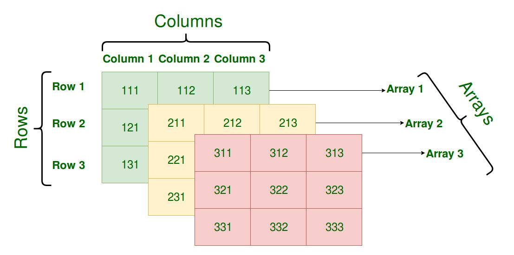

**图 3-1 多维数组**

数组作为一种基本的数据类型，我们通常都会从两个维度描述数组，我们首先需要描述数组中存储的元素类型，还需要描述数组最大能够存储的元素个数，在 Go 语言中我们往往会使用如下所示的方式来表示数组类型：

```
[10]int
[200]interface{}
```

与很多语言不同，**Go 语言中数组在初始化之后大小就无法改变，存储元素类型相同、但是大小不同的数组类型在 Go 语言看来也是完全不同的，只有两个条件都相同才是同一个类型**。

```
func NewArray(elem *Type, bound int64) *Type {
    if bound < 0 {
        Fatalf("NewArray: invalid bound %v", bound)
    }
    t := New(TARRAY)
    t.Extra = &Array{Elem: elem, Bound: bound}
    t.SetNotInHeap(elem.NotInHeap())
    return t
}
```

编译期间的数组类型是由上述的 [`cmd/compile/internal/types.NewArray`](https://github.com/golang/go/blob/616c39f6a636166447bdaac4f0871a5ca52bae8c/src/cmd/compile/internal/types/type.go#L473-L481) 函数生成的，类型 `Array` 包含两个字段，一个是元素类型 `Elem`，另一个是数组的大小 `Bound（范围、界）`，这两个字段共同构成了数组类型，而当前数组是否应该在堆栈中初始化也在编译期就确定了。


### 3.1.2 初始化

Go 语言中的数组有两种不同的创建方式，一种是显式的指定数组的大小，另一种是使用 `[…]T` 声明数组，Go 语言会在编译期间通过源代码对数组的大小进行**推断**：

```
arr1 := [3]int{1, 2, 3}
arr2 := [...]int{1, 2, 3}
```

上述两种声明方式在运行期间得到的结果是完全相同的，**后一种声明方式在编译期间就会被『转换』成为前一种**，这也就是编译器对数组大小的推导，下面我们来介绍编译器的推导过程。

#### 上限推导

两种不同的声明方式会导致编译器做出完全不同的处理，如果我们使用第一种方式 `[10]T`，那么变量的类型在编译进行到[类型检查](https://www.bookstack.cn/read/draveness-golang/7ab240185c175c73.md)阶段就会被提取出来，随后会使用 [`cmd/compile/internal/types.NewArray`](https://github.com/golang/go/blob/616c39f6a636166447bdaac4f0871a5ca52bae8c/src/cmd/compile/internal/types/type.go#L473-L481) 函数创建包含数组大小的 `Array` 类型。

当我们使用 `[…]T` 的方式声明数组时，虽然在这一步也会创建一个 `Array` 类型 `Array{Elem: elem, Bound: -1}`，但是其中的数组大小上限会是 `-1`，这里的 `-1` 只是一个占位符，编译器会在后面的 [`cmd/compile/internal/gc.typecheckcomplit`](https://github.com/golang/go/blob/b7d097a4cf6b8a9125e4770b54d33826fa803023/src/cmd/compile/internal/gc/typecheck.go#L2755-L2961) 函数中对该数组的大小进行推导：

```golang
func typecheckcomplit(n *Node) (res *Node) {
    ...
    switch t.Etype {
    case TARRAY, TSLICE:
        var length, i int64
        nl := n.List.Slice()
        for i2, l := range nl {
            i++
            if i > length {
                length = i
            }
        }
        if t.IsDDDArray() {
            t.SetNumElem(length)
        }
    }
}
```

这个删减后的 [`cmd/compile/internal/gc.typecheckcomplit`](https://github.com/golang/go/blob/b7d097a4cf6b8a9125e4770b54d33826fa803023/src/cmd/compile/internal/gc/typecheck.go#L2755-L2961) 函数通过**遍历元素的方式**来计算数组中元素的数量。上述代码中的 `DDDArray` 指的就是使用 `[…]T` 声明的数组，因为声明这种数组时需要使用三个点（**Dot**），所以在编译器中就被称作 `DDDArray`。

所以我们可以看出 `[…]T{1, 2, 3}` 和 `[3]T{1, 2, 3}` 在运行时是完全等价的，`[…]T` 这种初始化方式也只是 Go 语言为我们提供的一种**语法糖**，当我们不想计算数组中的元素个数时就可以通过这种方法较少一些工作。


#### 语句转换

对于一个由字面量组成的数组，根据数组元素数量的不同，编译器会在负责初始化字面量的 [`cmd/compile/internal/gc.anylit`](https://github.com/golang/go/blob/f07059d949057f414dd0f8303f93ca727d716c62/src/cmd/compile/internal/gc/sinit.go#L875-L967) 函数中做两种不同的优化：

- 当元素数量小于或者等于 4 个时，会直接将数组中的元素放置在**栈**上；
- 当元素数量大于 4 个时，会将数组中的元素放置到**静态区**并在运行时取出；

```
func anylit(n *Node, var_ *Node, init *Nodes) {
    t := n.Type
    switch n.Op {
    case OSTRUCTLIT, OARRAYLIT:
        if n.List.Len() > 4 {
            ...
        }
        fixedlit(inInitFunction, initKindLocalCode, n, var_, init)
    ...
    }
}
```

当数组的元素**小于或者等于四个**时，[`cmd/compile/internal/gc.fixedlit`](https://github.com/golang/go/blob/f07059d949057f414dd0f8303f93ca727d716c62/src/cmd/compile/internal/gc/sinit.go#L515-L583) 会负责在函数编译之前将 `[3]{1, 2, 3}` 转换成更加原始的语句：

```
func fixedlit(ctxt initContext, kind initKind, n *Node, var_ *Node, init *Nodes) {
    var splitnode func(*Node) (a *Node, value *Node)
    ...
    for _, r := range n.List.Slice() {
        a, value := splitnode(r)
        a = nod(OAS, a, value)
        a = typecheck(a, ctxStmt)
        switch kind {
        case initKindStatic:
            genAsStatic(a)
        case initKindLocalCode:
            a = orderStmtInPlace(a, map[string][]*Node{})
            a = walkstmt(a)
            init.Append(a)
        }
    }
}
```

当数组中元素的个数小于四个时，[`cmd/compile/internal/gc.fixedlit`](https://github.com/golang/go/blob/f07059d949057f414dd0f8303f93ca727d716c62/src/cmd/compile/internal/gc/sinit.go#L515-L583) 函数接受的 `kind` 是 `initKindLocalCode`，上述代码会将原有的初始化语句 `[3]int{1, 2, 3}` 拆分成一个声明变量的表达式和几个赋值表达式，这些表达式会完成对数组的初始化：

```
var arr [3]int
arr[0] = 1
arr[1] = 2
arr[2] = 3
```

但是如果当前数组的元素大于 4 个，`anylit` 方法会先获取一个唯一的 `staticname`，然后调用 [`cmd/compile/internal/gc.fixedlit`](https://github.com/golang/go/blob/f07059d949057f414dd0f8303f93ca727d716c62/src/cmd/compile/internal/gc/sinit.go#L515-L583) 函数在静态存储区初始化数组中的元素并将临时变量赋值给当前的数组：

```
func anylit(n *Node, var_ *Node, init *Nodes) {
    t := n.Type
    switch n.Op {
    case OSTRUCTLIT, OARRAYLIT:
        if n.List.Len() > 4 {
            vstat := staticname(t)
            vstat.Name.SetReadonly(true)
            fixedlit(inNonInitFunction, initKindStatic, n, vstat, init)
            a := nod(OAS, var_, vstat)
            a = typecheck(a, ctxStmt)
            a = walkexpr(a, init)
            init.Append(a)
            break
        }
        ...
    }
}
```

假设我们在代码中初始化 `[]int{1, 2, 3, 4, 5}` 数组，那么我们可以将上述过程理解成以下的伪代码：

```
var arr [5]int
statictmp_0[0] = 1
statictmp_0[1] = 2
statictmp_0[2] = 3
statictmp_0[3] = 4
statictmp_0[4] = 5
arr = statictmp_0
```

总结起来，如果数组中元素的个数小于或者等于 4 个，那么所有的变量会直接在栈上初始化，如果数组元素大于 4 个，变量就会在静态存储区初始化然后拷贝到栈上，这些转换后的代码才会继续进入[中间代码生成](https://www.bookstack.cn/read/draveness-golang/5a89e04c79706261.md)和[机器码生成](https://www.bookstack.cn/read/draveness-golang/100aabc3275d17e5.md)两个阶段，最后生成可以执行的二进制文件。


### 3.1.3 访问和赋值

无论是在栈上还是静态存储区，**数组在内存中其实就是一连串的内存空间**，表示数组的方法就是**一个指向数组开头的指针、数组中元素的数量以及数组中元素类型占的空间大小**，如果我们不知道数组中元素的数量，访问时就可能发生越界，而如果不知道数组中元素类型的大小，就没有办法知道应该一次取出多少字节的数据，如果没有这些信息，我们就无法知道这片连续的内存空间到底存储了什么数据：


**图 3-2 数组的内存空间**

**数组访问越界是非常严重的错误**，Go 语言中对越界的判断是可以在编译期间由静态类型检查完成的，

[`cmd/compile/internal/gc.typecheck1`](https://github.com/golang/go/blob/b7d097a4cf6b8a9125e4770b54d33826fa803023/src/cmd/compile/internal/gc/typecheck.go#L327-L2081) 函数会对访问数组的索引进行验证：

```
func typecheck1(n *Node, top int) (res *Node) {
    switch n.Op {
    case OINDEX:
        ok |= ctxExpr
        l := n.Left  // array
        r := n.Right // index
        switch n.Left.Type.Etype {
        case TSTRING, TARRAY, TSLICE:
            ...
            if n.Right.Type != nil && !n.Right.Type.IsInteger() {
                yyerror("non-integer array index %v", n.Right)
                break
            }
            if !n.Bounded() && Isconst(n.Right, CTINT) {
                x := n.Right.Int64()
                if x < 0 {
                    yyerror("invalid array index %v (index must be non-negative)", n.Right)
                } else if n.Left.Type.IsArray() && x >= n.Left.Type.NumElem() {
                    yyerror("invalid array index %v (out of bounds for %d-element array)", n.Right, n.Left.Type.NumElem())
                }
            }
        }
    ...
    }
}
```

- 访问数组的索引是非整数时会直接报错 —— `non-integer array index %v`；

- 访问数组的索引是负数时会直接报错 —— `"invalid array index %v (index must be non-negative)"`；

- 访问数组的索引越界时会直接报错 —— `"invalid array index %v (out of bounds for %d-element array)"`；

  

数组和字符串的一些简单越界错误都会在编译期间发现，比如我们直接使用整数或者常量访问数组，但是如果使用变量index去访问数组或者字符串时，编译器就无法发现对应的错误了，这时就需要 Go 语言运行时发挥作用了(panic: runtime error)：

```
arr[4]: invalid array index 4 (out of bounds for 3-element array)
arr[i]: panic: runtime error: index out of range [4] with length 3
```

Go 语言运行时在发现数组、切片和字符串的越界操作会由运行时的 `panicIndex` 和 [`runtime.goPanicIndex`](https://github.com/golang/go/blob/22d28a24c8b0d99f2ad6da5fe680fa3cfa216651/src/runtime/panic.go#L86-L89) 函数触发程序的运行时错误并导致崩溃退出：

```
TEXT runtime·panicIndex(SB),NOSPLIT,$0-8
    MOVL    AX, x+0(FP)
    MOVL    CX, y+4(FP)
    JMP    runtime·goPanicIndex(SB)
func goPanicIndex(x int, y int) {
    panicCheck1(getcallerpc(), "index out of range")
    panic(boundsError{x: int64(x), signed: true, y: y, code: boundsIndex})
}
```

当数组的访问操作 `OINDEX` 成功通过编译器的检查之后，会被转换成几个 SSA 指令，假设我们有如下所示的 Go 语言代码，通过如下的方式进行编译会得到 `ssa.html` 文件：

```
package check
func outOfRange() int {
    arr := [3]int{1, 2, 3}
    i := 4
    elem := arr[i]
    return elem
}
$ GOSSAFUNC=outOfRange go build array.go
dumped SSA to ./ssa.html
```


`start` 阶段生成的 SSA 代码就是优化之前的第一版中间代码，下面展示的部分就是 `elem := arr[i]` 对应的中间代码，在这段中间代码中我们发现 Go 语言为数组的访问操作生成了判断数组上限的指令 `IsInBounds` 以及当条件不满足时触发程序崩溃的 `PanicBounds` 指令：

```
b1:
    ...
    v22 (6) = LocalAddr <*[3]int> {arr} v2 v20
    v23 (6) = IsInBounds <bool> v21 v11
If v23 → b2 b3 (likely) (6)
b2: ← b1-
    v26 (6) = PtrIndex <*int> v22 v21
    v27 (6) = Copy <mem> v20
    v28 (6) = Load <int> v26 v27 (elem[int])
    ...
Ret v30 (+7)
b3: ← b1-
    v24 (6) = Copy <mem> v20
    v25 (6) = PanicBounds <mem> [0] v21 v11 v24
Exit v25 (6)
```

`PanicBounds` 指令最终会被转换成上面提到的 `panicIndex` 函数，当数组下标没有越界时，编译器会先获取数组的内存地址和访问的下标，然后利用 `PtrIndex` 计算出目标元素的地址，再使用 `Load` 操作将指针中的元素加载到内存中。

当然只有当编译器无法对数组下标是否越界无法做出判断时才会加入 `PanicBounds` 指令交给运行时进行判断，在使用字面量整数访问数组下标时就会生成非常简单的中间代码，当我们将上述代码中的 `arr[i]` 改成 `arr[2]` 时，就会得到如下所示的代码：

```
b1:
    ...
    v21 (5) = LocalAddr <*[3]int> {arr} v2 v20
    v22 (5) = PtrIndex <*int> v21 v14
    v23 (5) = Load <int> v22 v20 (elem[int])
    ...
```

Go 语言对于数组的访问还是有着比较多的检查的，它不仅会在编译期间提前发现一些简单的越界错误并插入用于检测数组上限的函数调用，而在运行期间这些插入的函数会负责保证不会发生越界错误。

数组的赋值和更新操作 `a[i] = 2` 也会生成 SSA 生成期间计算出数组当前元素的内存地址，然后修改当前内存地址的内容，这些赋值语句会被转换成如下所示的 SSA 操作：

```
b1:
    ...
    v21 (5) = LocalAddr <*[3]int> {arr} v2 v19
    v22 (5) = PtrIndex <*int> v21 v13
    v23 (5) = Store <mem> {int} v22 v20 v19
    ...
```

赋值的过程中会先确定目标数组的地址，再通过 `PtrIndex` 获取目标元素的地址，最后使用 `Store` 指令将数据存入地址中，从上面的这些 SSA 代码中我们可以看出无论是数组的寻址还是赋值都是在编译阶段完成的，没有运行时的参与。

### 3.1.4 小结

数组是 Go 语言中重要的数据结构，了解它的实现能够帮助我们更好地理解这门语言，通过对其实现的分析，我们知道了对数组的访问和赋值需要同时依赖编译器和运行时，它的大多数操作在[编译期间](https://www.bookstack.cn/read/draveness-golang/9e405d643b49d00e.md)都会转换成对内存的直接读写，在中间代码生成期间，编译器还会插入运行时方法 `panicIndex` 调用防止发生越界错误。

- Array data structure, https://en.wikipedia.org/wiki/Array_data_structure[↩︎](https://www.bookstack.cn/read/draveness-golang/79255565262cc9f6.md#fnref:1)


## 3.2 切片

我们在上一节介绍的数组在 Go 语言中没那么常用，更常用的数据结构其实是切片，**切片就是动态数组**，它的长度并不固定，我们可以随意向切片中追加元素，而切片会在容量不足时自动扩容。

在 Go 语言中，切片类型的声明方式与数组有一些相似，由于切片的长度是动态的，所以声明时只需要指定切片中的元素类型：

```
[]int
[]interface{}
```

从切片的定义我们能推测出，切片在编译期间的生成的类型只会包含切片中的元素类型，即 `int` 或者 `interface{}` 等。[`cmd/compile/internal/types.NewSlice`](https://github.com/golang/go/blob/616c39f6a636166447bdaac4f0871a5ca52bae8c/src/cmd/compile/internal/types/type.go#L484-L496) 就是编译期间用于创建 `Slice` 类型的函数：

```
func NewSlice(elem *Type) *Type {
    if t := elem.Cache.slice; t != nil {
        if t.Elem() != elem {
            Fatalf("elem mismatch")
        }
        return t
    }
    t := New(TSLICE)
    t.Extra = Slice{Elem: elem}
    elem.Cache.slice = t
    return t
}
```

上述方法返回的结构体 `TSLICE` 中的 `Extra` 字段是一个只包含切片内元素类型的 `Slice{Elem: elem}` 结构，也就是说**切片内元素的类型是在编译期间确定的**，编译器确定了类型之后，会将类型存储在 `Extra` 字段中帮助程序在运行时动态获取。


### 3.2.1 数据结构

编译期间的切片是 `Slice` 类型的，但是在运行时切片由如下的 `SliceHeader` 结构体表示，其中 **`Data` 字段是指向数组的指针**，`Len` 表示当前切片的长度，而 `Cap` 表示当前切片的容量，也就是 `Data` 数组的大小：

```
type SliceHeader struct {
    Data uintptr
    Len  int
    Cap  int
}
```

`Data` 作为一个指针指向的数组是一片连续的内存空间，这片内存空间可以用于存储切片中保存的全部元素，数组中的元素只是逻辑上的概念，底层存储其实都是连续的，所以我们可以将切片理解成一片连续的内存空间加上长度与容量的标识。


**图 3-3 Go 语言切片结构体**

从上图我们会发现切片与数组的关系非常密切，切片引入了一个抽象层，提供了对数组中部分片段的引用，作为数组的引用，我们可以在运行区间可以修改它的长度，如果底层的数组长度不足就会触发扩容机制，切片中的数组就会发生变化，不过在上层看来切片时没有变化的，上层只需要与切片打交道不需要关心底层的数组变化。

我们在上一节介绍过，获取数组大小、对数组中的元素的读写在编译期间就已经进行了简化，由于数组的内存固定且连续，很多操作都会变成对内存的直接读写。但是切片是运行时才会确定内容的结构，所有的操作还需要依赖 Go 语言的运行时来完成，我们接下来就会介绍切片一些常见操作的实现原理。


### 3.2.2 初始化

Go 语言中的切片有三种初始化的方式：

- 通过下标的方式获得数组或者切片的一部分；
- 使用字面量初始化新的切片；
- 使用关键字 `make` 创建切片：

```
arr[0:3] or slice[0:3]
slice := []int{1, 2, 3}
slice := make([]int, 10)
```


#### 使用下标

使用下标创建切片是最原始也最接近汇编语言的方式，它是所有方法中最为底层的一种，`arr[0:3]` 或者 `slice[0:3]` 这些操作会由编译器转换成 `OpSliceMake` 操作，我们可以通过下面的代码来验证一下：

```go
// ch03/op_slice_make.go
package opslicemake
func newSlice() []int {
    arr := [3]int{1, 2, 3}
    slice := arr[0:1]
    return slice
}
```

通过 `GOSSAFUNC` 变量编译上述代码可以得到如下所示的 SSA 中间代码，在[中间代码生成](https://www.bookstack.cn/read/draveness-golang/5a89e04c79706261.md)的 `decompose builtin` 阶段，`slice := arr[0:1]` 对应的部分：

```
v27 (+5) = SliceMake <[]int> v11 v14 v17
name &arr[*[3]int]: v11
name slice.ptr[*int]: v11
name slice.len[int]: v14
name slice.cap[int]: v17
```

`SliceMake` 这个操作会接受三个参数创建新的切片，元素类型、数组指针、切片大小和容量，这也就是我们在数据结构一节中提到的切片的几个字段。


#### 字面量

当我们使用字面量 `[]int{1, 2, 3}` 创建新的切片时，[`cmd/compile/internal/gc.slicelit`](https://github.com/golang/go/blob/f07059d949057f414dd0f8303f93ca727d716c62/src/cmd/compile/internal/gc/sinit.go#L595-L766) 函数会在编译期间将它展开成如下所示的代码片段：

```
var vstat [3]int
vstat[0] = 1
vstat[1] = 2
vstat[2] = 3
var vauto *[3]int = new([3]int)
*vauto = vstat
slice := vauto[:]
```

- 根据切片中的元素数量对底层数组的大小进行推断并创建一个数组；
- 将这些字面量元素存储到初始化的数组中；
- 创建一个同样指向 `[3]int` 类型的数组指针；
- 将静态存储区的数组 `vstat` 赋值给 `vauto` 指针所在的地址；
- 通过 `[:]` 操作获取一个底层使用 `vauto` 的切片；第 5 步中的 `[:]` 就是使用下标创建切片的方法，从这一点我们也能看出 `[:]` 操作是创建切片最底层的一种方法。


#### 关键字

如果使用字面量的方式创建切片，大部分的工作就都会在编译期间完成，但是当我们使用 `make` 关键字创建切片时，很多工作都需要运行时的参与；调用方必须在 `make` 函数中传入一个切片的大小以及可选的容量，[`cmd/compile/internal/gc.typecheck1`](https://github.com/golang/go/blob/b7d097a4cf6b8a9125e4770b54d33826fa803023/src/cmd/compile/internal/gc/typecheck.go#L327-L2126) 会对参数进行校验：

```
func typecheck1(n *Node, top int) (res *Node) {
    switch n.Op {
    ...
    case OMAKE:
        args := n.List.Slice()
        i := 1
        switch t.Etype {
        case TSLICE:
            if i >= len(args) {
                yyerror("missing len argument to make(%v)", t)
                return n
            }
            l = args[i]
            i++
            var r *Node
            if i < len(args) {
                r = args[i]
            }
            ...
            if Isconst(l, CTINT) && r != nil && Isconst(r, CTINT) && l.Val().U.(*Mpint).Cmp(r.Val().U.(*Mpint)) > 0 {
                yyerror("len larger than cap in make(%v)", t)
                return n
            }
            n.Left = l
            n.Right = r
            n.Op = OMAKESLICE
        }
    ...
    }
}
```


上述函数不仅会检查 `len` 是否传入，还会保证传入的容量 `cap` 一定大于或者等于 `len`，除了校验参数之外，当前函数会将 `OMAKE` 节点转换成 `OMAKESLICE`，随后的中间代码生成阶段在 [`cmd/compile/internal/gc.walkexpr`](https://github.com/golang/go/blob/4d5bb9c60905b162da8b767a8a133f6b4edcaa65/src/cmd/compile/internal/gc/walk.go#L439-L1532) 函数中的 [`OMAKESLICE`](https://github.com/golang/go/blob/4d5bb9c60905b162da8b767a8a133f6b4edcaa65/src/cmd/compile/internal/gc/walk.go#L1315) 分支依据两个重要条件对这里的 `OMAKESLICE` 进行转换：

- 切片的大小和容量是否足够小；
- 切片是否发生了逃逸，最终在堆上初始化当切片发生逃逸或者非常大时，我们需要 [`runtime.makeslice`](https://github.com/golang/go/blob/440f7d64048cd94cba669e16fe92137ce6b84073/src/runtime/slice.go#L34-L50) 函数在堆上初始化，如果当前的切片不会发生逃逸并且切片非常小的时候，`make([]int, 3, 4)` 会被直接转换成如下所示的代码：

```
var arr [4]int
n := arr[:3]
```

上述代码会初始化数组并且直接通过下标 `[:3]` 来得到数组的切片，这两部分操作都会在编译阶段完成，编译器会在栈上或者静态存储区创建数组，`[:3]` 会被转换成上一节提到的 `OpSliceMake` 操作。

分析了主要由编译器处理的分支之后，我们回到用于创建切片的运行时函数 [`runtime.makeslice`](https://github.com/golang/go/blob/440f7d64048cd94cba669e16fe92137ce6b84073/src/runtime/slice.go#L34-L50)，这个函数的实现非常简单：

```
func makeslice(et *_type, len, cap int) unsafe.Pointer {
    mem, overflow := math.MulUintptr(et.size, uintptr(cap))
    if overflow || mem > maxAlloc || len < 0 || len > cap {
        mem, overflow := math.MulUintptr(et.size, uintptr(len))
        if overflow || mem > maxAlloc || len < 0 {
            panicmakeslicelen()
        }
        panicmakeslicecap()
    }
    return mallocgc(mem, et, true)
}
```

它的主要工作就是计算当前切片占用的内存空间并在堆上申请一片连续的内存，它使用如下的方式计算占用的内存：

```
内存空间 = 切片中元素大小 x 切片容量
```

虽然大多的错误都可以在编译期间被检查出来，但是在创建切片的过程中如果发生了以下错误就会直接导致程序触发运行时错误并崩溃：

- 内存空间的大小发生了溢出；
- 申请的内存大于最大可分配的内存；
- 传入的长度小于 0 或者长度大于容量；`mallocgc` 就是用于申请内存的函数，这个函数的实现还是比较复杂，如果遇到了比较小的对象会直接初始化在 Go 语言调度器里面的 P 结构中，而大于 32KB 的一些对象会在堆上初始化，我们会在后面的章节中详细介绍 Go 语言的内存分配器，在这里就不展开分析了。

目前的 [`runtime.makeslice`](https://github.com/golang/go/blob/440f7d64048cd94cba669e16fe92137ce6b84073/src/runtime/slice.go#L34-L50) 会返回指向底层数组的指针，之前版本的 Go 语言中，数组指针、长度和容量会被合成一个 `slice` 结构并返回，但是从 [cmd/compile: move slice construction to callers of makeslice](https://github.com/golang/go/commit/020a18c545bf49ffc087ca93cd238195d8dcc411#diff-d9238ca551e72b3a80da9e0da10586a4) 这次提交[1](https://www.bookstack.cn/read/draveness-golang/bc59e924b285e5e9.md#fn:1)之后，构建结构体 `SliceHeader` 的工作就都交给 [`runtime.makeslice`](https://github.com/golang/go/blob/440f7d64048cd94cba669e16fe92137ce6b84073/src/runtime/slice.go#L34-L50) 的调用方处理了，这些调用方会在编译期间构建切片结构体：

```
func typecheck1(n *Node, top int) (res *Node) {
    switch n.Op {
    ...
    case OSLICEHEADER:
    switch 
        t := n.Type
        n.Left = typecheck(n.Left, ctxExpr)
        l := typecheck(n.List.First(), ctxExpr)
        c := typecheck(n.List.Second(), ctxExpr)
        l = defaultlit(l, types.Types[TINT])
        c = defaultlit(c, types.Types[TINT])
        n.List.SetFirst(l)
        n.List.SetSecond(c)
    ...
    }
}
```

`OSLICEHEADER` 操作会创建我们在上面介绍过的结构体 `SliceHeader`，其中包含数组指针、切片长度和容量，它也是切片在运行时的表示：

```
type SliceHeader struct {
    Data uintptr
    Len  int
    Cap  int
}
```

正是因为大多数对切片类型的操作并不需要直接操作原 `slice` 结构体，所以 `SliceHeader` 的引入能够减少切片初始化时的少量开销，这个改动能够减少 ~0.2% 的 Go 语言包大小并且能够减少 92 个 `panicindex` 的调用，占整个 Go 语言二进制的 ~3.5%。


### 3.2.3 访问元素

对切片常见的操作就是获取它的长度或者容量，这两个不同的函数 `len` 和 `cap` 被 Go 语言的编译器看成是两种特殊的操作，即 `OLEN` 和 `OCAP`，它们会在 [SSA 生成阶段](https://www.bookstack.cn/read/draveness-golang/5a89e04c79706261.md)被 [`cmd/compile/internal/gc.epxr`](https://github.com/golang/go/blob/a037582efff56082631508b15b287494df6e9b69/src/cmd/compile/internal/gc/ssa.go#L1975-L2724) 函数转换成 `OpSliceLen` 和 `OpSliceCap` 操作：

```
func (s *state) expr(n *Node) *ssa.Value {
    switch n.Op {
    case OLEN, OCAP:
        switch {
        case n.Left.Type.IsSlice():
            op := ssa.OpSliceLen
            if n.Op == OCAP {
                op = ssa.OpSliceCap
            }
            return s.newValue1(op, types.Types[TINT], s.expr(n.Left))
        ...
        }
    ...
    }
}
```

访问切片中的字段可能会触发 `decompose builtin` 阶段的优化，`len(slice)` 或者 `cap(slice)` 在一些情况下会被直接替换成切片的长度或者容量，不需要运行时从切片结构中获取：

```
(SlicePtr (SliceMake ptr _ _ )) -> ptr
(SliceLen (SliceMake _ len _)) -> len
(SliceCap (SliceMake _ _ cap)) -> cap
```

除了获取切片的长度和容量之外，访问切片中元素使用的 `OINDEX` 操作也会在中间代码生成期间转换成对地址的直接访问：

```
func (s *state) expr(n *Node) *ssa.Value {
    switch n.Op {
    case OINDEX:
        switch {
        case n.Left.Type.IsSlice():
            p := s.addr(n, false)
            return s.load(n.Left.Type.Elem(), p)
        ...
        }
    ...
    }
}
```

切片的操作基本都是在编译期间完成的，除了访问切片的长度、容量或者其中的元素之外，使用 `range` 遍历切片时也会在编译期间转换成形式更简单的代码，我们会在后面的 `range` 关键字一节中介绍使用 `range` 遍历切片的过程。


### 3.2.4 追加和扩容

向切片中追加元素应该是最常见的切片操作，在 Go 语言中我们会使用 `append` 关键字向切片追加元素，中间代码生成阶段的 [`cmd/compile/internal/gc.state.append`](https://github.com/golang/go/blob/a037582efff56082631508b15b287494df6e9b69/src/cmd/compile/internal/gc/ssa.go#L2732-L2884) 方法会拆分 `append` 关键字，该方法追加元素会根据返回值是否会覆盖原变量，分别进入两种流程，如果 `append` 返回的『新切片』不需要赋值回原有的变量，就会进入如下的处理流程：

```
// append(slice, 1, 2, 3)
ptr, len, cap := slice
newlen := len + 3
if newlen > cap {
    ptr, len, cap = growslice(slice, newlen)
    newlen = len + 3
}
*(ptr+len) = 1
*(ptr+len+1) = 2
*(ptr+len+2) = 3
return makeslice(ptr, newlen, cap)
```


我们会先对切片结构体进行解构获取它的数组指针、大小和容量，如果在追加元素后切片的大小大于容量，那么就会调用 [`runtime.growslice`](https://github.com/golang/go/blob/440f7d64048cd94cba669e16fe92137ce6b84073/src/runtime/slice.go#L76-L191) 对切片进行扩容并将新的元素依次加入切片；如果 `append` 后的切片会覆盖原切片，即 `slice = append(slice, 1, 2, 3)`， [`cmd/compile/internal/gc.state.append`](https://github.com/golang/go/blob/a037582efff56082631508b15b287494df6e9b69/src/cmd/compile/internal/gc/ssa.go#L2732-L2884) 就会使用另一种方式改写关键字：

```
// slice = append(slice, 1, 2, 3)
a := &slice
ptr, len, cap := slice
newlen := len + 3
if uint(newlen) > uint(cap) {
   newptr, len, newcap = growslice(slice, newlen)
   vardef(a)
   *a.cap = newcap
   *a.ptr = newptr
}
newlen = len + 3
*a.len = newlen
*(ptr+len) = 1
*(ptr+len+1) = 2
*(ptr+len+2) = 3
```

是否覆盖原变量的逻辑其实差不多，最大的区别在于最后的结果是不是赋值回原有的变量，如果我们选择覆盖原有的变量，也不需要担心切片的拷贝，因为 Go 语言的编译器已经对这种情况作了优化。


**图 3-4 向 Go 语言的切片追加元素**


到这里我们已经通过 `append` 关键字被转换的控制流了解了在切片容量足够时如何向切片中追加元素，但是当切片的容量不足时就会调用 [`runtime.growslice`](https://github.com/golang/go/blob/440f7d64048cd94cba669e16fe92137ce6b84073/src/runtime/slice.go#L76-L191) 函数为切片扩容，**扩容就是为切片分配一块新的内存空间并将原切片的元素全部拷贝过去**，我们分几部分分析该方法：

```
func growslice(et *_type, old slice, cap int) slice {
    newcap := old.cap
    doublecap := newcap + newcap
    if cap > doublecap {
        newcap = cap
    } else {
        if old.len < 1024 {
            newcap = doublecap
        } else {
            for 0 < newcap && newcap < cap {
                newcap += newcap / 4
            }
            if newcap <= 0 {
                newcap = cap
            }
        }
    }
```

在分配内存空间之前需要先确定新的切片容量，Go 语言根据切片的当前容量选择不同的策略进行扩容：

- 如果期望容量大于当前容量的两倍就会使用期望容量；
- 如果当前切片容量小于 1024 就会将容量翻倍；
- 如果当前切片容量大于 1024 就会每次增加 25% 的容量，直到新容量大于期望容量；确定了切片的容量之后，就可以计算切片中新数组占用的内存了，计算的方法就是将目标容量和元素大小相乘，计算新容量时可能会发生溢出或者请求的内存超过上限，在这时就会直接 `panic`，不过相关的代码在这里就被省略了：

```
    var overflow bool
    var newlenmem, capmem uintptr
    switch {
    ...
    default:
        lenmem = uintptr(old.len) * et.size
        newlenmem = uintptr(cap) * et.size
        capmem, _ = math.MulUintptr(et.size, uintptr(newcap))
        capmem = roundupsize(capmem)
        newcap = int(capmem / et.size)
    }
    ...
    var p unsafe.Pointer
    if et.kind&kindNoPointers != 0 {
        p = mallocgc(capmem, nil, false)
        memclrNoHeapPointers(add(p, newlenmem), capmem-newlenmem)
    } else {
        p = mallocgc(capmem, et, true)
        if writeBarrier.enabled {
            bulkBarrierPreWriteSrcOnly(uintptr(p), uintptr(old.array), lenmem)
        }
    }
    memmove(p, old.array, lenmem)
    return slice{p, old.len, newcap}
}
```

如果切片中元素不是指针类型，那么就会调用 `memclrNoHeapPointers` 将超出切片当前长度的位置清空并在最后使用 `memmove` 将原数组内存中的内容拷贝到新申请的内存中。这里的 `memclrNoHeapPointers` 和 `memmove` 都是用目标机器上的汇编指令实现的，在这里就不展开介绍了。

[`runtime.growslice`](https://github.com/golang/go/blob/440f7d64048cd94cba669e16fe92137ce6b84073/src/runtime/slice.go#L76-L191) 函数最终会返回一个新的 `slice` 结构，其中包含了新的数组指针、大小和容量，这个返回的三元组最终会改变原有的切片，帮助 `append` 完成元素追加的功能。


### 3.2.5 拷贝切片

切片的拷贝虽然不是一个常见的操作类型，但是却是我们学习切片实现原理必须要谈及的一个问题，当我们使用 `copy(a, b)` 的形式对切片进行拷贝时，编译期间的 [`cmd/compile/internal/gc.copyany`](https://github.com/golang/go/blob/bf4990522263503a1219372cd8f1ee9422b51324/src/cmd/compile/internal/gc/walk.go#L2980-L3040) 函数也会分两种情况进行处理，如果当前 `copy` 不是在运行时调用的，`copy(a, b)` 会被直接转换成下面的代码：

```
n := len(a)
if n > len(b) {
    n = len(b)
}
if a.ptr != b.ptr {
    memmove(a.ptr, b.ptr, n*sizeof(elem(a))) 
}
```

其中 `memmove` 会负责**对内存进行拷贝**，在其他情况下，编译器会使用 [`runtime.slicecopy`](https://github.com/golang/go/blob/440f7d64048cd94cba669e16fe92137ce6b84073/src/runtime/slice.go#L197-L230) 函数替换运行期间调用的 `copy`，例如：`go copy(a, b)`：

```go
func slicecopy(to, fm slice, width uintptr) int {
    if fm.len == 0 || to.len == 0 {
        return 0
    }
    n := fm.len
    if to.len < n {
        n = to.len
    }
    if width == 0 {
        return n
    }
    ...
    size := uintptr(n) * width
    if size == 1 {
        *(*byte)(to.array) = *(*byte)(fm.array)
    } else {
        memmove(to.array, fm.array, size)
    }
    return n
}
```

上述函数的实现非常直接，两种不同的拷贝方式一般都会通过 `memmove` 将**整块内存**中的内容拷贝到目标的内存区域中：

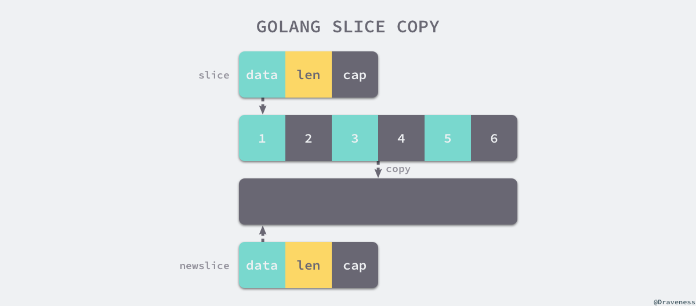

**图 3-5 Go 语言切片的拷贝**

相比于依次对元素进行拷贝，这种方式能够提供更好的性能，但是需要注意的是，哪怕使用 `memmove` 对内存成块进行拷贝，但是这个操作还是会占用非常多的资源，在大切片上执行拷贝操作时一定要注意性能影响。


### 3.2.6 小结

切片的很多功能都是在运行时实现的了，无论是初始化切片，还是对切片进行追加或扩容都需要运行时的支持，需要注意的是在遇到大切片扩容或者复制时可能会发生大规模的内存拷贝，一定要在使用时减少这种情况的发生避免对程序的性能造成影响。

------

- cmd/compile: move slice construction to callers of makeslice https://github.com/golang/go/commit/020a18c545bf49ffc087ca93cd238195d8dcc411#diff-d9238ca551e72b3a80da9e0da10586a4[↩︎](https://www.bookstack.cn/read/draveness-golang/bc59e924b285e5e9.md#fnref:1)


## 3.3 哈希表

这一节会介绍 Go 语言中的另一个集合元素 — 哈希，也就是 Map 的实现原理；哈希表是除了数组之外，最常见的数据结构，几乎所有的语言都会有数组和哈希表这两种集合元素，有的语言将数组实现成列表，有的语言将哈希表称作结构体或者字典，但是它们是两种设计集合元素的思路，数组用于表示元素的序列，而哈希表示的是键值对之间映射关系，只是不同语言的叫法和实现稍微有些不同。

[哈希表](https://en.wikipedia.org/wiki/Hash_table)[1](https://www.bookstack.cn/read/draveness-golang/8a6fa5746b8fbe7e.md#fn:1)是一种古老的数据结构，在 **1953 年**就有人使用拉链法实现了哈希表，它能够根据键（Key）直接访问内存中的存储位置，也就是说我们能够直接通过键找到该键对应的一个值。


### 3.3.1 设计原理

哈希表是计算机科学中的最重要数据结构之一，这不仅因为它 `O(1)` 的读写性能非常优秀，还因为它提供了键值之间的映射。想要实现一个性能优异的哈希表，需要注意两个关键点 —— **哈希函数和冲突解决方法**。

#### 哈希函数

实现哈希表的关键点在于如何选择哈希函数，哈希函数的选择在很大程度上能够决定哈希表的读写性能，在理想情况下，哈希函数应该能够将不同键能够地映射到不同的索引上，这要求**哈希函数输出范围大于输入范围**，但是由于键的数量会远远大于映射的范围，所以在实际使用时，这个理想的结果是不可能实现的。


**图 3-7 完美哈希函数**

比较实际的方式是让哈希函数的结果能够尽可能的均匀分布，然后通过工程上的手段解决哈希碰撞的问题，但是哈希的结果一定要尽可能均匀，结果不均匀的哈希函数会造成更多的冲突并导致更差的读写性能。

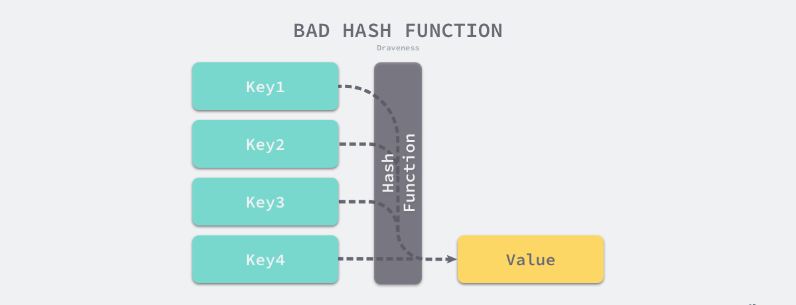

**图 3-8 不均匀哈希函数**

在一个使用结果较为均匀的哈希函数中，哈希的增删改查都需要 `O(1)` 的时间复杂度，但是非常不均匀的哈希函数会导致所有的操作都会占用最差 `O(n)` 的复杂度，所以在哈希表中使用好的哈希函数是至关重要的。


#### 冲突解决

就像我们之前所提到的，在通常情况下，哈希函数输入的范围一定会远远大于输出的范围，所以在使用哈希表时一定会遇到冲突，哪怕我们使用了完美的哈希函数，当输入的键足够多最终也会造成冲突。

然而我们的哈希函数往往都是不完美的，输出的范围是有限的，所以一定会发生哈希碰撞，这时就需要一些方法来解决哈希碰撞的问题，常见方法的就是开放寻址法和拉链法。


##### 开放寻址法

[开放寻址法](https://en.wikipedia.org/wiki/Open_addressing)【[2](https://www.bookstack.cn/read/draveness-golang/8a6fa5746b8fbe7e.md#fn:2)】是一种在哈希表中解决哈希碰撞的方法，这种方法的核心思想是**对数组中的元素依次探测和比较以判断目标键值对是否存在于哈希表中**，如果我们使用开放寻址法来实现哈希表，那么在支撑哈希表的数据结构就是**数组**，不过因为数组的长度有限，存储 `(author, draven)` 这个键值对时会从如下的**索引开始遍历**：

```
index := hash("author") % array.len
```

当我们向当前哈希表写入新的数据时发生了冲突，就会将键值对写入到下一个不为空的位置：


**图 3-9 开放地址法写入数据**


如上图所示，当 Key3 与已经存入哈希表中的两个键值对 Key1 和 Key2 发生冲突时，Key3 会被写入 Key2 后面的空闲内存中；当我们再去读取 Key3 对应的值时就会先对键进行哈希并取模，这会帮助我们找到 Key1，因为 Key1 与我们期望的键 Key3 不匹配，所以会继续查找后面的元素，直到内存为空或者找到目标元素。


**图 3-9 开放地址法读取数据**

当需要查找某个键对应的值时，就会从索引的位置开始对数组进行线性探测，找到目标键值对或者空内存就意味着这一次查询操作的结束。

开放寻址法中对性能影响最大的就是**装载因子**，它是数组中元素的数量与数组大小的比值，随着装载因子的增加，线性探测的平均用时就会逐渐增加，这会同时影响哈希表的读写性能，当装载率超过 70% 之后，哈希表的性能就会急剧下降，而一旦装载率达到 100%，整个哈希表就会完全失效，这时查找任意元素都需要遍历数组中全部的元素，所以在实现哈希表时一定要时刻关注装载因子的变化。


##### 拉链法

与开放地址法相比，拉链法是哈希表中最常见的实现方法，大多数的编程语言都用拉链法实现哈希表，它的实现比较开放地址法稍微复杂一些，但是**平均查找的长度也比较短，各个用于存储节点的内存都是动态申请的，可以节省比较多的存储空间**。

**实现拉链法一般会使用数组加上链表**，不过有一些语言会在拉链法的哈希中引入红黑树以优化性能，拉链法会使用链表数组作为哈希底层的数据结构，我们可以将它看成一个可以扩展的『二维数组』：


**图 3-10 拉链法写入数据**

如上图所示，当我们需要将一个键值对 `(Key6, Value6)` 写入哈希表时，键值对中的键 `Key6` 都会先经过一个哈希函数，哈希函数返回的哈希会帮助我们选择一个桶，和开放地址法一样，选择桶的方式就是直接对哈希返回的结果取模：

```
index := hash("Key6") % array.len
```

选择了 2 号桶之后就可以遍历当前桶中的链表了，在遍历链表的过程中会遇到以下两种情况：

- 找到键相同的键值对 —— 更新键对应的值；
- 没有找到键相同的键值对 —— 在链表的末尾追加新键值对；将键值对写入哈希之后，要通过某个键在其中获取映射的值，就会经历如下的过程：


**图 3-11 拉链法读取数据**

Key11 展示了一个键在哈希表中不存在的例子，当哈希表发现它命中 4 号桶时，它会依次遍历桶中的链表，然而遍历到链表的末尾也没有找到期望的键，所以哈希表中没有该键对应的值。

在一个性能比较好的哈希表中，每一个桶中都应该有 0~1 个元素，有时会有 2~3 个，很少会超过这个数量，计算哈希、定位桶和遍历链表三个过程是哈希表读写操作的主要开销，使用拉链法实现的哈希也有装载因子这一概念：

```
装载因子 := 元素数量 / 桶数量
```

与开放地址法一样，拉链法的**装载因子**越大，哈希的读写性能就越差，在一般情况下使用拉链法的哈希表装载因子都不会超过 1，当哈希表的装载因子较大时就会触发哈希的扩容，创建更多的桶来存储哈希中的元素，保证性能不会出现严重的下降。如果有 1000 个桶的哈希表存储了 10000 个键值对，它的性能是保存 1000 个键值对的 1/10，但是仍然比在链表中直接读写好 1000 倍。


### 3.3.2 数据结构

Go 语言运行时同时使用了多个数据结构组合表示哈希表，其中使用 [`hmap`](https://github.com/golang/go/blob/ed15e82413c7b16e21a493f5a647f68b46e965ee/src/runtime/map.go#L115-L129) 结构体来表示哈希，我们先来看一下这个结构体内部的字段：

```
type hmap struct {
    count     int
    flags     uint8
    B         uint8
    noverflow uint16
    hash0     uint32
    buckets    unsafe.Pointer
    oldbuckets unsafe.Pointer
    nevacuate  uintptr
    extra *mapextra
}
```

- `count` 表示当前哈希表中的元素数量；
- `B` 表示当前哈希表持有的 `buckets` 数量，但是因为哈希表中桶的数量都 2 的倍数，所以该字段会存储对数，也就是 `len(buckets) == 2^B`；
- `hash0` 是哈希的种子，它能为哈希函数的结果引入随机性，这个值在创建哈希表时确定，并在调用哈希函数时作为参数传入；
- `oldbuckets` 是哈希在扩容时用于保存之前 `buckets` 的字段，它的大小是当前 `buckets` 的一半；

- 

**图 3-12 哈希表的数据结构**

如上图所示哈希表 `hmap` 的桶就是 `bmap`，每一个 `bmap` 都能存储 8 个键值对，当哈希表中存储的数据过多，单个桶无法装满时就会使用 `extra.overflow` 中桶存储溢出的数据。上述两种不同的桶在内存中是连续存储的，我们在这里将它们分别称为**正常桶和溢出桶**，上图中黄色的 `bmap` 就是正常桶，绿色的 `bmap` 是溢出桶，溢出桶是在 Go 语言还使用 C 语言实现时就使用的设计[3](https://www.bookstack.cn/read/draveness-golang/8a6fa5746b8fbe7e.md#fn:3)，由于它能够减少扩容的频率所以一直使用至今。

这个桶的结构体 `bmap` 在 Go 语言源代码中的定义只包含一个简单的 `tophash` 字段，`tophash` 存储了键的哈希的高 8 位，通过比较不同键的哈希的高 8 位可以减少访问键值对次数以提高性能：

```
type bmap struct {
    tophash [bucketCnt]uint8
}
```

`bmap` 结构体其实不止包含 `tophash` 字段，**由于哈希表中可能存储不同类型的键值对并且 Go 语言也不支持泛型，**所以键值对占据的内存空间大小只能在编译时进行推导，这些字段在运行时也都是通过计算内存地址的方式直接访问的，所以它的定义中就没有包含这些字段，但是我们能根据编译期间的 [`cmd/compile/internal/gc.bmap`](https://github.com/golang/go/blob/be64a19d99918c843f8555aad580221207ea35bc/src/cmd/compile/internal/gc/reflect.go#L82-L187) 函数对它的结构重建：

```
type bmap struct {
    topbits  [8]uint8
    keys     [8]keytype
    values   [8]valuetype
    pad      uintptr
    overflow uintptr
}
```

如果哈希表存储的数据逐渐增多，我们会对哈希表进行扩容或者使用额外的桶存储溢出的数据，不会让单个桶中的数据超过 8 个，不过溢出桶只是临时的解决方案，创建过多的溢出桶最终也会导致哈希的扩容。

从 Go 语言哈希的定义中就可以发现，它比前面两节提到的数组和切片复杂得多，结构体中不仅包含大量字段，还使用了较多的复杂结构，在后面的小节中我们会详细介绍不同字段的作用。


### 3.3.3 初始化

既然已经介绍了常见哈希表的基本原理和实现方法，那么可以开始分析 Go 语言中哈希表的实现，首先要分析的就是在 Go 语言中初始化哈希的两种方法 — 通过字面量和运行时。

#### 字面量

目前的现代编程语言基本都支持使用字面量的方式初始化哈希，一般都会使用 `key: value` 的语法来表示键值对，Go 语言中也不例外：

```
hash := map[string]int{
    "1": 2,
    "3": 4,
    "5": 6,
}
```

我们需要在初始化哈希时声明键值对的类型，这种使用字面量初始化的方式最终都会通过 [`cmd/compile/internal/gc.maplit`](https://github.com/golang/go/blob/f07059d949057f414dd0f8303f93ca727d716c62/src/cmd/compile/internal/gc/sinit.go#L768-L873) 函数初始化，我们来分析一下 [`cmd/compile/internal/gc.maplit`](https://github.com/golang/go/blob/f07059d949057f414dd0f8303f93ca727d716c62/src/cmd/compile/internal/gc/sinit.go#L768-L873) 函数初始化哈希的过程：

```
func maplit(n *Node, m *Node, init *Nodes) {
    a := nod(OMAKE, nil, nil)
    a.Esc = n.Esc
    a.List.Set2(typenod(n.Type), nodintconst(int64(n.List.Len())))
    litas(m, a, init)
    var stat, dyn []*Node
    for _, r := range n.List.Slice() {
        stat = append(stat, r)
    }
    if len(stat) > 25 {
        ...
    } else {
        addMapEntries(m, stat, init)
    }
}
```

当哈希表中的元素数量少于或者等于 25 个时，编译器会直接调用 `addMapEntries` 将字面量初始化的结构体转换成以下的代码，将所有的键值对一次加入到哈希表中：

```
hash := make(map[string]int, 3)
hash["1"] = 2
hash["3"] = 4
hash["5"] = 6
```

这种初始化的方式与前面两节分析的[数组](https://www.bookstack.cn/read/draveness-golang/79255565262cc9f6.md)和[切片](https://www.bookstack.cn/read/draveness-golang/bc59e924b285e5e9.md)的几乎完全相同，由此看来集合类型的初始化在 Go 语言中有着相同的处理方式和逻辑。

一旦哈希表中元素的数量超过了 25 个，就会在编译期间创建两个数组分别存储键和值的信息，这些键值对会通过一个如下所示的 for 循环加入目标的哈希：

```
hash := make(map[string]int, 26)
vstatk := []string{"1", "2", "3", ... ， "26"}
vstatv := []int{1, 2, 3, ... , 26}
for i := 0; i < len(vstak); i++ {
    hash[vstatk[i]] = vstatv[i]
}
```

这里展开的两个切片 `vstatk` 和 `vstatv` 还会被编辑器继续展开，具体的展开方式可以阅读上一节了解[切片的初始化](https://www.bookstack.cn/read/draveness-golang/bc59e924b285e5e9.md)，不过无论使用哪种方法，使用字面量初始化的过程都会使用 Go 语言中的关键字 `make` 来创建新的哈希并通过最原始的 `[]` 语法向哈希追加元素。


#### 运行时

无论 `make` 是从哪里来的，只要我们使用 `make` 创建哈希，Go 语言编译器都会在[类型检查](https://www.bookstack.cn/read/draveness-golang/7ab240185c175c73.md)期间将它们转换成对 [`runtime.makemap`](https://github.com/golang/go/blob/dcd3b2c173b77d93be1c391e3b5f932e0779fb1f/src/runtime/map.go#L303-L336) 的调用，使用字面量来初始化哈希也只是语言提供的辅助工具，最后调用的都是 [`runtime.makemap`](https://github.com/golang/go/blob/dcd3b2c173b77d93be1c391e3b5f932e0779fb1f/src/runtime/map.go#L303-L336)：

```
func makemap(t *maptype, hint int, h *hmap) *hmap {
    mem, overflow := math.MulUintptr(uintptr(hint), t.bucket.size)
    if overflow || mem > maxAlloc {
        hint = 0
    }
    if h == nil {
        h = new(hmap)
    }
    h.hash0 = fastrand()
    B := uint8(0)
    for overLoadFactor(hint, B) {
        B++
    }
    h.B = B
    if h.B != 0 {
        var nextOverflow *bmap
        h.buckets, nextOverflow = makeBucketArray(t, h.B, nil)
        if nextOverflow != nil {
            h.extra = new(mapextra)
            h.extra.nextOverflow = nextOverflow
        }
    }
    return h
}
```

这个函数的执行过程会分成以下几个部分：

- 计算哈希占用的内存是否溢出或者超出能分配的最大值；
- 调用 `fastrand` 获取一个随机的哈希种子；
- 根据传入的 `hint` 计算出需要的最小需要的桶的数量；
- 使用 [`runtime.makeBucketArray`](https://github.com/golang/go/blob/dcd3b2c173b77d93be1c391e3b5f932e0779fb1f/src/runtime/map.go#L344-L387) 创建用于保存桶的数组；[`runtime.makeBucketArray`](https://github.com/golang/go/blob/dcd3b2c173b77d93be1c391e3b5f932e0779fb1f/src/runtime/map.go#L344-L387) 函数会根据传入的 `B` 计算出的需要创建的桶数量在内存中分配一片连续的空间用于存储数据：

```
func makeBucketArray(t *maptype, b uint8, dirtyalloc unsafe.Pointer) (buckets unsafe.Pointer, nextOverflow *bmap) {
    base := bucketShift(b)
    nbuckets := base
    if b >= 4 {
        nbuckets += bucketShift(b - 4)
        sz := t.bucket.size * nbuckets
        up := roundupsize(sz)
        if up != sz {
            nbuckets = up / t.bucket.size
        }
    }
    buckets = newarray(t.bucket, int(nbuckets))
    if base != nbuckets {
        nextOverflow = (*bmap)(add(buckets, base*uintptr(t.bucketsize)))
        last := (*bmap)(add(buckets, (nbuckets-1)*uintptr(t.bucketsize)))
        last.setoverflow(t, (*bmap)(buckets))
    }
    return buckets, nextOverflow
}
```

当桶的数量小于 $2^4$ 时，由于数据较少、使用溢出桶的可能性较低，这时就会省略创建的过程以减少额外开销；当桶的数量多于 $2^4$ 时，就会额外创建 $2^{B-4}$ 个溢出桶，根据上述代码，我们能确定正常桶和溢出桶在内存中的存储空间是连续的，只是被 `hmap` 中的不同字段引用。


# 第四章 语言基础

## 4.1 函数调用

> [4.1 函数调用](https://www.bookstack.cn/read/draveness-golang/5de3a4330de09d9e.md)

函数是 Go 语言中的一等公民，理解和掌握函数的调用过程是我们深入学习 Go 无法跳过的，本节将从函数的调用惯例和参数的传递方法两个方面分别介绍函数的执行过程。

### 4.1.1 调用惯例

无论是系统级编程语言 C 和 Go，还是脚本语言 Ruby 和 Python，这些编程语言在调用函数时往往都使用相同的语法：

```
somefunction(arg0, arg1)
```

虽然它们调用函数的语法很相似，但是它们的调用惯例却可能大不相同。调用惯例是调用方和被调用方对于参数和返回值传递的约定，我们将在这里为各位读者分别介绍 C 和 Go 语言的调用惯例。

#### C 语言

我们先来研究 C 语言的调用惯例，使用 [GCC](https://gcc.gnu.org/)[1](https://www.bookstack.cn/read/draveness-golang/5de3a4330de09d9e.md#fn:1) 和 [Clang](https://clang.llvm.org/)[2](https://www.bookstack.cn/read/draveness-golang/5de3a4330de09d9e.md#fn:2) **编译器将 C 语言编译成汇编代码**是分析它调用惯例的最好方法，从汇编语言中可以一窥函数调用的具体过程。

GCC 和 Clang 编译相同 C 语言代码可能会生成不同的汇编指令，不过生成的代码在结构上不会有太大的区别，所以对只想理解调用惯例的人来说没有太多影响。作者在本节中选择使用 GCC 编译器来编译 C 语言：

```
$ gcc --version
gcc (Ubuntu 4.8.2-19ubuntu1) 4.8.2
Copyright (C) 2013 Free Software Foundation, Inc.
This is free software; see the source for copying conditions.  There is NO
warranty; not even for MERCHANTABILITY or FITNESS FOR A PARTICULAR PURPOSE.
```

假设我们有以下的 C 语言代码，代码中只包含两个函数，其中一个是主函数 `main`，另一个是我们定义的函数 `my_function`：

```
// ch04/my_function.c
int my_function(int arg1, int arg2) {
    return arg1 + arg2;
}
int main() {
    int i = my_function(1, 2);
}
```

我们可以使用 `cc -S my_function.c` 命令将上述文件编译成如下所示的汇编代码：

```
main:
    pushq    %rbp
    movq    %rsp, %rbp
    subq    $16, %rsp
    movl    $2, %esi  // 设置第二个参数
    movl    $1, %edi  // 设置第一个参数
    call    my_function
    movl    %eax, -4(%rbp)
my_function:
    pushq    %rbp
    movq    %rsp, %rbp
    movl    %edi, -4(%rbp)    // 取出第一个参数，放到栈上
    movl    %esi, -8(%rbp)    // 取出第二个参数，放到栈上
    movl    -8(%rbp), %eax    // eax = edi = 1
    movl    -4(%rbp), %edx    // edx = esi = 2
    addl    %edx, %eax        // eax = eax + edx = 1 + 2 = 3
    popq    %rbp
```

我们按照 `my_function` 函数调用前、调用时以及调用后三个部分分析上述调用过程：

- 在 `my_function` 调用之前，调用方 `main` 函数将 `my_function` 的两个参数分别存到 edi 和 esi 寄存器中；
- 在 `my_function` 执行时，它会将寄存器 edi 和 esi 中的数据存储到 eax 和 edx 两个寄存器中，随后通过汇编指令 `addl` 计算两个入参之和；
- 在 `my_function` 调用之后，使用寄存器 eax 传递返回值，`main` 函数将 `my_function` 的返回值存储到栈上的 `i` 变量中；

当 `my_function` 函数的入参增加至八个，这时重新编译当前的程序可以会得到不同的汇编语言：

```
main:
    pushq    %rbp
    movq    %rsp, %rbp
    subq    $16, %rsp     // 为参数传递申请 16 字节的栈空间
    movl    $8, 8(%rsp)   // 传递第 8 个参数
    movl    $7, (%rsp)    // 传递第 7 个参数
    movl    $6, %r9d
    movl    $5, %r8d
    movl    $4, %ecx
    movl    $3, %edx
    movl    $2, %esi
    movl    $1, %edi
    call    my_function
```

`main` 函数调用 `my_function` 时，前六个参数是使用 edi、esi、edx、ecx、r8d 和 r9d 六个寄存器传递的。寄存器的使用顺序也是调用惯例的一部分，函数的第一个参数一定会使用 edi 寄存器，第二个参数使用 esi 寄存器，以此类推。

最后的两个参数与前面的完全不同，调用方 `main` 函数通过传递这两个参数，图 4-1 展示了 `main` 函数在调用 `my_function` 前的栈信息：

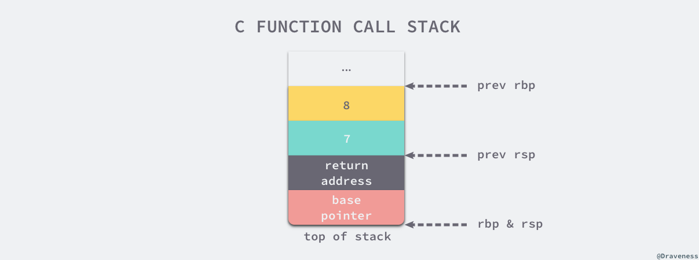

**图 4-1 C 语言 main 函数的调用栈**

上图中 rbp 寄存器的作用是存储函数调用栈的基址指针，即属于 `main` 函数的栈空间的起始位置，而另一个寄存器 rsp 存储的是 `main` 函数调用栈结束的位置，这两个寄存器共同表示了一个函数的栈空间。

在调用 `my_function` 之前，`main` 函数通过 `subq $16, %rsp` 指令分配了 16 个字节的栈地址，随后将第六个以上的参数按照从右到左的顺序存入栈中，即第八个和第七个，余下的六个参数会通过寄存器传递，接下来运行的 `call my_function` 指令会调用 `my_function` 函数：

```
my_function:
    pushq    %rbp
    movq    %rsp, %rbp
    movl    %edi, -4(%rbp)    // rbp-4 = edi = 1
    movl    %esi, -8(%rbp)    // rbp-8 = esi = 2
    ...
    movl    -8(%rbp), %eax    // eax = 2
    movl    -4(%rbp), %edx    // edx = 1
    addl    %eax, %edx        // edx = eax + edx = 3
    ...
    movl    16(%rbp), %eax    // eax = 7
    addl    %eax, %edx        // edx = eax + edx = 28
    movl    24(%rbp), %eax    // eax = 8
    addl    %edx, %eax        // edx = eax + edx = 36
    popq    %rbp
```

`my_function` 会先将寄存器中的全部数据转移到栈上，然后利用 eax 寄存器计算所有入参的和并返回结果。

我们可以将本节的发现和分析简单总结成 —— 当我们在 x86_64 的机器上使用 C 语言中调用函数时，参数都是通过寄存器和栈传递的，其中：

- 六个以及六个以下的参数会按照顺序分别使用 edi、esi、edx、ecx、r8d 和 r9d 六个寄存器传递；
- 六个以上的参数会使用栈传递，函数的参数会以从右到左的顺序依次存入栈中；

而函数的返回值是通过 eax 寄存器进行传递的，由于只使用一个寄存器存储返回值，所以 C 语言的函数不能同时返回多个值。


#### Go 语言

分析了 C 语言函数的调用惯例之后，我们再来剖析一下 Go 语言中函数的调用惯例。我们以下面这个非常简单的代码片段为例简要分析一下：

```
package main
func myFunction(a, b int) (int, int) {
    return a + b, a - b
}
func main() {
    myFunction(66, 77)
}
```

上述的 `myFunction` 函数接受两个整数并返回两个整数，`main` 函数在调用 `myFunction` 时将 66 和 77 两个参数传递到当前函数中，使用 `go tool compile -S -N -l main.go` 命令编译上述代码可以得到如下所示的汇编指令：

注：如果编译时不使用 -N -l 参数，编译器会对汇编代码进行优化，编译结果会有较大差别。

```
"".main STEXT size=68 args=0x0 locals=0x28
    0x0000 00000 (main.go:7)    MOVQ    (TLS), CX
    0x0009 00009 (main.go:7)    CMPQ    SP, 16(CX)
    0x000d 00013 (main.go:7)    JLS    61
    0x000f 00015 (main.go:7)    SUBQ    $40, SP      // 分配 40 字节栈空间
    0x0013 00019 (main.go:7)    MOVQ    BP, 32(SP)   // 将基址指针存储到栈上
    0x0018 00024 (main.go:7)    LEAQ    32(SP), BP
    0x001d 00029 (main.go:8)    MOVQ    $66, (SP)    // 第一个参数
    0x0025 00037 (main.go:8)    MOVQ    $77, 8(SP)   // 第二个参数
    0x002e 00046 (main.go:8)    CALL    "".myFunction(SB)
    0x0033 00051 (main.go:9)    MOVQ    32(SP), BP
    0x0038 00056 (main.go:9)    ADDQ    $40, SP
    0x003c 00060 (main.go:9)    RET
```

根据 `main` 函数生成的汇编指令，我们可以分析出 `main` 函数调用 `myFunction` 之前的栈情况：

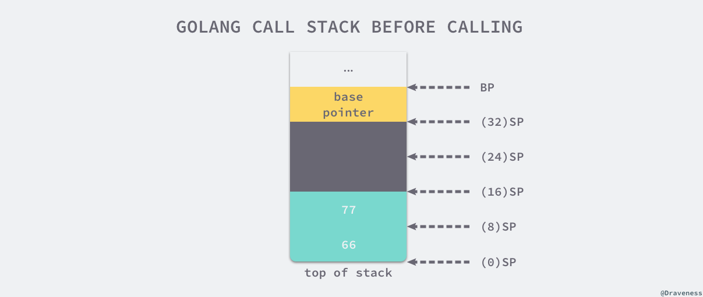

**图 4-2 Go 语言 main 函数的调用栈**

`main` 函数通过 `SUBQ $40, SP` 指令一共在栈上分配了 40 字节的内存空间：

| 空间          | 大小    | 作用                           |
| :------------ | :------ | :----------------------------- |
| SP+32 ~ BP    | 8 字节  | `main` 函数的栈基址指针        |
| SP+16 ~ SP+32 | 16 字节 | 函数 `myFunction` 的两个返回值 |
| SP ~ SP+16    | 16 字节 | 函数 `myFunction` 的两个参数   |

`myFunction` 入参的压栈顺序和 C 语言一样，都是从右到左，即第一个参数 66 在栈顶的 SP ~ SP+8，第二个参数存储在 SP+8 ~ SP+16 的空间中。

当我们准备好函数的入参之后，会调用汇编指令 `CALL "".myFunction(SB)`，这个指令首先会将 `main` 的返回地址存入栈中，然后改变当前的栈指针 SP 并开始执行 `myFunction` 的汇编指令：

```
"".myFunction STEXT nosplit size=49 args=0x20 locals=0x0
    0x0000 00000 (main.go:3)    MOVQ    $0, "".~r2+24(SP) // 初始化第一个返回值
    0x0009 00009 (main.go:3)    MOVQ    $0, "".~r3+32(SP) // 初始化第二个返回值
    0x0012 00018 (main.go:4)    MOVQ    "".a+8(SP), AX    // AX = 66
    0x0017 00023 (main.go:4)    ADDQ    "".b+16(SP), AX   // AX = AX + 77 = 143
    0x001c 00028 (main.go:4)    MOVQ    AX, "".~r2+24(SP) // (24)SP = AX = 143
    0x0021 00033 (main.go:4)    MOVQ    "".a+8(SP), AX    // AX = 66
    0x0026 00038 (main.go:4)    SUBQ    "".b+16(SP), AX   // AX = AX - 77 = -11
    0x002b 00043 (main.go:4)    MOVQ    AX, "".~r3+32(SP) // (32)SP = AX = -11
    0x0030 00048 (main.go:4)    RET
```

从上述的汇编代码中我们可以看出，当前函数在执行时首先会将 `main` 函数中预留的两个返回值地址置成 `int` 类型的默认值 0，然后根据栈的相对位置获取参数并进行加减操作并将值存回栈中，在 `myFunction` 函数返回之间，栈中的数据如图 4-3 所示：

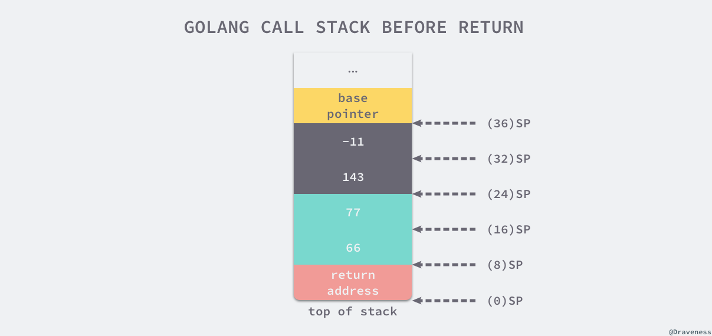

**图 4-3 myFunction 函数返回前的栈**

在 `myFunction` 返回之后，`main` 函数会通过以下的指令来恢复栈基址指针并销毁已经失去作用的 40 字节的栈空间：

```
    0x0033 00051 (main.go:9)    MOVQ    32(SP), BP    0x0038 00056 (main.go:9)    ADDQ    $40, SP    0x003c 00060 (main.go:9)    RET
```

通过分析 Go 语言编译后的汇编指令，我们发现 Go 语言使用栈传递参数和接收返回值，所以它只需要在栈上多分配一些内存就可以返回多个值。

> 思考

C 语言和 Go 语言在设计函数的调用惯例时选择也不同的实现。C 语言同时使用寄存器和栈传递参数，使用 eax 寄存器传递返回值；而 Go 语言使用栈传递参数和返回值。我们可以对比一下这两种设计的优点和缺点：

- C 语言的方式能够极大地减少函数调用的额外开销，但是也增加了实现的复杂度；
  - CPU 访问栈的开销比访问寄存器高几十倍[3](https://www.bookstack.cn/read/draveness-golang/5de3a4330de09d9e.md#fn:3)；
  - 需要单独处理函数参数过多的情况；
- Go 语言的方式能够降低实现的复杂度并支持多返回值，但是牺牲了函数调用的性能；
  - 不需要考虑超过寄存器数量的参数应该如何传递；
  - 不需要考虑不同架构上的寄存器差异；
  - 函数入参和出参的内存空间需要在栈上进行分配；

Go 语言使用栈作为参数和返回值传递的方法是综合考虑后的设计，选择这种设计意味着编译器会更加简单、更容易维护。

### 4.1.2 参数传递

> TODO 跳过


## 4.2 接口

- [4.2 接口](https://www.bookstack.cn/read/draveness-golang/5833e4cb4df6241b.md)

Go 语言中的接口就是一组方法的签名（集合），它是 Go 语言的重要组成部分。使用接口能够让我们更好地组织并写出易于测试的代码，然而很多工程师对 Go的接口了解都非常有限，也不清楚其底层的实现原理，这成为了开发高性能服务的最大阻碍。

本节会介绍使用接口时遇到的一些常见问题以及它的设计与实现，包括接口的类型转换、类型断言以及动态派发机制，帮助各位读者更好地理解接口类型。

### 4.2.1 概述

**在计算机科学中，接口是计算机系统中多个组件共享的边界，不同的组件能够在边界上交换信息**[1](https://www.bookstack.cn/read/draveness-golang/5833e4cb4df6241b.md#fn:1)。如图 4-5，接口的本质就是引入一个新的中间层，调用方可以通过接口与具体实现分离，解除上下游的耦合，上层的模块不再需要依赖下层的具体模块，只需要依赖一个约定好的接口。

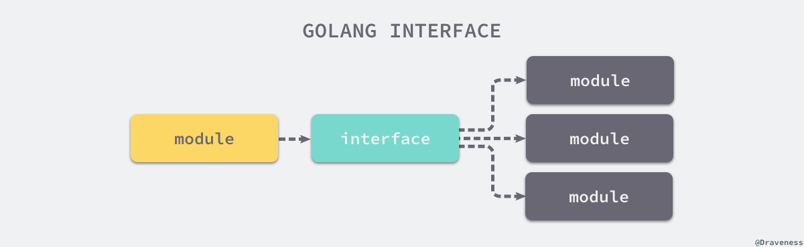

**图 4-5 上下游通过接口解耦**

这种面向接口的编程方式有着非常强大的生命力，无论是在框架还是操作系统中我们都能够找到接口的身影。可移植操作系统接口（Portable Operating System Interface，POSIX)[2](https://www.bookstack.cn/read/draveness-golang/5833e4cb4df6241b.md#fn:2)就是一个典型的例子，它定义了应用程序接口和命令行等标准，为计算机软件带来了可移植性 — 只要操作系统实现了 POSIX，计算机软件就可以直接在不同操作系统上运行。

除了解耦有依赖关系的上下游，接口还能够帮助我们隐藏底层实现，减少关注点。《计算机程序的构造和解释》中有这么一句话：

> 代码必须能够被人阅读，只是机器恰好可以执行[3](https://www.bookstack.cn/read/draveness-golang/5833e4cb4df6241b.md#fn:3)

人能够同时处理的信息非常有限，定义良好的接口能够隔离底层的实现，让我们将重点放在当前的代码片段中。SQL 就是接口的一个例子，当我们使用 SQL 语句查询数据时，其实不需要关心底层数据库的具体实现，我们只在乎 SQL 返回的结果是否符合预期。


**图 4-6 SQL 和不同数据库**

计算机科学中的接口是一个比较抽象的概念，但是编程语言中接口的概念就更加具体。

Go 语言中的接口是一种内置的类型，它定义了一组方法的签名，这一小节会先介绍 Go 语言接口的几个基本概念以及常见问题，为之后介绍实现原理做一些铺垫。

#### 隐式接口

很多面向对象语言都有接口这一概念，例如 Java 和 C#。Java 的接口不仅可以定义方法签名，还可以定义变量，这些定义的变量可以直接在实现接口的类中使用：

```java
public interface MyInterface {
    public String hello = "Hello";
    public void sayHello();
}
```

上述代码定义了一个必须实现的方法 `sayHello` 和一个会注入到实现类的变量 `hello`。在下面的代码中，`MyInterfaceImpl` 就实现了 `MyInterface` 接口：

```java
public class MyInterfaceImpl implements MyInterface {
    public void sayHello() {
        System.out.println(MyInterface.hello);
    }
}
```


Java 中的类必须通过上述方式显式地声明实现的接口，但是在 Go 语言中实现接口就不需要使用类似的方式。首先，我们简单了解一下在 Go 语言中如何定义接口。定义接口需要使用 `interface` 关键字，在接口中我们只能定义方法签名，不能包含成员变量，一个常见的 Go 语言接口是这样的：

```
type error interface {
    Error() string
}
```


如果一个类型需要实现 `error` 接口，那么它只需要实现 `Error() string` 方法，下面的 `RPCError` 结构体就是 `error` 接口的一个实现：

```go
type RPCError struct {
    Code    int64
    Message string
}
func (e *RPCError) Error() string {
    return fmt.Sprintf("%s, code=%d", e.Message, e.Code)
}
```

细心的读者可能会发现上述代码根本就没有 `error` 接口的影子，这是为什么呢？Go 语言中**接口的实现都是隐式的**，我们只需要实现 `Error() string` 方法实现了 `error` 接口。Go 语言实现接口的方式与 Java 完全不同：

- 在 Java 中：实现接口需要显式的声明接口并实现所有方法；
- 在 Go 中：实现接口的所有方法就隐式的实现了接口；

我们使用上述 `RPCError` 结构体时并不关心它实现了哪些接口，**Go 语言只会在传递参数、返回参数以及变量赋值时才会对某个类型是否实现接口进行检查**，这里举几个例子来演示发生接口类型检查的时机：


```go
func main() {
    var rpcErr error = NewRPCError(400, "unknown err") // typecheck1
    err := AsErr(rpcErr) // typecheck2
    println(err) 
}
func NewRPCError(code int64, msg string) error {
    return &RPCError{ // typecheck3
        Code:    code,
        Message: msg,
    }
}
func AsErr(err error) error {
    return err
}
```

Go 语言会[编译期间](https://www.bookstack.cn/read/draveness-golang/9e405d643b49d00e.md)对代码进行类型检查，上述代码总共触发了三次类型检查：

- 将 `*RPCError` 类型的变量赋值给 `error` 类型的变量 `rpcErr`；
- 将 `*RPCError` 类型的变量 `rpcErr` 传递给签名中参数类型为 `error` 的 `AsErr` 函数；
- 将 `*RPCError` 类型的变量从函数签名的返回值类型为 `error` 的 `NewRPCError` 函数中返回；从类型检查的过程来看，编译器仅在需要时才对类型进行检查，类型实现接口时只需要实现接口中的全部方法，不需要像 Java 等编程语言中一样显式声明。


#### 类型

接口也是 Go 语言中的一种类型，它能够出现在变量的定义、函数的入参和返回值中并对它们进行约束，不过 Go 语言中有两种略微不同的接口，一种是带有一组方法的接口，另一种是不带任何方法的 `interface{}`：


**图 4-7 Go 语言中的两种接口**


Go 语言使用 `iface` 结构体表示第一种接口，使用 `eface` 结构体表示第二种空接口，两种接口虽然都使用 `interface` 声明，但是由于后者在 Go 语言中非常常见，所以在实现时使用了特殊的类型。

需要注意的是，与 C 语言中的 `void ` *不同，`interface{}` 类型**不是任意类型**，如果我们将类型转换成了 `interface{}` 类型，这边的变量在运行期间的类型也发生了变化，获取变量类型时就会得到 `interface{}`。

```go
package main
func main() {
    type Test struct{}
    v := Test{}
    Print(v)
}
func Print(v interface{}) {
    println(v)
}
```

上述函数不接受任意类型的参数，只接受 `interface{}` 类型的值，在调用 `Print` 函数时会对参数 `v` 进行类型转换，将原来的 `Test` 类型转换成 `interface{}` 类型，我们会在本节后面介绍类型转换的过程和原理。


#### 指针和接口

在 Go 语言中同时使用指针和接口时会发生一些让人困惑的问题，接口在定义一组方法时没有对实现的接收者做限制，所以我们会看到『一个类型』实现接口的两种方式：

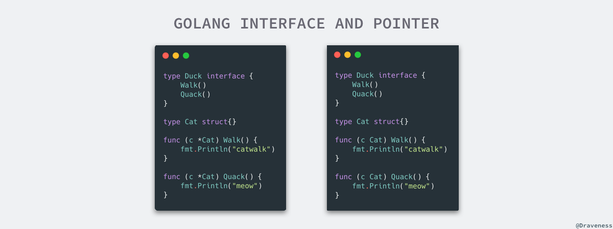

**图 4-8 结构体和指针实现接口**

这是因为**结构体类型和指针类型是完全不同的**，就像我们不能向一个接受指针的函数传递结构体，在实现接口时这两种类型也不能划等号。但是上图中的两种实现不可以同时存在，Go 语言的编译器会在结构体类型和指针类型都实现一个方法时报错 —— `method redeclared`。


对 `Cat` 结构体来说，它**在实现接口时可以选择接受者的类型**，即结构体或者结构体指针，在初始化时也可以初始化成结构体或者指针。下面的代码总结了如何使用结构体、结构体指针实现接口，以及如何使用结构体、结构体指针初始化变量。

```
type Cat struct {}
type Duck interface { ... }

type (c  Cat) Quack {}  // 使用结构体实现接口
type (c *Cat) Quack {}  // 使用结构体指针实现接口

var d Duck = Cat{}      // 使用结构体初始化变量
var d Duck = &Cat{}     // 使用结构体指针初始化变量
```


实现接口的类型和初始化返回的类型两个维度组成了四种情况，这四种情况并不都能通过编译器的检查：

|                      | 结构体实现接口 | 结构体指针实现接口 |
| :------------------- | :------------- | :----------------- |
| 结构体初始化变量     | 通过           | 不通过             |
| 结构体指针初始化变量 | 通过           | 通过               |

四种中只有『使用指针实现接口，使用结构体初始化变量』无法通过编译，其他的三种情况都可以正常执行。当实现接口的类型和初始化变量时返回的类型时相同时，代码通过编译是理所应当的：

- 方法接受者和初始化类型都是结构体；
- 方法接受者和初始化类型都是结构体指针；

而剩下的两种方式为什么一种能够通过编译，另一种无法通过编译呢？我们先来看一下能够通过编译的情况，

也就是方法的接受者是结构体，而初始化的变量是结构体指针：

```go
type Cat struct{}
func (c Cat) Quack() {
    fmt.Println("meow")
}
func main() {
    var c Duck = &Cat{}
    c.Quack()
}
```

作为指针的 `&Cat{}` 变量能够**隐式地获取**到指向的结构体，所以能在结构体上调用 `Walk` 和 `Quack` 方法（可以将结构体变量赋值给结构体指针，指针会隐式获取对应结构体的指针）。我们可以将这里的调用理解成 C 语言中的 `d->Walk()` 和 `d->Speak()`，它们都会先获取指向的结构体再执行对应的方法。

但是如果我们将上述代码中方法的接受者和初始化的类型进行交换，代码就无法通过编译了：

```
type Duck interface {
    Quack()
}
type Cat struct{}
func (c *Cat) Quack() {
    fmt.Println("meow")
}
func main() {
    var c Duck = Cat{}
    c.Quack()
}
$ go build interface.go
./interface.go:20:6: cannot use Cat literal (type Cat) as type Duck in assignment:
    Cat does not implement Duck (Quack method has pointer receiver)
```


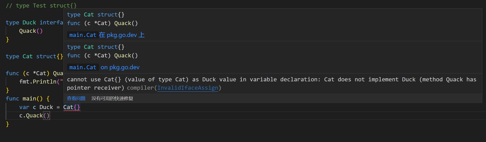

编译器会提醒我们：`Cat` 类型没有实现 `Duck` 接口，`Quack` 方法的接受者是指针。这两个报错对于刚刚接触 Go 语言的开发者比较难以理解，如果我们想要搞清楚这个问题，首先要知道 Go 语言在[传递参数](https://www.bookstack.cn/read/draveness-golang/5de3a4330de09d9e.md)时都是传值的。

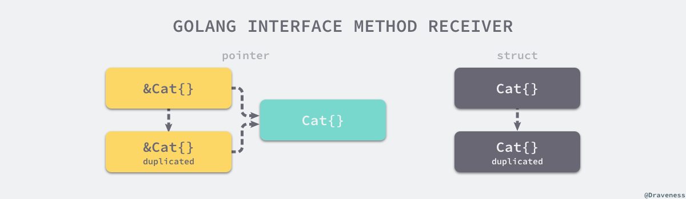

**图 4-9 实现接口的接受者类型**

如上图所示，无论上述代码中初始化的变量 `c` 是 `Cat{}` 还是 `&Cat{}`，使用 `c.Quack()` 调用方法时都会发生值拷贝：

- 如图 4-9 左侧，对于 `&Cat{}` 来说，这意味着拷贝一个新的 `&Cat{}` 指针，这个指针与原来的指针指向一个相同并且唯一的结构体，所以编译器可以隐式的对变量解引用（dereference）获取指针指向的结构体；
- 如图 4-9 右侧，对于 `Cat{}` 来说，这意味着 `Quack` 方法会接受一个全新的 `Cat{}`，因为方法的参数是 `*Cat`，编译器不会无中生有创建一个新的指针；即使编译器可以创建新指针，这个指针指向的也不是最初调用该方法的结构体；


上面的分析解释了指针类型的现象，当我们使用指针实现接口时，只有指针类型的变量才会实现该接口；当我们使用结构体实现接口时，指针类型和结构体类型都会实现该接口。当然这并不意味着我们应该一律使用结构体实现接口，这个问题在实际工程中也没那么重要，在这里我们只想解释现象背后的原因。


#### nil 和 non-nil

我们可以通过一个例子理解**『Go 语言的接口类型不是任意类型』**这一句话，下面的代码在 `main` 函数中初始化了一个 `*TestStruct` 结构体指针，由于指针的零值是 `nil`，所以变量 `s` 在初始化之后也是 `nil`：

```go
package main
type TestStruct struct{}
func NilOrNot(v interface{}) bool {
    return v == nil
}
func main() {
    var s *TestStruct
    fmt.Println(s == nil)      // #=> true
    fmt.Println(NilOrNot(s))   // #=> false
}
$ go run main.go
true
false
```

我们简单总结一下上述代码执行的结果：

- 将上述变量与 `nil` 比较会返回 `true`；
- 将上述变量传入 `NilOrNot` 方法并与 `nil` 比较会返回 `false`；

出现上述现象的原因是 —— 调用 `NilOrNot` 函数时发生了**隐式的类型转换**，除了向方法传入参数之外，变量的赋值也会触发隐式类型转换。在类型转换时，`*TestStruct` 类型会转换成 `interface{}` 类型，转换后的变量不仅包含转换前的变量，还包含变量的类型信息 `TestStruct`，所以转换后的变量与 `nil` 不相等。


### 4.2.2 数据结构

相信各位读者已经对 Go 语言的接口有了一些的了解，接下来我们从源代码和汇编指令层面介绍接口的底层数据结构。

Go 语言根据接口类型『是否包含一组方法』对类型做了不同的处理。我们使用 `iface` 结构体表示包含方法的接口；使用 `eface` 结构体表示不包含任何方法的 `interface{}` 类型，`eface` 结构体在 Go 语言的定义是这样的：

```go
type eface struct { // 16 bytes
    _type *_type
    data  unsafe.Pointer
}
```

由于 `interface{}` 类型不包含任何方法，所以它的结构也相对来说比较简单，只包含指向底层数据和类型的两个指针。从上述结构我们也能推断出 — Go 语言中的任意类型都可以转换成 `interface{}` 类型。

另一个用于表示接口的结构体就是 `iface`，这个结构体中有指向原始数据的指针 `data`，不过更重要的是 `itab` 类型中的 `tab` 字段。

```
type iface struct { // 16 bytes
    tab  *itab
    data unsafe.Pointer
}
```

接下来我们将详细分析 Go 语言接口中的这两个类型，即 `_type` 和 `itab`。


#### 类型结构体

`_type` 是 Go 语言类型的运行时表示。下面是运行时包中的结构体，结构体包含了很多元信息，例如：类型的大小、哈希、对齐以及种类等。

```go
type _type struct {
    size       uintptr
    ptrdata    uintptr
    hash       uint32
    tflag      tflag
    align      uint8
    fieldAlign uint8
    kind       uint8
    equal      func(unsafe.Pointer, unsafe.Pointer) bool
    gcdata     *byte
    str        nameOff
    ptrToThis  typeOff
}
```

- `size` 字段存储了类型占用的内存空间，为内存空间的分配提供信息；
- `hash` 字段能够帮助我们快速确定类型是否相等；
- `equal` 字段用于判断当前类型的多个对象是否相等，该字段是为了减少 Go 语言二进制包大小从 `typeAlg` 结构体中迁移过来的[4](https://www.bookstack.cn/read/draveness-golang/5833e4cb4df6241b.md#fn:4)；

我们只需要对 `_type` 结构体中的字段有一个大体的概念，不需要详细理解所有字段的作用和意义。


#### itab 结构体

`itab` 结构体是接口类型的核心组成部分，每一个 `itab` 都占 32 字节的空间，我们可以将其看成接口类型和具体类型的组合，它们分别用 `inter` 和 `_type` 两个字段表示：

```go
type itab struct { // 32 bytes
    inter *interfacetype
    _type *_type
    hash  uint32
    _     [4]byte
    fun   [1]uintptr
}
```

除了 `inter` 和 `_type` 两个用于表示类型的字段之外，上述结构体中的另外两个字段也有自己的作用：

- `hash` 是对 `_type.hash` 的拷贝，当我们想将 `interface` 类型转换成具体类型时，可以使用该字段快速判断目标类型和具体类型 `_type` 是否一致；
- `fun` 是一个动态大小的数组，它是一个用于动态派发的虚函数表，存储了一组函数指针。**虽然该变量被声明成大小固定的数组，但是在使用时会通过原始指针获取其中的数据**，所以 `fun` 数组中保存的元素数量是不确定的；

我们会在类型断言中介绍 `hash` 字段的使用，在动态派发一节中介绍 `fun` 数组中存储的函数指针是如何被使用的。


### 4.2.3 类型转换

既然我们已经了解了接口在运行时的数据结构，接下来会通过几个例子来深入理解接口类型是如何初始化和传递的，这里会介绍在实现接口时使用指针类型和结构体类型的区别。这两种不同的接口实现方式会导致 Go 语言编译器生成不同的汇编代码，带来执行过程上的一些差异。

#### 指针类型

首先我们回到这一节开头提到的 `Duck` 接口的例子，我们使用 `//go:noinline` 指令[5](https://www.bookstack.cn/read/draveness-golang/5833e4cb4df6241b.md#fn:5)禁止 `Quack` 方法的内联编译：

```
package main
type Duck interface {
    Quack()
}
type Cat struct {
    Name string
}
//go:noinline
func (c *Cat) Quack() {
    println(c.Name + " meow")
}
func main() {
    var c Duck = &Cat{Name: "grooming"}
    c.Quack()
}
```

我们使用编译器将上述代码编译成汇编语言，删掉其中一些对理解接口原理无用的指令并保留与赋值语句 `var c Duck = &Cat{Name: "grooming"}` 相关的代码，我们将生成的汇编指令拆分成三部分分析：

- 结构体 `Cat` 的初始化；
- 赋值触发的类型转换过程；
- 调用接口的方法 `Quack()`；我们先来分析结构体 `Cat` 的初始化过程：

```
LEAQ    type."".Cat(SB), AX                ;; AX = &type."".Cat
MOVQ    AX, (SP)                           ;; SP = &type."".Cat
CALL    runtime.newobject(SB)              ;; SP + 8 = &Cat{}
MOVQ    8(SP), DI                          ;; DI = &Cat{}
MOVQ    $8, 8(DI)                          ;; StringHeader(DI.Name).Len = 8
LEAQ    go.string."grooming"(SB), AX       ;; AX = &"grooming"
MOVQ    AX, (DI)                           ;; StringHeader(DI.Name).Data = &"grooming"
```


- 获取 `Cat` 结构体类型指针并将其作为参数放到栈上；
- 通过 `CALL` 指定调用 [`runtime.newobject`](https://github.com/golang/go/blob/5042317d6919d4c84557e04be35130430e8d1dd4/src/runtime/malloc.go#L1162-L1164) 函数，这个函数会以 `Cat` 结构体类型指针作为入参，分配一片新的内存空间并将指向这片内存空间的指针返回到 SP+8 上；
- SP+8 现在存储了一个指向 `Cat` 结构体的指针，我们将栈上的指针拷贝到寄存器 `DI` 上方便操作；
- 由于 `Cat` 中只包含一个字符串类型的 `Name` 变量，所以在这里会分别将字符串地址 `&"grooming"` 和字符串长度 `8` 设置到结构体上，最后三行汇编指令等价于 `cat.Name = "grooming"`；字符串在运行时的表示其实就是指针加上字符串长度，在前面的章节[字符串](https://www.bookstack.cn/read/draveness-golang/0bc3143426c7b7ea.md)已经介绍过它的底层表示和实现原理，但是我们这里要看一下初始化之后的 `Cat` 结构体在内存中的表示是什么样的：

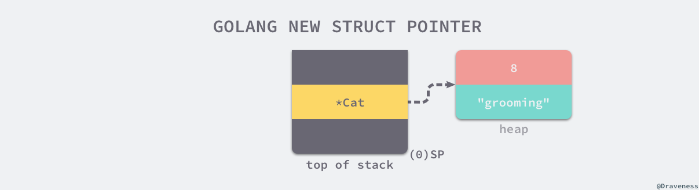

**图 4-10 Cat 结构体指针**

因为 `Cat` 结构体的定义中只包含一个字符串，而字符串在 Go 语言中总共占 16 字节，所以每一个 `Cat` 结构体的大小都是 16 字节。初始化 `Cat` 结构体之后就进入了将 `*Cat` 转换成 `Duck` 类型的过程了：

```
LEAQ    go.itab.*"".Cat,"".Duck(SB), AX    ;; AX = *itab(go.itab.*"".Cat,"".Duck)
MOVQ    DI, (SP)                           ;; SP = AX
```

类型转换的过程比较简单，`Duck` 作为一个包含方法的接口，它在底层使用 `iface` 结构体表示。`iface` 结构体包含两个字段，其中一个是指向数据的指针，另一个是表示接口和结构体关系的 `tab` 字段，我们已经通过上一段代码 SP+8 初始化了 `Cat` 结构体指针，这段代码只是将编译期间生成的 `itab` 结构体指针复制到 SP 上：

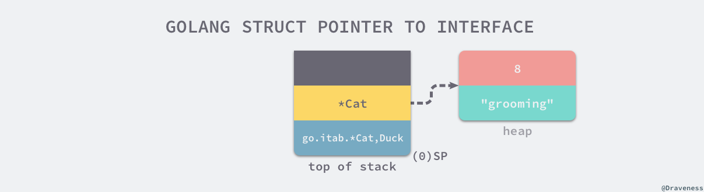

**图 4-11 Cat 类型转换**

到这里，我们会发现 SP ~ SP+16 共同组成了 `iface` 结构体，而栈上的这个 `iface` 结构体也是 `Quack` 方法的第一个入参。

```
CALL    "".(*Cat).Quack(SB)                ;; SP.Quack()
```

上述代码会直接通过 `CALL` 指令完成方法的调用，细心的读者可能会发现一个问题 —— 为什么在代码中我们调用的是 `Duck.Quack` 但生成的汇编是 `*Cat.Quack` 呢？Go 语言的编译器会在编译期间将一些需要动态派发的方法调用改写成对目标方法的直接调用，以减少性能的额外开销。如果在这里禁用编译器优化，就会看到动态派发的过程，我们会在后面分析接口的动态派发以及性能上的额外开销。


#### 结构体类型

在这里，我们继续修改上一节中的代码，使用结构体类型实现 `Duck` 接口并初始化结构体类型的变量：

```go
package main
type Duck interface {
    Quack()
}
type Cat struct {
    Name string
}
//go:noinline
func (c Cat) Quack() {
    println(c.Name + " meow")
}
func main() {
    var c Duck = Cat{Name: "grooming"}
    c.Quack()
}
```

如果我们在初始化变量时使用指针类型 `&Cat{Name: "grooming"}` 也能够通过编译，不过生成的汇编代码和上一节中的几乎完全相同，所以这里也就不分析这个情况了。

编译上述的代码会得到如下所示的汇编指令，需要注意的是为了代码更容易理解和分析，这里的汇编指令依然经过了删减，不过不会影响具体的执行过程。与上一节一样，我们将汇编代码的执行过程分成以下几个部分：

- 初始化 `Cat` 结构体；
- 完成从 `Cat` 到 `Duck` 接口的类型转换；
- 调用接口的 `Quack` 方法；我们先来看一下上述汇编代码中用于初始化 `Cat` 结构体的部分：

```
XORPS   X0, X0                          ;; X0 = 0
MOVUPS  X0, ""..autotmp_1+32(SP)        ;; StringHeader(SP+32).Data = 0
LEAQ    go.string."grooming"(SB), AX    ;; AX = &"grooming"
MOVQ    AX, ""..autotmp_1+32(SP)        ;; StringHeader(SP+32).Data = AX
MOVQ    $8, ""..autotmp_1+40(SP)        ;; StringHeader(SP+32).Len =8
```

这段汇编指令会在栈上初始化 `Cat` 结构体，而上一节的代码在堆上申请了 16 字节的内存空间，栈上只有一个指向 `Cat` 的指针。

初始化结构体后就进入类型转换的阶段，编译器会将 `go.itab."".Cat,"".Duck` 的地址和指向 `Cat` 结构体的指针作为参数一并传入 [`runtime.convT2I`](https://github.com/golang/go/blob/0c5d545ccdd01403d6ce865fb03774a6aff6032c/src/runtime/iface.go#L398-L411) 函数：

```
LEAQ    go.itab."".Cat,"".Duck(SB), AX     ;; AX = &(go.itab."".Cat,"".Duck)
MOVQ    AX, (SP)                           ;; SP = AX
LEAQ    ""..autotmp_1+32(SP), AX           ;; AX = &(SP+32) = &Cat{Name: "grooming"}
MOVQ    AX, 8(SP)                          ;; SP + 8 = AX
CALL    runtime.convT2I(SB)                ;; runtime.convT2I(SP, SP+8)
```

这个函数会获取 `itab` 中存储的类型，根据类型的大小申请一片内存空间并将 `elem` 指针中的内容拷贝到目标的内存空间中：

```
func convT2I(tab *itab, elem unsafe.Pointer) (i iface) {
    t := tab._type
    x := mallocgc(t.size, t, true)
    typedmemmove(t, x, elem)
    i.tab = tab
    i.data = x
    return
}
```

[`runtime.convT2I`](https://github.com/golang/go/blob/0c5d545ccdd01403d6ce865fb03774a6aff6032c/src/runtime/iface.go#L398-L411) 会返回一个 `iface` 结构体，其中包含 `itab` 指针和 `Cat` 变量。当前函数返回之后，`main` 函数的栈上会包含以下数据：

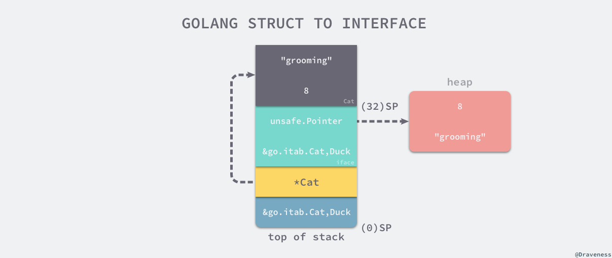

**图 4-12 结构体到指针**

SP 和 SP+8 中存储的 `itab` 和 `Cat` 指针就是 [`runtime.convT2I`](https://github.com/golang/go/blob/0c5d545ccdd01403d6ce865fb03774a6aff6032c/src/runtime/iface.go#L398-L411) 函数的入参，这个函数的返回值位于 SP+16，是一个占 16 字节内存空间的 `iface` 结构体，SP+32 存储的就是在栈上的 `Cat` 结构体，它会在 [`runtime.convT2I`](https://github.com/golang/go/blob/0c5d545ccdd01403d6ce865fb03774a6aff6032c/src/runtime/iface.go#L398-L411) 执行的过程中拷贝到堆上。

在最后，我们会通过以下的指令调用 `Cat` 实现的接口方法 `Quack()`：

```
MOVQ    16(SP), AX ;; AX = &(go.itab."".Cat,"".Duck)
MOVQ    24(SP), CX ;; CX = &Cat{Name: "grooming"}
MOVQ    24(AX), AX ;; AX = AX.fun[0] = Cat.Quack
MOVQ    CX, (SP)   ;; SP = CX
CALL    AX         ;; CX.Quack()
```

这几个汇编指令还是非常好理解的，`MOVQ 24(AX), AX` 是最关键的指令，它从 `itab` 结构体中取出 `Cat.Quack` 方法指针作为 `CALL` 指令调用时的参数。接口变量的第 24 字节是 `itab.fun` 数组开始的位置，由于 `Duck` 接口只包含一个方法，所以 `itab.fun[0]` 中存储的就是指向 `Quack` 方法的指针了。


### 4.2.4 类型断言

上一节介绍是如何把具体类型转换成接口类型，而这一节介绍的是如何将一个接口类型转换成具体类型。本节会根据接口中是否存在方法分两种情况介绍类型断言的执行过程。

#### 非空接口

首先分析接口中包含方法的情况，`Duck` 接口一个非空的接口，我们来分析从 `Duck` 转换回 `Cat` 结构体的过程：

```
func main() {
    var c Duck = &Cat{Name: "grooming"}
    switch c.(type) {
    case *Cat:
        cat := c.(*Cat)
        cat.Quack()
    }
}
```

我们将编译得到的汇编指令分成两部分分析，第一部分是变量的初始化，第二部分是类型短信，第一部分的代码如下：

```
00000 TEXT    "".main(SB), ABIInternal, $32-0
...
00029 XORPS    X0, X0
00032 MOVUPS    X0, ""..autotmp_4+8(SP)
00037 LEAQ    go.string."grooming"(SB), AX
00044 MOVQ    AX, ""..autotmp_4+8(SP)
00049 MOVQ    $8, ""..autotmp_4+16(SP)
```

0037 ~ 0049 三个指令初始化了 `Duck` 变量，`Cat` 结构体初始化在 SP+8 ~ SP+24 上。因为 Go 语言的编译器做了一些优化，所以代码中没有`iface` 的构建过程，不过对于这一节要介绍的类型断言和转换没有太多的影响。下面进入类型转换的部分：

```
00058 CMPL  go.itab.*"".Cat,"".Duck+16(SB), $593696792  
                                        ;; if (c.tab.hash != 593696792) {
00068 JEQ   80                          ;;      
00070 MOVQ  24(SP), BP                  ;;      BP = SP+24
00075 ADDQ  $32, SP                     ;;      SP += 32
00079 RET                               ;;      return
                                        ;; } else {
00080 LEAQ  ""..autotmp_4+8(SP), AX     ;;      AX = &Cat{Name: "grooming"}
00085 MOVQ  AX, (SP)                    ;;      SP = AX
00089 CALL  "".(*Cat).Quack(SB)         ;;      SP.Quack()
00094 JMP   70                          ;;      ...
                                        ;;      BP = SP+24
                                        ;;      SP += 32
                                        ;;      return
                                        ;; }
```

switch语句生成的汇编指令会将目标类型的 `hash` 与接口变量中的 `itab.hash` 进行比较：

- 如果两者相等意味着变量的具体类型是Cat，我们会跳转到 0080 所在的分支完成类型转换。
  - 获取 SP+8 存储的 `Cat` 结构体指针；
  - 将结构体指针拷贝到栈顶；
  - 调用 `Quack` 方法；
  - 恢复函数的栈并返回；
- 如果接口中存在的具体类型不是 `Cat`，就会直接恢复栈指针并返回到调用方；


**图 4-13 接口转换成结构体**

上图展示了调用 `Quack` 方法时的堆栈情况，其中 `Cat` 结构体存储在 SP+8 ~ SP+24 上，`Cat` 指针存储在栈顶并指向上述结构体。

#### 空接口

当我们使用空接口类型 `interface{}` 进行类型断言时，如果不关闭 Go 语言编译器的优化选项，生成的汇编指令是差不多的。编译器会省略将 `Cat` 结构体转换成 `eface` 的过程：

```go
func main() {
    var c interface{} = &Cat{Name: "grooming"}
    switch c.(type) {
    case *Cat:
        cat := c.(*Cat)
        cat.Quack()
    }
}
```

如果禁用编译器优化，上述代码会在类型断言时就不是直接获取变量中具体类型的 `_type`，而是从 `eface._type` 中获取，汇编指令仍然会使用目标类型的 `hash` 字段与变量的类型比较。


### 4.2.5 动态派发

动态派发（Dynamic dispatch）是在运行期间选择具体多态操作（方法或者函数）执行的过程，它是一种在面向对象语言中常见的特性[6](https://www.bookstack.cn/read/draveness-golang/5833e4cb4df6241b.md#fn:6)。

Go 语言虽然不是严格意义上的面向对象语言，但是接口的引入为它带来了动态派发这一特性，调用接口类型的方法时，如果编译期间不能确认接口的类型，Go 语言会在运行期间决定具体调用该方法的哪个实现。

在如下所示的代码中，`main` 函数调用了两次 `Quack` 方法：

- 第一次以 `Duck` 接口类型的身份调用，调用时需要经过运行时的动态派发；
- 第二次以 `*Cat` 具体类型的身份调用，编译期就会确定调用的函数：

```go
func main() {
    var c Duck = &Cat{Name: "grooming"}
    c.Quack()
    c.(*Cat).Quack()
}
```

因为编译器优化影响了我们对原始汇编指令的理解，所以需要使用编译参数 `-N` 关闭编译器优化。如果不指定这个参数，编译器会对代码进行重写，与最初生成的执行过程有一些偏差，例如：

- 因为接口类型中的 `tab` 参数并没有被使用，所以优化从 `Cat` 转换到 `Duck` 的过程；
- 因为变量的具体类型是确定的，所以删除从 `Duck` 接口类型转换到 `*Cat` 具体类型时可能会发生 `panic` 的分支；
- …

在具体分析调用 `Quack` 方法的两种姿势之前，我们要先了解 `Cat` 结构体究竟是如何初始化的，以及初始化完成后的栈上有哪些数据：

```
LEAQ    type."".Cat(SB), AX                
MOVQ    AX, (SP)
CALL    runtime.newobject(SB)              ;; SP + 8 = new(Cat)
MOVQ    8(SP), DI                          ;; DI = SP + 8
MOVQ    DI, ""..autotmp_2+32(SP)           ;; SP + 32 = DI
MOVQ    $8, 8(DI)                          ;; StringHeader(cat).Len = 8
LEAQ    go.string."grooming"(SB), AX       ;; AX = &"grooming"
MOVQ    AX, (DI)                           ;; StringHeader(cat).Data = AX
MOVQ    ""..autotmp_2+32(SP), AX           ;; AX = &Cat{...}
MOVQ    AX, ""..autotmp_1+40(SP)           ;; SP + 40 = &Cat{...}
LEAQ    go.itab.*"".Cat,"".Duck(SB), CX    ;; CX = &go.itab.*"".Cat,"".Duck
MOVQ    CX, "".c+48(SP)                    ;; iface(c).tab = SP + 48 = CX
MOVQ    AX, "".c+56(SP)                    ;; iface(c).data = SP + 56 = AX
```

这段代码的初始化过程其实和上两节中的过程没有太多的差别，它先初始化了 `Cat` 结构体指针，再将 `Cat` 和 `tab` 打包成了一个 `iface` 类型的结构体，我们直接来看初始化结束后的栈情况：

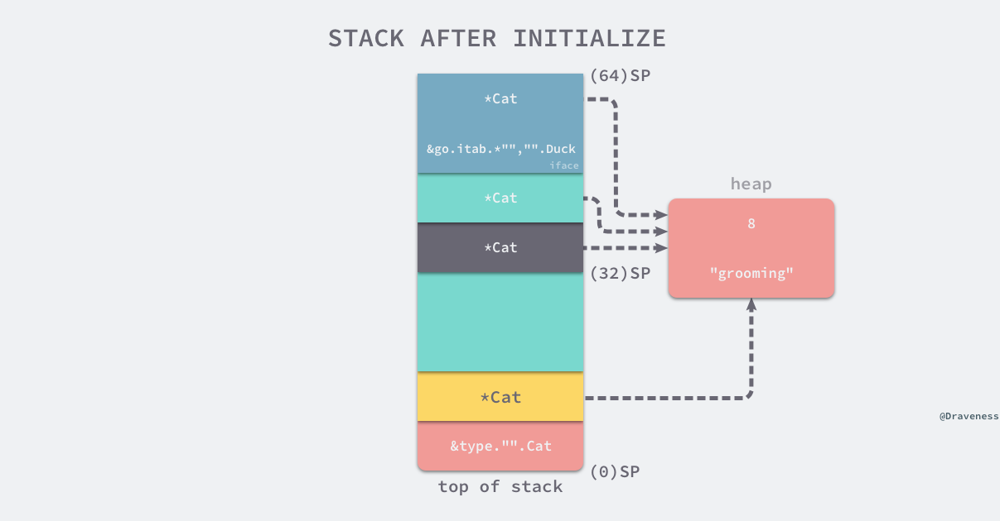

**图 4-14 接口类型初始化后的栈**

- SP 是 `Cat` 类型，它也是运行时 [`runtime.newobject`](https://github.com/golang/go/blob/5042317d6919d4c84557e04be35130430e8d1dd4/src/runtime/malloc.go#L1162-L1164) 方法的参数；
- SP+8 是 [`runtime.newobject`](https://github.com/golang/go/blob/5042317d6919d4c84557e04be35130430e8d1dd4/src/runtime/malloc.go#L1162-L1164) 方法的返回值，也就是指向堆上的 `Cat` 结构体的指针；
- SP+32、SP+40 是对 SP+8 的拷贝，这两个指针都会指向栈上的 `Cat` 结构体；
- SP+48 ~ SP+64 是接口变量 `iface` 结构体，其中包含了 `tab` 结构体指针和 `*Cat` 指针；

初始化过程结束之后，我们进入到了动态派发的过程，`c.Quack()` 语句展开的汇编指令会在运行时确定函数指针。

```
MOVQ    "".c+48(SP), AX                    ;; AX = iface(c).tab
MOVQ    24(AX), AX                         ;; AX = iface(c).tab.fun[0] = Cat.Quack
MOVQ    "".c+56(SP), CX                    ;; CX = iface(c).data
MOVQ    CX, (SP)                           ;; SP = CX = &Cat{...}
CALL    AX                                 ;; SP.Quack()
```


这段代码的执行过程可以分成以下三个步骤：

- 从接口变量中获取了保存 `Cat.Quack` 方法指针的 `tab.func[0]`；
- 接口变量在中的数据会被拷贝到栈顶；
- 方法指针会被拷贝到寄存器中并通过汇编指令 `CALL` 触发：另一个调用 `Quack` 方法的语句 `c.(*Cat).Quack()*` *生成的汇编指令看起来会有一些复杂，但是代码前半部分都是在做类型转换，将接口类型转换成 ``*`Cat` 类型，只有最后两行代码才是函数调用相关的指令：

```
MOVQ    "".c+56(SP), AX                    ;; AX = iface(c).data = &Cat{...}
MOVQ    "".c+48(SP), CX                    ;; CX = iface(c).tab
LEAQ    go.itab.*"".Cat,"".Duck(SB), DX    ;; DX = &&go.itab.*"".Cat,"".Duck
CMPQ    CX, DX                             ;; CMP(CX, DX)
JEQ    163
JMP    201
MOVQ    AX, ""..autotmp_3+24(SP)           ;; SP+24 = &Cat{...}
MOVQ    AX, (SP)                           ;; SP = &Cat{...}
CALL    "".(*Cat).Quack(SB)                ;; SP.Quack()
```

下面的几行代码只是将 `Cat` 指针拷贝到了栈顶并调用 `Quack` 方法。这一次调用的函数指针在编译期就已经确定了，所以运行时就不需要动态查找方法的实现：

```
MOVQ    "".c+48(SP), AX                    ;; AX = iface(c).tab
MOVQ    24(AX), AX                         ;; AX = iface(c).tab.fun[0] = Cat.Quack
MOVQ    "".c+56(SP), CX                    ;; CX = iface(c).data
```

#### 基准测试

下面代码中的两个方法 `BenchmarkDirectCall` 和 `BenchmarkDynamicDispatch` 分别会调用结构体方法和接口方法，在接口上调用方法时会使用动态派发机制，我们以直接调用作为基准分析动态派发带来了多少额外开销：

```go
func BenchmarkDirectCall(b *testing.B) {
    c := &Cat{Name: "grooming"}
    for n := 0; n < b.N; n++ {
        // MOVQ    AX, "".c+24(SP)
        // MOVQ    AX, (SP)
        // CALL    "".(*Cat).Quack(SB)
        c.Quack()
    }
}
func BenchmarkDynamicDispatch(b *testing.B) {
    c := Duck(&Cat{Name: "grooming"})
    for n := 0; n < b.N; n++ {
        // MOVQ    "".d+56(SP), AX
        // MOVQ    24(AX), AX
        // MOVQ    "".d+64(SP), CX
        // MOVQ    CX, (SP)
        // CALL    AX
        c.Quack()
    }
}
```

我们直接运行下面的命令，使用 1 个 CPU 运行上述代码，每一个基准测试都会被执行 3 次：

```
$ go test -gcflags=-N -benchmem -test.count=3 -test.cpu=1 -test.benchtime=1s -bench=.
goos: darwin
goarch: amd64
pkg: github.com/golang/playground
BenchmarkDirectCall          500000000             3.11 ns/op           0 B/op           0 allocs/op
BenchmarkDirectCall          500000000             2.94 ns/op           0 B/op           0 allocs/op
BenchmarkDirectCall          500000000             3.04 ns/op           0 B/op           0 allocs/op
BenchmarkDynamicDispatch     500000000             3.40 ns/op           0 B/op           0 allocs/op
BenchmarkDynamicDispatch     500000000             3.79 ns/op           0 B/op           0 allocs/op
BenchmarkDynamicDispatch     500000000             3.55 ns/op           0 B/op           0 allocs/op
```

- 调用结构体方法时，每一次调用需要 `~3.03ns`；
- 使用动态派发时，每一调用需要 `~3.58ns`；

在关闭编译器优化的情况下，从上面的数据来看，动态派发生成的指令会带来 `~18%` 左右的额外性能开销。

这些性能开销在一个复杂的系统中不会带来太多的影响。一个项目不可能只使用动态派发，而且如果我们开启编译器优化后，动态派发的额外开销会降低至 `~5%`，这对应用性能的整体影响就更小了，所以与使用接口带来的好处相比，动态派发的额外开销往往可以忽略。

上面的性能测试建立在实现和调用方法的都是结构体指针上，当我们将结构体指针换成结构体又会有比较大的差异：

```go
func BenchmarkDirectCall(b *testing.B) {
    c := Cat{Name: "grooming"}
    for n := 0; n < b.N; n++ {
        // MOVQ    AX, (SP)
        // MOVQ    $8, 8(SP)
        // CALL    "".Cat.Quack(SB)
        c.Quack()
    }
}
func BenchmarkDynamicDispatch(b *testing.B) {
    c := Duck(Cat{Name: "grooming"})
    for n := 0; n < b.N; n++ {
        // MOVQ    16(SP), AX
        // MOVQ    24(SP), CX
        // MOVQ    AX, "".d+32(SP)
        // MOVQ    CX, "".d+40(SP)
        // MOVQ    "".d+32(SP), AX
        // MOVQ    24(AX), AX
        // MOVQ    "".d+40(SP), CX
        // MOVQ    CX, (SP)
        // CALL    AX
        c.Quack()
    }
}
```

我们重新执行相同的基准测试时，会得到如下所示的结果：

```
$ go test -gcflags=-N -benchmem -test.count=3 -test.cpu=1 -test.benchtime=1s .
goos: darwin
goarch: amd64
pkg: github.com/golang/playground
BenchmarkDirectCall          500000000             3.15 ns/op           0 B/op           0 allocs/op
BenchmarkDirectCall          500000000             3.02 ns/op           0 B/op           0 allocs/op
BenchmarkDirectCall          500000000             3.09 ns/op           0 B/op           0 allocs/op
BenchmarkDynamicDispatch     200000000             6.92 ns/op           0 B/op           0 allocs/op
BenchmarkDynamicDispatch     200000000             6.91 ns/op           0 B/op           0 allocs/op
BenchmarkDynamicDispatch     200000000             7.10 ns/op           0 B/op           0 allocs/op
```

直接调用方法需要消耗时间的平均值和使用指针实现接口时差不多，约为 `~3.09ns`，而使用动态派发调用方法却需要 `~6.98ns` 相比直接调用额外消耗了 `~125%` 的时间，从生成的汇编指令我们也能看出后者的额外开销会高很多。

|        | 直接调用 | 动态派发 |
| :----- | :------- | :------- |
| 指针   | ~3.03ns  | ~3.58ns  |
| 结构体 | ~3.09ns  | ~6.98ns  |

从上述表格我们可以看到使用结构体来实现接口带来的开销会大于使用指针实现，而动态派发在结构体上的表现非常差，这也提醒我们应当尽量避免使用结构体类型实现接口。

使用结构体带来的巨大性能差异不只是接口带来的问题，带来性能问题主要因为 Go 语言在函数调用时是传值的，动态派发的过程只是放大了参数拷贝带来的影响。


### 4.2.6 小结

重新回顾一下本节介绍的内容，我们在开头简单介绍了使用 Go 语言接口的常见问题，例如使用不同类型实现接口带来的差异、函数调用时发生的隐式类型转换；我们还分析了接口的类型转换、类型断言以及动态派发机制。相信这一节中内容能够帮助各位读者深入理解 Go 语言的接口。

------

- Wikepedia: Interface (computing) [https://en.wikipedia.org/wiki/Interface_(computing)](https://en.wikipedia.org/wiki/Interface_(computing))[↩︎](https://www.bookstack.cn/read/draveness-golang/5833e4cb4df6241b.md#fnref:1)
- Wikipedia: POSIX https://en.wikipedia.org/wiki/POSIX[↩︎](https://www.bookstack.cn/read/draveness-golang/5833e4cb4df6241b.md#fnref:2)
- 计算机程序的构造和解释，Harold Abelson / Gerald Jay Sussman / Julie Sussman https://book.douban.com/subject/1148282/[↩︎](https://www.bookstack.cn/read/draveness-golang/5833e4cb4df6241b.md#fnref:3)
- cmd/compile,runtime: generate hash functions only for types which are map keys https://github.com/golang/go/commit/36f30ba289e31df033d100b2adb4eaf557f05a34[↩︎](https://www.bookstack.cn/read/draveness-golang/5833e4cb4df6241b.md#fnref:4)
- Go’s hidden #pragmas https://dave.cheney.net/2018/01/08/gos-hidden-pragmas[↩︎](https://www.bookstack.cn/read/draveness-golang/5833e4cb4df6241b.md#fnref:5)
- Wikipedia: Dynamic Dispatch https://en.wikipedia.org/wiki/Dynamic_dispatch[↩︎](https://www.bookstack.cn/read/draveness-golang/5833e4cb4df6241b.md#fnref:6


## 4.3 反射

> [4.3 反射](https://www.bookstack.cn/read/draveness-golang/f42669fa0cd10c64.md)

反射是 Go 语言比较重要的特性。虽然在大多数的应用和服务中并不常见，但是很多框架都依赖 Go 语言的反射机制实现简化代码的逻辑。因为 Go 语言的语法元素很少、设计简单，所以它没有特别强的表达能力，但是 Go 语言的 [`reflect`](https://golang.org/pkg/reflect/) 包能够弥补它在语法上的一些劣势。

[`reflect`](https://golang.org/pkg/reflect/) 实现了运行时的反射能力，能够让程序操作不同类型的对象[1](https://www.bookstack.cn/read/draveness-golang/f42669fa0cd10c64.md#fn:1)。反射包中有两对非常重要的函数和类型，[`reflect.TypeOf`](https://github.com/golang/go/blob/52c4488471ed52085a29e173226b3cbd2bf22b20/src/reflect/type.go#L1365-L1368) 能获取类型信息，[`reflect.ValueOf`](https://github.com/golang/go/blob/52c4488471ed52085a29e173226b3cbd2bf22b20/src/reflect/value.go#L2316-L2328) 能获取数据的运行时表示，另外两个类型是 `Type` 和 `Value`，它们与函数是一一对应的关系：


**图 4-15 反射函数和类型**

类型 `Type` 是反射包定义的一个接口，我们可以使用 [`reflect.TypeOf`](https://github.com/golang/go/blob/52c4488471ed52085a29e173226b3cbd2bf22b20/src/reflect/type.go#L1365-L1368) 函数获取任意变量的的类型，`Type` 接口中定义了一些有趣的方法，`MethodByName` 可以获取当前类型对应方法的引用、`Implements` 可以判断当前类型是否实现了某个接口：

```go
type Type interface {
        Align() int
        FieldAlign() int
        Method(int) Method
        MethodByName(string) (Method, bool)
        NumMethod() int
        ...
        Implements(u Type) bool
        ...
}
```


反射包中 `Value` 的类型与 `Type` 不同，它被声明成了结构体。这个结构体没有对外暴露的字段，但是提供了获取或者写入数据的方法：

```go
type Value struct {
        // contains filtered or unexported fields
}
func (v Value) Addr() Value
func (v Value) Bool() bool
func (v Value) Bytes() []byte
...
```

反射包中的所有方法基本都是围绕着 `Type` 和 `Value` 这两个类型设计的。我们通过 [`reflect.TypeOf`](https://github.com/golang/go/blob/52c4488471ed52085a29e173226b3cbd2bf22b20/src/reflect/type.go#L1365-L1368)、[`reflect.ValueOf`](https://github.com/golang/go/blob/52c4488471ed52085a29e173226b3cbd2bf22b20/src/reflect/value.go#L2316-L2328) 可以将一个普通的变量转换成『反射』包中提供的 `Type` 和 `Value`，随后就可以使用反射包中的方法对它们进行复杂的操作。

### 4.3.1 三大法则

运行时反射是程序在运行期间检查其自身结构的一种方式。反射带来的灵活性是一把双刃剑，**反射作为一种元编程方式可以减少重复代码**[2](https://www.bookstack.cn/read/draveness-golang/f42669fa0cd10c64.md#fn:2)，**但是过量的使用反射会使我们的程序逻辑变得难以理解并且运行缓慢**。我们在这一节中会介绍 Go 语言反射的三大法则[3](https://www.bookstack.cn/read/draveness-golang/f42669fa0cd10c64.md#fn:3)，其中包括：

- 从 `interface{}` 变量可以反射出反射对象；
- 从反射对象可以获取 `interface{}` 变量；
- 要修改反射对象，其值必须可设置；


#### 第一法则

反射的第一法则是我们能将 Go 语言的 `interface{}` 变量转换成反射对象。很多读者可能会对这以法则产生困惑 —— 为什么是从 `interface{}` 变量到反射对象？当我们执行 `reflect.ValueOf(1)` 时，虽然看起来是获取了基本类型 `int` 对应的反射类型，但是由于 [`reflect.TypeOf`](https://github.com/golang/go/blob/52c4488471ed52085a29e173226b3cbd2bf22b20/src/reflect/type.go#L1365-L1368)、[`reflect.ValueOf`](https://github.com/golang/go/blob/52c4488471ed52085a29e173226b3cbd2bf22b20/src/reflect/value.go#L2316-L2328) 两个方法的入参都是 `interface{}` 类型，所以在方法执行的过程中发生了类型转换。

在[函数调用](http://draveness.me/golang-function-call)一节中曾经介绍过，Go 语言的函数调用都是值传递的，变量会在函数调用时进行类型转换。基本类型 `int` 会转换成 `interface{}` 类型，这也就是为什么第一条法则是『从接口到反射对象』。

上面提到的 [`reflect.TypeOf`](https://github.com/golang/go/blob/52c4488471ed52085a29e173226b3cbd2bf22b20/src/reflect/type.go#L1365-L1368) 和 [`reflect.ValueOf`](https://github.com/golang/go/blob/52c4488471ed52085a29e173226b3cbd2bf22b20/src/reflect/value.go#L2316-L2328) 函数就能完成这里的转换，如果我们认为 Go 语言的类型和反射类型处于两个不同的『世界』，那么这两个函数就是连接这两个世界的桥梁。

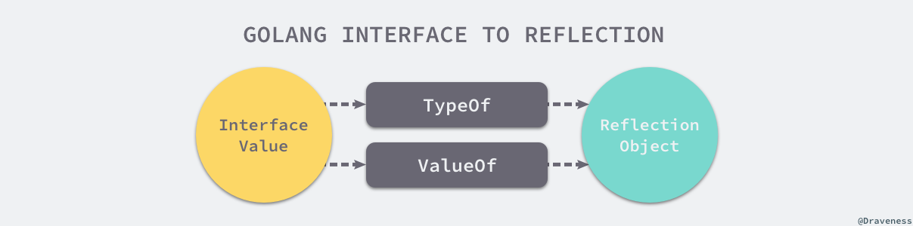

**图 4-16 接口到反射对象**


我们通过以下例子简单介绍这两个函数的作用，[`reflect.TypeOf`](https://github.com/golang/go/blob/52c4488471ed52085a29e173226b3cbd2bf22b20/src/reflect/type.go#L1365-L1368) 获取了变量 `author` 的类型，[`reflect.ValueOf`](https://github.com/golang/go/blob/52c4488471ed52085a29e173226b3cbd2bf22b20/src/reflect/value.go#L2316-L2328) 获取了变量的值 `draven`。如果我们知道了一个变量的类型和值，那么就意味着知道了这个变量的全部信息。

```go
package main
import (
    "fmt"
    "reflect"
)
func main() {
    author := "draven"
    fmt.Println("TypeOf author:", reflect.TypeOf(author))
    fmt.Println("ValueOf author:", reflect.ValueOf(author))
}
$ go run main.go
TypeOf author: string
ValueOf author: draven
```

有了变量的类型之后，我们可以通过 `Method` 方法获得类型实现的方法，通过 `Field` 获取类型包含的全部字段。

对于不同的类型，我们也可以调用不同的方法获取相关信息：

- 结构体：获取字段的数量并通过下标和字段名获取字段 `StructField`；
- 哈希表：获取哈希表的 `Key` 类型；
- 函数或方法：获取入参和返回值的类型；
- …

总而言之，使用 [`reflect.TypeOf`](https://github.com/golang/go/blob/52c4488471ed52085a29e173226b3cbd2bf22b20/src/reflect/type.go#L1365-L1368) 和 [`reflect.ValueOf`](https://github.com/golang/go/blob/52c4488471ed52085a29e173226b3cbd2bf22b20/src/reflect/value.go#L2316-L2328) 能够获取 Go 语言中的变量对应的反射对象。一旦获取了反射对象，我们就能得到跟当前类型相关数据和操作，并可以使用这些运行时获取的结构执行方法。


#### 第二法则

反射的第二法则是我们可以从反射对象可以获取 `interface{}` 变量。既然能够将接口类型的变量转换成反射对象，那么一定需要其他方法将反射对象还原成接口类型的变量，[`reflect`](https://golang.org/pkg/reflect/) 中的 [`reflect.Value.Interface`](https://github.com/golang/go/blob/52c4488471ed52085a29e173226b3cbd2bf22b20/src/reflect/value.go#L992-L994) 方法就能完成这项工作：

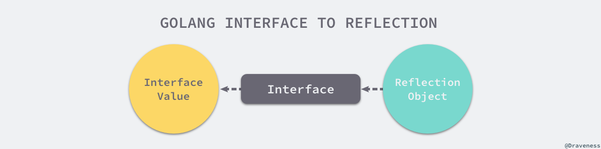

**图 4-17 反射对象到接口**

不过调用 [`reflect.Value.Interface`](https://github.com/golang/go/blob/52c4488471ed52085a29e173226b3cbd2bf22b20/src/reflect/value.go#L992-L994) 方法只能获得 `interface{}` 类型的变量，如果想要将其还原成最原始的状态还需要经过如下所示的显式类型转换：

```go
v := reflect.ValueOf(1)
v.Interface().(int)
```

从反射对象到接口值的过程就是从接口值到反射对象的镜面过程，两个过程都需要经历两次转换：

- 从接口值到反射对象：
  - 从基本类型到接口类型的类型转换；
  - 从接口类型到反射对象的转换；
- 从反射对象到接口值：
  - 反射对象转换成接口类型；
  - 通过显式类型转换变成原始类型；

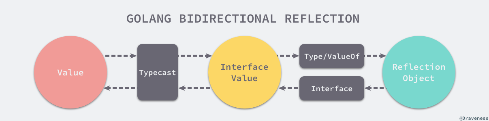

**图 4-18 接口和反射对象的双向转换**

当然不是所有的变量都需要类型转换这一过程。如果变量本身就是 `interface{}` 类型，那么它不需要类型转换，因为类型转换这一过程一般都是隐式的，所以我不太需要关心它，只有在我们需要将反射对象转换回基本类型时才需要显式的转换操作。


#### 第三法则

Go 语言反射的最后一条法则是与值是否可以被更改有关，如果我们想要更新一个 `reflect.Value`，那么它持有的值一定是可以被更新的，假设我们有以下代码：

```go
func main() {
    i := 1
    v := reflect.ValueOf(i)
    v.SetInt(10)
    fmt.Println(i)
}
$ go run reflect.go
panic: reflect: reflect.flag.mustBeAssignable using unaddressable value
goroutine 1 [running]:
reflect.flag.mustBeAssignableSlow(0x82, 0x1014c0)
    /usr/local/go/src/reflect/value.go:247 +0x180
reflect.flag.mustBeAssignable(...)
    /usr/local/go/src/reflect/value.go:234
reflect.Value.SetInt(0x100dc0, 0x414020, 0x82, 0x1840, 0xa, 0x0)
    /usr/local/go/src/reflect/value.go:1606 +0x40
main.main()
    /tmp/sandbox590309925/prog.go:11 +0xe0
```

运行上述代码会导致程序崩溃并报出 `reflect: reflect.flag.mustBeAssignable using unaddressable value` 错误，仔细思考一下就能够发现出错的原因，Go 语言的[函数调用](http://draveness.me/golang-function-call)都是**传值的**，所以我们得到的反射对象跟最开始的变量没有任何关系，所以直接对它修改会导致崩溃。

想要修改原有的变量只能通过如下的方法（地址传值+elem（））：

```
func main() {
    i := 1
    v := reflect.ValueOf(&i)
    v.Elem().SetInt(10)
    fmt.Println(i)
}
$ go run reflect.go
10
```

- 调用 [`reflect.ValueOf`](https://github.com/golang/go/blob/52c4488471ed52085a29e173226b3cbd2bf22b20/src/reflect/value.go#L2316-L2328) 函数获取变量指针；
- 调用 [`reflect.Value.Elem`](https://github.com/golang/go/blob/52c4488471ed52085a29e173226b3cbd2bf22b20/src/reflect/value.go#L788-L821) 方法获取指针指向的变量；
- 调用 [`reflect.Value.SetInt`](https://github.com/golang/go/blob/52c4488471ed52085a29e173226b3cbd2bf22b20/src/reflect/value.go#L1600-L1616) 方法更新变量的值：由于 Go 语言的函数调用都是值传递的，所以我们只能先获取指针对应的 `reflect.Value`，再通过 [`reflect.Value.Elem`](https://github.com/golang/go/blob/52c4488471ed52085a29e173226b3cbd2bf22b20/src/reflect/value.go#L788-L821) 方法迂回的方式得到可以被设置的变量，我们通过如下所示的代码理解这个过程：

```
func main() {
    i := 1
    v := &i
    *v = 10
}
```

如果不能直接操作 `i` 变量修改其持有的值，我们就只能获取 `i` 变量所在地址并使用 `*v` 修改所在地址中存储的整数。


### 4.3.2 类型和值

Go 语言的 `interface{}` 类型在语言内部是通过 `emptyInterface` 这个结体来表示的，其中的 `rtype` 字段用于表示变量的类型，另一个 `word` 字段指向内部封装的数据：

```go
type emptyInterface struct {
    typ  *rtype
    word unsafe.Pointer
}
```

用于获取变量类型的 [`reflect.TypeOf`](https://github.com/golang/go/blob/52c4488471ed52085a29e173226b3cbd2bf22b20/src/reflect/type.go#L1365-L1368) 函数将传入的变量隐式转换成 `emptyInterface` 类型并获取其中存储的类型信息 `rtype`：

```go
func TypeOf(i interface{}) Type {
    eface := *(*emptyInterface)(unsafe.Pointer(&i))
    return toType(eface.typ)
}
func toType(t *rtype) Type {
    if t == nil {
        return nil
    }
    return t
}
```

[`reflect.TypeOf`](https://github.com/golang/go/blob/52c4488471ed52085a29e173226b3cbd2bf22b20/src/reflect/type.go#L1365-L1368) 函数的实现原理其实并不复杂，它只是将一个 `interface{}` 变量转换成了内部的 `emptyInterface` 表示，然后从中获取相应的类型信息。

用于获取接口值 `Value` 的函数 [`reflect.ValueOf`](https://github.com/golang/go/blob/52c4488471ed52085a29e173226b3cbd2bf22b20/src/reflect/value.go#L2316-L2328) 实现也非常简单，在该函数中我们先调用了 [`reflect.escapes`](https://github.com/golang/go/blob/4e8d27068df52eb372dc2ba7e929e47850934805/src/reflect/value.go#L2779-L2783) 函数保证当前值逃逸到堆上，然后通过 [`reflect.unpackEface`](https://github.com/golang/go/blob/4e8d27068df52eb372dc2ba7e929e47850934805/src/reflect/value.go#L140-L152) 方法从接口中获取 `Value` 结构体：

```go
func ValueOf(i interface{}) Value {
    if i == nil {
        return Value{}
    }
    escapes(i)
    return unpackEface(i)
}
func unpackEface(i interface{}) Value {
    e := (*emptyInterface)(unsafe.Pointer(&i))
    t := e.typ
    if t == nil {
        return Value{}
    }
    f := flag(t.Kind())
    if ifaceIndir(t) {
        f |= flagIndir
    }
    return Value{t, e.word, f}
}
```

[`reflect.unpackEface`](https://github.com/golang/go/blob/4e8d27068df52eb372dc2ba7e929e47850934805/src/reflect/value.go#L140-L152) 函数会将传入的接口转换成 `emptyInterface` 结构体，然后将具体类型和指针包装成 `Value` 结构体并返回。

[`reflect.TypeOf`](https://github.com/golang/go/blob/52c4488471ed52085a29e173226b3cbd2bf22b20/src/reflect/type.go#L1365-L1368) 和 [`reflect.ValueOf`](https://github.com/golang/go/blob/52c4488471ed52085a29e173226b3cbd2bf22b20/src/reflect/value.go#L2316-L2328) 函数的实现都很简单。我们已经分析了这两个函数的实现，现在需要了解编译器在调用函数之前做了哪些工作：

```go
package main
import (
    "reflect"
)
func main() {
    i := 20
    _ = reflect.TypeOf(i)
}
$ go build -gcflags="-S -N" main.go
...
MOVQ    $20, ""..autotmp_20+56(SP) // autotmp = 20
LEAQ    type.int(SB), AX           // AX = type.int(SB)
MOVQ    AX, ""..autotmp_19+280(SP) // autotmp_19+280(SP) = type.int(SB)
LEAQ    ""..autotmp_20+56(SP), CX  // CX = 20
MOVQ    CX, ""..autotmp_19+288(SP) // autotmp_19+288(SP) = 20
...
```

从上面这段截取的汇编语言，我们发现在函数调用之前已经发生了类型转换，上述指令将 `int` 类型的变量转换成了占用 16 字节 `autotmp_19+280(SP) ~ autotmp_19+288(SP)` 的接口，两个 `LEAQ` 指令分别获取了类型的指针 `type.int(SB)` 以及变量 `i` 所在的地址。

当我们想要将一个变量转换成反射对象时，Go 语言会在编译期间完成类型转换的工作，将变量的类型和值转换成了 `interface{}` 并等待运行期间使用 [`reflect`](https://golang.org/pkg/reflect/) 包获取接口中存储的信息。


### 4.3.3 更新变量

当我们想要更新一个 `reflect.Value`，就需要调用 [`reflect.Value.Set`](https://github.com/golang/go/blob/4e8d27068df52eb372dc2ba7e929e47850934805/src/reflect/value.go#L1525-L1538) 方法更新反射对象，该方法会调用 [`reflect.flag.mustBeAssignable`](https://github.com/golang/go/blob/4e8d27068df52eb372dc2ba7e929e47850934805/src/reflect/value.go#L232-L236) 和 [`reflect.flag.mustBeExported`](https://github.com/golang/go/blob/4e8d27068df52eb372dc2ba7e929e47850934805/src/reflect/value.go#L214-L218) 分别检查当前反射对象是否是可以被设置的以及字段是否是对外公开的：

```go
func (v Value) Set(x Value) {
    v.mustBeAssignable()
    x.mustBeExported()
    var target unsafe.Pointer
    if v.kind() == Interface {
        target = v.ptr
    }
    x = x.assignTo("reflect.Set", v.typ, target)
    typedmemmove(v.typ, v.ptr, x.ptr)
}
```

[`reflect.Value.Set`](https://github.com/golang/go/blob/4e8d27068df52eb372dc2ba7e929e47850934805/src/reflect/value.go#L1525-L1538) 方法会调用 [`reflect.Value.assignTo`](https://github.com/golang/go/blob/4e8d27068df52eb372dc2ba7e929e47850934805/src/reflect/value.go#L2370-L2404) 并返回一个新的反射对象，**这个返回的反射对象指针就会直接覆盖原始的反射变量**。

```go
func (v Value) assignTo(context string, dst *rtype, target unsafe.Pointer) Value {
    ...
    switch {
    case directlyAssignable(dst, v.typ):
        ...
        return Value{dst, v.ptr, fl}
    case implements(dst, v.typ):
        if v.Kind() == Interface && v.IsNil() {
            return Value{dst, nil, flag(Interface)}
        }
        x := valueInterface(v, false)
        if dst.NumMethod() == 0 {
            *(*interface{})(target) = x
        } else {
            ifaceE2I(dst, x, target)
        }
        return Value{dst, target, flagIndir | flag(Interface)}
    }
    panic(context + ": value of type " + v.typ.String() + " is not assignable to type " + dst.String())
}
```

[`reflect.Value.assignTo`](https://github.com/golang/go/blob/4e8d27068df52eb372dc2ba7e929e47850934805/src/reflect/value.go#L2370-L2404) 会根据当前和被设置的反射对象类型创建一个新的 `Value` 结构体：

- 如果两个反射对象的类型是可以被直接替换，就会直接将目标反射对象返回；
- 如果当前反射对象是接口并且目标对象实现了接口，就会将目标对象简单包装成接口值；

在变量更新的过程中，[`reflect.Value.assignTo`](https://github.com/golang/go/blob/4e8d27068df52eb372dc2ba7e929e47850934805/src/reflect/value.go#L2370-L2404) 返回的 `reflect.Value` 中的指针会覆盖当前反射对象中的指针实现变量的更新。


### 4.3.4 实现协议

[`reflect`](https://golang.org/pkg/reflect/) 包还为我们提供了 [`reflect.rtypes.Implements`](https://github.com/golang/go/blob/4e8d27068df52eb372dc2ba7e929e47850934805/src/reflect/type.go#L1430-L1438) 方法可以用于判断某些类型是否遵循特定的接口。在 Go 语言中获取结构体的反射类型 `reflect.Type` 还是比较容易的，但是想要获得接口的类型就需要通过以下方式：

```go
reflect.TypeOf((*<interface>)(nil)).Elem()
```

我们通过一个例子在介绍如何判断一个类型是否实现了某个接口。假设我们需要判断如下代码中的 `CustomError` 是否实现了 Go 语言标准库中的 `error` 接口：

```go
type CustomError struct{}
func (*CustomError) Error() string {
    return ""
}
func main() {
    typeOfError := reflect.TypeOf((*error)(nil)).Elem()
    customErrorPtr := reflect.TypeOf(&CustomError{})
    customError := reflect.TypeOf(CustomError{})
    fmt.Println(customErrorPtr.Implements(typeOfError)) // #=> true
    fmt.Println(customError.Implements(typeOfError)) // #=> false
}
```

上述代码的运行结果正如我们在[接口](https://www.bookstack.cn/read/draveness-golang/5833e4cb4df6241b.md)一节中介绍的：

- `CustomError` 类型并没有实现 `error` 接口；
- `*CustomError` 指针类型实现了 `error` 接口；

抛开上述的执行结果不谈，我们来分析一下 [`reflect.rtypes.Implements`](https://github.com/golang/go/blob/4e8d27068df52eb372dc2ba7e929e47850934805/src/reflect/type.go#L1430-L1438) 方法的工作原理：

```go
func (t *rtype) Implements(u Type) bool {
    if u == nil {
        panic("reflect: nil type passed to Type.Implements")
    }
    if u.Kind() != Interface {
        panic("reflect: non-interface type passed to Type.Implements")
    }
    return implements(u.(*rtype), t)
}
```


[`reflect.rtypes.Implements`](https://github.com/golang/go/blob/4e8d27068df52eb372dc2ba7e929e47850934805/src/reflect/type.go#L1430-L1438) 方法会检查传入的类型是不是接口，如果不是接口或者是空值就会直接 panic 中止当前程序。在参数没有问题的情况下，上述方法会调用私有函数 [`reflect.implements`](https://github.com/golang/go/blob/4e8d27068df52eb372dc2ba7e929e47850934805/src/reflect/type.go#L1461-L1543) 判断类型之间是否有实现关系：

```go
func implements(T, V *rtype) bool {
    t := (*interfaceType)(unsafe.Pointer(T))
    if len(t.methods) == 0 {
        return true
    }
    ...
    v := V.uncommon()
    i := 0
    vmethods := v.methods()
    for j := 0; j < int(v.mcount); j++ {
        tm := &t.methods[i]
        tmName := t.nameOff(tm.name)
        vm := vmethods[j]
        vmName := V.nameOff(vm.name)
        if vmName.name() == tmName.name() && V.typeOff(vm.mtyp) == t.typeOff(tm.typ) {
            if i++; i >= len(t.methods) {
                return true
            }
        }
    }
    return false
}
```

如果接口中不包含任何方法，就意味着这是一个空的接口，任意类型都自动实现该接口，这时就会直接返回 `true`。

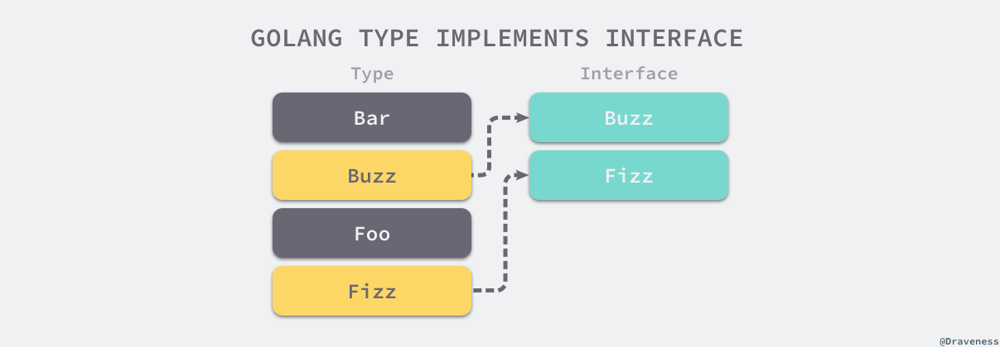

**图 4-19 类型实现接口**

在其他情况下，由于方法都是按照字母序存储的，[`reflect.implements`](https://github.com/golang/go/blob/4e8d27068df52eb372dc2ba7e929e47850934805/src/reflect/type.go#L1461-L1543) 会维护两个用于遍历接口和类型方法的索引 `i` 和 `j` 判断类型是否实现了接口，因为最多只会进行 `n + m` 次数的比较，所以整个过程的时间复杂度是 `O(n+m)`。

### 4.3.5 方法调用

作为一门静态语言，如果我们想要通过 [`reflect`](https://golang.org/pkg/reflect/) 包利用反射在运行期间执行方法不是一件容易的事情，下面的十几行代码就使用反射来执行 `Add(0, 1)` 函数：

```go
func Add(a, b int) int { return a + b }
func main() {
    v := reflect.ValueOf(Add)
    if v.Kind() != reflect.Func {
        return
    }
    t := v.Type()
    argv := make([]reflect.Value, t.NumIn())
    for i := range argv {
        if t.In(i).Kind() != reflect.Int {
            return
        }
        argv[i] = reflect.ValueOf(i)
    }
    result := v.Call(argv)
    if len(result) != 1 || result[0].Kind() != reflect.Int {
        return
    }
    fmt.Println(result[0].Int()) // #=> 1
}
```

- 通过 [`reflect.ValueOf`](https://github.com/golang/go/blob/52c4488471ed52085a29e173226b3cbd2bf22b20/src/reflect/value.go#L2316-L2328) 获取函数 `Add` 对应的反射对象；
- 根据反射对象 [`reflect.rtype.NumIn`](https://github.com/golang/go/blob/4e8d27068df52eb372dc2ba7e929e47850934805/src/reflect/type.go#L979-L985) 方法返回的参数个数创建 `argv` 数组；
- 多次调用 [`reflect.ValueOf`](https://github.com/golang/go/blob/52c4488471ed52085a29e173226b3cbd2bf22b20/src/reflect/value.go#L2316-L2328) 函数逐一设置 `argv` 数组中的各个参数；
- 调用反射对象 `Add` 的 [`reflect.Value.Call`](https://github.com/golang/go/blob/4e8d27068df52eb372dc2ba7e929e47850934805/src/reflect/value.go#L318-L322) 方法并传入参数列表；
- 获取返回值数组、验证数组的长度以及类型并打印其中的数据；使用反射来调用方法非常复杂，原本只需要一行代码就能完成的工作，现在需要十几行代码才能完成，但这也是在静态语言中使用动态特性需要付出的成本。

```
func (v Value) Call(in []Value) []Value {
    v.mustBe(Func)
    v.mustBeExported()
    return v.call("Call", in)
}
```

[`reflect.Value.Call`](https://github.com/golang/go/blob/4e8d27068df52eb372dc2ba7e929e47850934805/src/reflect/value.go#L318-L322) 方法是运行时调用方法的入口，它通过两个 `MustBe` 开头的方法确定了当前反射对象的类型是函数以及可见性，随后调用 [`reflect.Value.call`](https://github.com/golang/go/blob/4e8d27068df52eb372dc2ba7e929e47850934805/src/reflect/value.go#L339-L501) 完成方法调用，这个私有方法的执行过程会分成以下的几个部分：

- 检查输入参数以及类型的合法性；
- 将传入的 `reflect.Value` 参数数组设置到栈上；
- 通过函数指针和输入参数调用函数；
- 从栈上获取函数的返回值；我们将按照上面的顺序分析使用 [`reflect`](https://golang.org/pkg/reflect/) 进行函数调用的几个过程。


#### 参数检查

参数检查是通过反射调用方法的第一步，在参数检查期间我们会从反射对象中取出当前的函数指针 `unsafe.Pointer`，如果该函数指针是方法，那么我们就会通过 [`reflect.methodReceiver`](https://github.com/golang/go/blob/4e8d27068df52eb372dc2ba7e929e47850934805/src/reflect/value.go#L612-L645) 函数获取方法的接受者和函数指针。

```go
func (v Value) call(op string, in []Value) []Value {
    t := (*funcType)(unsafe.Pointer(v.typ))
    ...
    if v.flag&flagMethod != 0 {
        rcvr = v
        rcvrtype, t, fn = methodReceiver(op, v, int(v.flag)>>flagMethodShift)
    } else {
        ...
    }
    n := t.NumIn()
    if len(in) < n {
        panic("reflect: Call with too few input arguments")
    }
    if len(in) > n {
        panic("reflect: Call with too many input arguments")
    }
    for i := 0; i < n; i++ {
        if xt, targ := in[i].Type(), t.In(i); !xt.AssignableTo(targ) {
            panic("reflect: " + op + " using " + xt.String() + " as type " + targ.String())
        }
    }
```

在上述方法中，上述方法还会检查传入参数的个数以及参数的类型与函数签名中的类型是否可以匹配，任何参数的不匹配都会导致整个程序的崩溃中止。

#### 准备参数

当我们已经对当前方法的参数完成验证之后，就会进入函数调用的下一个阶段，为函数调用准备参数，在前面的章节[函数调用](https://draveness.me/golang/basic/golang-function-call.html)中我们已经介绍过 Go 语言的函数调用惯例，函数或者方法在调用时，所有的参数都会被依次放置到栈上。

```go
    nout := t.NumOut()
    frametype, _, retOffset, _, framePool := funcLayout(t, rcvrtype)
    var args unsafe.Pointer
    if nout == 0 {
        args = framePool.Get().(unsafe.Pointer)
    } else {
        args = unsafe_New(frametype)
    }
    off := uintptr(0)
    if rcvrtype != nil {
        storeRcvr(rcvr, args)
        off = ptrSize
    }
    for i, v := range in {
        targ := t.In(i).(*rtype)
        a := uintptr(targ.align)
        off = (off + a - 1) &^ (a - 1)
        n := targ.size
        ...
        addr := add(args, off, "n > 0")
        v = v.assignTo("reflect.Value.Call", targ, addr)
        *(*unsafe.Pointer)(addr) = v.ptr
        off += n
    }
```

- 通过 [`reflect.funcLayout`](https://github.com/golang/go/blob/4e8d27068df52eb372dc2ba7e929e47850934805/src/reflect/type.go#L2975-L3048) 函数计算当前函数需要的参数和返回值的栈布局，也就是每一个参数和返回值所占的空间大小；
- 如果当前函数有返回值，需要为当前函数的参数和返回值分配一片内存空间 `args`；
- 如果当前函数是方法，需要向将方法的接受者拷贝到 `args` 内存中；
- 将所有函数的参数按照顺序依次拷贝到对应args 内存中
  - 使用 [`reflect.funcLayout`](https://github.com/golang/go/blob/4e8d27068df52eb372dc2ba7e929e47850934805/src/reflect/type.go#L2975-L3048) 返回的参数计算参数在内存中的位置；
  - 将参数拷贝到内存空间中；准备参数的过程是计算各个参数和返回值占用的内存空间并将所有的参数都拷贝内存空间对应的位置的过程，该过程会考虑函数和方法、返回值数量以及参数类型带来的差异。

#### 调用函数

准备好调用函数需要的全部参数之后，就会通过以下的代码执行函数指针了。我们会向该函数传入栈类型、函数指针、参数和返回值的内存空间、栈的大小以及返回值的偏移量：

```
    call(frametype, fn, args, uint32(frametype.size), uint32(retOffset))
```

上述函数实际上并不存在，它会在编译期间被链接到 [`runtime.reflectcall`](https://github.com/golang/go/blob/a38a917aee626a9b9d5ce2b93964f586bf759ea0/src/runtime/asm_386.s#L489-L526) 这个用汇编实现的函数上，我们在这里不会分析该函数的具体实现，感兴趣的读者可以自行了解其实现原理。

#### 处理返回值

当函数调用结束之后，就会开始处理函数的返回值：

- 如果函数没有任何返回值，会直接清空 `args` 中的全部内容来释放内存空间；
- 如果当前函数有返回值；
  - 将 `args` 中与输入参数有关的内存空间清空；
  - 创建一个 `nout` 长度的切片用于保存由反射对象构成的返回值数组；
  - 从函数对象中获取返回值的类型和内存大小，将 `args` 内存中的数据转换成 `reflect.Value` 类型并存储到切片中；

```go
    var ret []Value
    if nout == 0 {
        typedmemclr(frametype, args)
        framePool.Put(args)
    } else {
        typedmemclrpartial(frametype, args, 0, retOffset)
        ret = make([]Value, nout)
        off = retOffset
        for i := 0; i < nout; i++ {
            tv := t.Out(i)
            a := uintptr(tv.Align())
            off = (off + a - 1) &^ (a - 1)
            if tv.Size() != 0 {
                fl := flagIndir | flag(tv.Kind())
                ret[i] = Value{tv.common(), add(args, off, "tv.Size() != 0"), fl}
            } else {
                ret[i] = Zero(tv)
            }
            off += tv.Size()
        }
    }
    return ret
}
```

由 `reflect.Value` 构成的 `ret` 数组会被返回到上层，到这里为止使用反射实现函数调用的过程就结束了。

### 4.3.6 小结

Go 语言的 [`reflect`](https://golang.org/pkg/reflect/) 包为我们提供的多种能力，包括如何使用反射来动态修改变量、判断类型是否实现了某些接口以及动态调用方法等功能，通过对反射包中方法原理的分析能帮助我们理解之前看起来比较怪异、令人困惑的现象。

- Package reflect https://golang.org/pkg/reflect/[↩︎](https://www.bookstack.cn/read/draveness-golang/f42669fa0cd10c64.md#fnref:1)
- 谈元编程与表达能力 https://draveness.me/metaprogramming[↩︎](https://www.bookstack.cn/read/draveness-golang/f42669fa0cd10c64.md#fnref:2)
- The Laws of Reflection https://blog.golang.org/laws-of-reflection[↩︎](https://www.bookstack.cn/read/draveness-golang/f42669fa0cd10c64.md#fnref:3)


## 4.5 推荐阅读

> [4.4 推荐阅读](https://www.bookstack.cn/read/draveness-golang/82497e663992a6f7.md)

- [The Function Stack](https://www.tenouk.com/Bufferoverflowc/Bufferoverflow2a.html)
- [Why do byte spills occur and what do they achieve?](https://stackoverflow.com/questions/16453314/why-do-byte-spills-occur-and-what-do-they-achieve)
- [Friday Q&A 2011-12-16: Disassembling the Assembly, Part 1](https://mikeash.com/pyblog/friday-qa-2011-12-16-disassembling-the-assembly-part-1.html)
- [x86 calling conventions](https://en.wikipedia.org/wiki/X86_calling_conventions)
- [Call Stack](https://en.wikipedia.org/wiki/Call_stack)
- [Chapter I: A Primer on Go Assembly](https://github.com/teh-cmc/go-internals/blob/master/chapter1_assembly_primer/README.md)
- [How Interfaces Work in Go](https://www.tapirgames.com/blog/golang-interface-implementation)
- [Interfaces and other types · Effective Go](https://golang.org/doc/effective_go.html#interfaces_and_types)
- [How to use interfaces in Go](https://jordanorelli.com/post/32665860244/how-to-use-interfaces-in-go)
- [Go Data Structures: Interfaces](https://research.swtch.com/interfaces)
- [Duck typing · Wikipedia](https://en.wikipedia.org/wiki/Duck_typing)
- [What is POSIX?](http://www.robelle.com/smugbook/posix.html)
- [Chapter II: Interfaces](https://github.com/teh-cmc/go-internals/blob/master/chapter2_interfaces/README.md)
- [The Laws of Reflection](https://blog.golang.org/laws-of-reflection)
- [runtime: new itab lookup table](https://github.com/golang/go/commit/3d1699ea787f38be6088f9a098d6e08dafca9387)
- [runtime: need a better itab table](https://github.com/golang/go/issues/20505)


# 第五章 常用关键字

## 5.1 for 和 range

> [5.1 for 和 range](https://www.bookstack.cn/read/draveness-golang/816b8b0f4e15285f.md)

循环是所有编程语言都有的控制结构，除了使用经典的『三段式』循环之外，Go 语言还引入了另一个关键字 range 帮助我们快速遍历[数组](https://www.bookstack.cn/read/draveness-golang/79255565262cc9f6.md)、[切片](https://www.bookstack.cn/read/draveness-golang/bc59e924b285e5e9.md)、[哈希表](https://www.bookstack.cn/read/draveness-golang/8a6fa5746b8fbe7e.md) 以及 [Channel](https://www.bookstack.cn/read/draveness-golang/c666731d5f1a2820.md) 等集合类型。本节将深入分析 Go 语言的两种不同循环，也就是经典的 for 循环和 for/range 循环，我们会分析这两种循环的运行时结构以及它们的实现原理，

for 循环能够将代码中的数据和逻辑分离，让同一份代码能够多次复用处理同样的逻辑。我们先来看一下 Go 语言 for 循环对应的汇编代码，下面是一段经典的三段式循环的代码，我们将它编译成汇编指令：

```go
package main
func main() {
    for i := 0; i < 10; i++ {
        println(i)
    }
}
"".main STEXT size=98 args=0x0 locals=0x18
    00000 (main.go:3)    TEXT    "".main(SB), $24-0
    ...
    00029 (main.go:3)    XORL    AX, AX                   ;; i := 0
    00031 (main.go:4)    JMP    75
    00033 (main.go:4)    MOVQ    AX, "".i+8(SP)
    00038 (main.go:5)    CALL    runtime.printlock(SB)
    00043 (main.go:5)    MOVQ    "".i+8(SP), AX
    00048 (main.go:5)    MOVQ    AX, (SP)
    00052 (main.go:5)    CALL    runtime.printint(SB)
    00057 (main.go:5)    CALL    runtime.printnl(SB)
    00062 (main.go:5)    CALL    runtime.printunlock(SB)
    00067 (main.go:4)    MOVQ    "".i+8(SP), AX
    00072 (main.go:4)    INCQ    AX                       ;; i++
    00075 (main.go:4)    CMPQ    AX, $10                  ;; 比较变量 i 和 10
    00079 (main.go:4)    JLT    33                           ;; 跳转到 33 行如果 i < 10
    ...
```

我们将上述汇编指令的执行过程分成三个部分进行分析：

- 0029 ~ 0031 行负责循环的初始化；
  - 对寄存器 `AX` 中的变量 `i` 进行初始化并执行 `JMP 75` 指令跳转到 0075 行；
- 0075 ~ 0079 行负责检查循环的终止条件，将寄存器中存储的数据 i与 10 比较；
  - `JLT 33` 命令会在变量的值小于 10 时跳转到 0033 行执行循环主体；
  - `JLT 33` 命令会在变量的值大于 10 时跳出循环体执行下面的代码；
- 0033 ~ 0072 行是循环内部的语句；
  - 通过多个汇编指令打印变量中的内容；
  - `INCQ AX` 指令会将变量加一，然后再与 10 进行比较，回到第二步；for/range 循环经过优化的汇编代码有着完全相同的结构。无论是变量的初始化、循环体的执行还是最后的条件判断都是完全一样的，所以这里也就不展开分析对应的汇编指令了。

```go
package main
func main() {
    arr := []int{1, 2, 3}
    for i, _ := range arr {
        println(i)
    }
}
```

在汇编语言中，无论是经典的 for 循环还是 for/range 循环都会使用 **`JMP`** 以及相关的命令跳回循环体的开始位置来多次执行代码的逻辑。从不同循环具有相同的汇编代码可以猜到，使用 for/range 的控制结构最终也会被 Go 语言编译器转换成普通的 for 循环，后面的分析会印证这一点。


### 5.1.1 现象

在深入语言的源代码中了解两种不同循环的实现之前，我们可以先来看一下使用 `for` 和 `range` 会遇到的一些现象和问题，我们可以带着这些现象和问题去源代码中寻找答案，这样能更高效地理解实现。

#### 循环永动机

如果我们在遍历数组的同时修改数组的元素，能否得到一个永远都不会停止的循环呢？你可以自己尝试运行下面的代码来得到结果：

```go
func main() {
    arr := []int{1, 2, 3}
    for _, v := range arr {
        arr = append(arr, v)
    }
    fmt.Println(arr)
}
$ go run main.go
1 2 3 1 2 3
```


上述代码的输出意味着循环只遍历了原始切片中的三个元素，我们在遍历切片时追加的元素不会增加循环的执行次数，所以循环最终还是停了下来。

#### 神奇的指针

第二个例子是使用 Go 语言经常会犯的错误[1](https://www.bookstack.cn/read/draveness-golang/816b8b0f4e15285f.md#fn:1)。当我们在遍历一个数组时，如果获取 `range` 返回变量的地址并保存到另一个数组或者哈希时，就会遇到令人困惑的现象：

```go
func main() {
    arr := []int{1, 2, 3}
    newArr := []*int{}
    for _, v := range arr {
        newArr = append(newArr, &v)
    }
    for _, v := range newArr {
        fmt.Println(*v)
    }
}
$ go run main.go
3 3 3
```

上述代码最终会输出三个连续的 `3`，这个问题比较常见，一些有经验的开发者不经意也会犯这种错误，正确的做法应该是使用 `&arr[i]` 替代 `&v`，我们会在下面分析这一现象背后的原因。（因为newArr是一个地址数组，而遍历是v的地址是不变的，所以最后其实存的是同个地址，且最后地址上的值是3）


#### 遍历清空数组

当我们想要在 Go 语言中清空一个切片或者哈希表时，我们一般都会使用以下的方法将切片中的元素置零，但是依次去遍历切片和哈希表看起来是非常耗费性能的事情：

```go
func main() {
    arr := []int{1, 2, 3}
    for i, _ := range arr {
        arr[i] = 0
    }
}
```

因为数组、切片和哈希表占用的内存空间都是连续的，所以最快的方法是直接清空这片内存中的内容，当我们编译上述代码时会得到以下的汇编指令：

```
"".main STEXT size=93 args=0x0 locals=0x30
    0x0000 00000 (main.go:3)    TEXT    "".main(SB), $48-0
    ...
    0x001d 00029 (main.go:4)    MOVQ    "".statictmp_0(SB), AX
    0x0024 00036 (main.go:4)    MOVQ    AX, ""..autotmp_3+16(SP)
    0x0029 00041 (main.go:4)    MOVUPS    "".statictmp_0+8(SB), X0
    0x0030 00048 (main.go:4)    MOVUPS    X0, ""..autotmp_3+24(SP)
    0x0035 00053 (main.go:5)    PCDATA    $2, $1
    0x0035 00053 (main.go:5)    LEAQ    ""..autotmp_3+16(SP), AX
    0x003a 00058 (main.go:5)    PCDATA    $2, $0
    0x003a 00058 (main.go:5)    MOVQ    AX, (SP)
    0x003e 00062 (main.go:5)    MOVQ    $24, 8(SP)
    0x0047 00071 (main.go:5)    CALL    runtime.memclrNoHeapPointers(SB)
    ...
```

从生成的汇编代码我们可以看出，编译器会直接使用 [`runtime.memclrNoHeapPointers`](https://github.com/golang/go/blob/05c02444eb2d8b8d3ecd949c4308d8e2323ae087/src/runtime/memclr_386.s#L12-L16) 清空切片中的数据，这也是我们在下面的小节会介绍的内容。


#### 随机遍历

当我们在 Go 语言中使用 `range` 遍历哈希表时，往往都会使用如下的代码结构，但是这段代码在每次运行时都会打印出不同的结果：

```go
func main() {
    hash := map[string]int{
        "1": 1,
        "2": 2,
        "3": 3,
    }
    for k, v := range hash {
        println(k, v)
    }
}
```

两次运行上述代码可能会得到不同的结果，第一次会打印 `2 3 1`，第二次会打印 `1 2 3`，如果我们运行的次数足够多，最后会得到几种不同的遍历顺序。

这是 Go 语言故意的设计，它在运行时为哈希表的遍历引入不确定性，也是告诉所有使用 Go 语言的使用者，程序不要依赖于哈希表的稳定遍历，我们在下面的小节会介绍在**遍历的过程是如何引入不确定性的**。


### 5.1.2 经典循环

Go 语言中的经典循环在编译器看来是一个 `OFOR` 类型的节点，这个节点由以下四个部分组成：

- 初始化循环的 `Ninit`；
- 循环的中止条件 `Left`；
- 循环体结束时执行的 `Right`；
- 循环体 `NBody`：

```
for Ninit; Left; Right {
    NBody
}
```

在生成 SSA 中间代码的阶段，[`cmd/compile/internal/gc.stmt`](https://github.com/golang/go/blob/4d5bb9c60905b162da8b767a8a133f6b4edcaa65/src/cmd/compile/internal/gc/ssa.go#L1023-L1502) 方法在发现传入的节点类型是 `OFOR` 时就会执行以下的代码块，这段代码的会将循环中的代码分成不同的块：

```go
func (s *state) stmt(n *Node) {
    switch n.Op {
    case OFOR, OFORUNTIL:
        bCond, bBody, bIncr, bEnd := ...
        b := s.endBlock()
        b.AddEdgeTo(bCond)
        s.startBlock(bCond)
        s.condBranch(n.Left, bBody, bEnd, 1)
        s.startBlock(bBody)
        s.stmtList(n.Nbody)
        b.AddEdgeTo(bIncr)
        s.startBlock(bIncr)
        s.stmt(n.Right)
        b.AddEdgeTo(bCond)
        s.startBlock(bEnd)
    }
}
```


一个常见的 for 循环代码会被 [`cmd/compile/internal/gc.stmt`](https://github.com/golang/go/blob/4d5bb9c60905b162da8b767a8a133f6b4edcaa65/src/cmd/compile/internal/gc/ssa.go#L1023-L1502) 方法转换成下面的控制结构，该结构中包含了 4 个不同的块，这些代码块之间的连接就表示汇编语言中的跳转关系，与我们理解的 for 循环控制结构其实没有太多的差别。

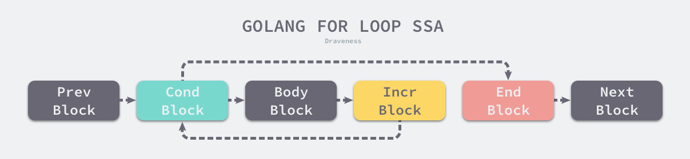

**图 5-1 Go 语言循环生成的 SSA 代码**

[机器码生成](https://www.bookstack.cn/read/draveness-golang/100aabc3275d17e5.md)阶段会将这些代码块转换成机器码，以及指定 CPU 架构上运行的机器语言，就是我们在前面编译得到的汇编指令。


### 5.1.3 范围循环

与简单的经典循环相比，范围循环在 Go 语言中更常见、实现也更复杂。这种循环同时使用 for 和 range 两个关键字，编译器会在编译期间将所有 for/range 循环变成的经典循环。从编译器的视角来看，就是将 `ORANGE` 类型的节点转换成 `OFOR` 节点:


**图 5-2 范围循环、普通循环和 SSA**

节点类型的转换过程都发生在 SSA 中间代码生成阶段，所有的 for/range 循环都会被 [`cmd/compile/internal/gc.walkrange`](https://github.com/golang/go/blob/440f7d64048cd94cba669e16fe92137ce6b84073/src/cmd/compile/internal/gc/range.go#L155-L456) 函数转换成不包含复杂结构、只包含基本表达式的语句。接下来，我们按照循环遍历的元素类型依次介绍遍历数组和切片、哈希表、字符串以及管道时的过程。

#### 数组和切片

对于数组和切片来说，Go 语言有三种不同的遍历方式，这三种不同的遍历方式分别对应着代码中的不同条件，它们会在 [`cmd/compile/internal/gc.walkrange`](https://github.com/golang/go/blob/440f7d64048cd94cba669e16fe92137ce6b84073/src/cmd/compile/internal/gc/range.go#L155-L456) 函数中转换成不同的控制逻辑，我们将该函数的相关逻辑分成几个部分进行分析：

- 分析遍历数组和切片清空元素的情况；
- 分析使用 `for range a {}` 遍历数组和切片，不关心索引和数据的情况；
- 分析使用 `for i := range a {}` 遍历数组和切片，只关心索引的情况；
- 分析使用 `for i, elem := range a {}` 遍历数组和切片，关心索引和数据的情况；

```go
func walkrange(n *Node) *Node {
    switch t.Etype {
    case TARRAY, TSLICE:
        if arrayClear(n, v1, v2, a) {
            return n
        }
```

[`cmd/compile/internal/gc.arrayClear`](https://github.com/golang/go/blob/440f7d64048cd94cba669e16fe92137ce6b84073/src/cmd/compile/internal/gc/range.go#L532-L610) 是一个非常有趣的优化，这个函数会优化 Go 语言遍历数组或者切片并删除全部元素的逻辑：

```
// original
for i := range a {
    a[i] = zero
}
// optimized
if len(a) != 0 {
    hp = &a[0]
    hn = len(a)*sizeof(elem(a))
    memclrNoHeapPointers(hp, hn)
    i = len(a) - 1
}
```

相比于依次清除数组或者切片中的数据，Go 语言会直接使用 [`runtime.memclrNoHeapPointers`](https://github.com/golang/go/blob/05c02444eb2d8b8d3ecd949c4308d8e2323ae087/src/runtime/memclr_386.s#L12-L16) 或者 [`runtime.memclrHasPointers`](https://github.com/golang/go/blob/db16de920370892b0241d3fa0617dddff2417a4d/src/runtime/mbarrier.go#L345-L348) 函数直接清除目标数组对应内存空间中的数据，并在执行完成后更新用于遍历数组的索引，这也印证了我们在遍历清空数组一节中观察到的现象。

处理了这种特殊的情况之后，我们就可以继续回到 `ORANGE` 节点的处理过程了。这里会设置 for 循环的 `Left` 和 `Right` 字段，也就是终止条件和循环体每次执行结束后运行的代码：

```
ha := a
hv1 := temp(types.Types[TINT])
hn := temp(types.Types[TINT])
init = append(init, nod(OAS, hv1, nil))
init = append(init, nod(OAS, hn, nod(OLEN, ha, nil)))
n.Left = nod(OLT, hv1, hn)
n.Right = nod(OAS, hv1, nod(OADD, hv1, nodintconst(1)))
if v1 == nil {
break
}
```

如果原始的循环是 `for range a {}`，那么就满足 `v1 == nil` 的条件，即循环不关心数组的索引和数据，它会被编译器转换成如下所示的代码：

```
ha := a
hv1 := 0
hn := len(ha)
v1 := hv1
for ; hv1 < hn; hv1++ {
    ...
}
```

这是 `ORANGE` 结构在编译期间被转换的最简单形式，由于原始代码不需要获取数组的索引和元素，只需要使用数组或者切片的数量执行对应次数的循环，所以会生成一个最简单的 for 循环。

如果我们在遍历数组时需要使用索引 `for i := range a {}`，那么编译器会继续会执行下面的代码：

```
        if v2 == nil {
            body = []*Node{nod(OAS, v1, hv1)}
            break
        }
```

`v2 == nil` 意味着调用方不关心数组的元素，只关心遍历数组使用的索引。它会将 `for i := range a {}` 转换成如下所示的逻辑，与第一种循环相比，这种循环在循环体中添加了 `v1 := hv1` 语句，传递遍历数组时的索引：

```
ha := a
hv1 := 0
hn := len(ha)
v1 := hv1
for ; hv1 < hn; hv1++ {
    v1 := hv1
    ...
}
```

上面的两种情况虽然也是使用 range 经常遇到的情况，但是同时去遍历索引和元素也很常见。处理这种情况会使用下面这段的代码：

```
        tmp := nod(OINDEX, ha, hv1)
        tmp.SetBounded(true)
        a := nod(OAS2, nil, nil)
        a.List.Set2(v1, v2)
        a.Rlist.Set2(hv1, tmp)
        body = []*Node{a}
    }
    n.Ninit.Append(init...)
    n.Nbody.Prepend(body...)
    return n
}
```

这段代码处理的就是遍历数组和切片时，同时关心索引和切片的情况。它不仅会在循环体中插入更新索引的语句，还会插入赋值操作让循环体内部的代码能够访问数组中的元素：

```
ha := a
hv1 := 0
hn := len(ha)
v1 := hv1
for ; hv1 < hn; hv1++ {
    tmp := ha[hv1]
    v1, v2 := hv1, tmp
    ...
}
```

对于所有的 range 循环，Go 语言都会在编译期将原切片或者数组赋值给一个新的变量 `ha`，在赋值的过程中就发生了拷贝，所以我们遍历的切片已经不是原始的切片变量了。

而遇到这种同时遍历索引和元素的 range 循环时，Go 语言会额外创建一个新的 `v2` 变量存储切片中的元素，**循环中使用的这个变量 v2 会在每一次迭代被重新赋值，在赋值时也发生了拷贝**。

```
func main() {
    arr := []int{1, 2, 3}
    newArr := []*int{}
    for i, _ := range arr {
        newArr = append(newArr, &arr[i])
    }
    for _, v := range newArr {
        fmt.Println(*v)
    }
}
```

因为在循环中获取返回变量的地址都完全相同，所以会发生神奇的指针一节中的现象。所以如果我们想要访问数组中元素所在的地址，不应该直接获取 range 返回的变量地址 `&v2`，而应该使用 `&a[index]` 这种形式。


#### 哈希表

在遍历哈希表时，编译器会使用 [`runtime.mapiterinit`](https://github.com/golang/go/blob/36f30ba289e31df033d100b2adb4eaf557f05a34/src/runtime/map.go#L797-L844) 和 [`runtime.mapiternext`](https://github.com/golang/go/blob/36f30ba289e31df033d100b2adb4eaf557f05a34/src/runtime/map.go#L846-L970) 两个运行时函数重写原始的 for/range 循环：

```
ha := a
hit := hiter(n.Type)
th := hit.Type
mapiterinit(typename(t), ha, &hit)
for ; hit.key != nil; mapiternext(&hit) {
    key := *hit.key
    val := *hit.val
}
```

上述代码是 `for key, val := range hash {}` 生成的，在 [`cmd/compile/internal/gc.walkrange`](https://github.com/golang/go/blob/440f7d64048cd94cba669e16fe92137ce6b84073/src/cmd/compile/internal/gc/range.go#L155-L456) 函数处理 `TMAP` 节点时会根据接受 range 返回值的数量在循环体中插入需要的赋值语句：


**图 5-3 不同方式遍历哈希插入的语句**

这三种不同的情况会分别向循环体插入不同的赋值语句。遍历哈希表时会使用 [`runtime.mapiterinit`](https://github.com/golang/go/blob/36f30ba289e31df033d100b2adb4eaf557f05a34/src/runtime/map.go#L797-L844) 函数初始化遍历开始的元素：

```
func mapiterinit(t *maptype, h *hmap, it *hiter) {
    it.t = t
    it.h = h
    it.B = h.B
    it.buckets = h.buckets
    r := uintptr(fastrand())
    it.startBucket = r & bucketMask(h.B)
    it.offset = uint8(r >> h.B & (bucketCnt - 1))
    it.bucket = it.startBucket
    mapiternext(it)
}
```

该函数会初始化 `hiter` 结构体中的字段，并通过 [`runtime.fastrand`](https://github.com/golang/go/blob/383b447e0da5bd1fcdc2439230b5a1d3e3402117/src/runtime/stubs.go#L99-L111) 生成一个随机数帮助我们随机选择一个桶开始遍历。Go 团队在设计哈希表的遍历时就不想让使用者依赖固定的遍历顺序，所以引入了随机数保证遍历的随机性。

遍历哈希会使用 [`runtime.mapiternext`](https://github.com/golang/go/blob/36f30ba289e31df033d100b2adb4eaf557f05a34/src/runtime/map.go#L846-L970) 函数，我们在这里简化了很多逻辑，省去了一些边界条件以及哈希表扩容时的兼容操作，这里只需要关注处理遍历逻辑的核心代码，我们会将该函数分成桶的选择和桶内元素的遍历两部分进行分析，首先是桶的选择过程：

```go
func mapiternext(it *hiter) {
    h := it.h
    t := it.t
    bucket := it.bucket
    b := it.bptr
    i := it.i
    alg := t.key.alg
next:
    if b == nil {
        if bucket == it.startBucket && it.wrapped {
            it.key = nil
            it.value = nil
            return
        }
        b = (*bmap)(add(it.buckets, bucket*uintptr(t.bucketsize)))
        bucket++
        if bucket == bucketShift(it.B) {
            bucket = 0
            it.wrapped = true
        }
        i = 0
    }
```

这段代码主要有两个作用：

- 在待遍历的桶为空时选择需要遍历的新桶；
- 在不存在待遍历的桶时返回 `(nil, nil)` 键值对并中止遍历过程；[`runtime.mapiternext`](https://github.com/golang/go/blob/36f30ba289e31df033d100b2adb4eaf557f05a34/src/runtime/map.go#L846-L970) 函数中第二段代码的主要作用就是从桶中找到下一个遍历的元素，在大多数情况下都会直接操作内存获取目标键值的内存地址，不过如果哈希表处于扩容期间就会调用 [`runtime.mapaccessK`](https://github.com/golang/go/blob/36f30ba289e31df033d100b2adb4eaf557f05a34/src/runtime/map.go#L511-L552) 函数获取键值对：

```
    for ; i < bucketCnt; i++ {
        offi := (i + it.offset) & (bucketCnt - 1)
        k := add(unsafe.Pointer(b), dataOffset+uintptr(offi)*uintptr(t.keysize))
        v := add(unsafe.Pointer(b), dataOffset+bucketCnt*uintptr(t.keysize)+uintptr(offi)*uintptr(t.valuesize))
        if (b.tophash[offi] != evacuatedX && b.tophash[offi] != evacuatedY) ||
            !(t.reflexivekey() || alg.equal(k, k)) {
            it.key = k
            it.value = v
        } else {
            rk, rv := mapaccessK(t, h, k)
            it.key = rk
            it.value = rv
        }
        it.bucket = bucket
        it.i = i + 1
        return
    }
    b = b.overflow(t)
    i = 0
    goto next
}
```

当上述函数已经遍历了正常桶，就会通过 [`runtime.bmap.overflow`](https://github.com/golang/go/blob/36f30ba289e31df033d100b2adb4eaf557f05a34/src/runtime/map.go#L207-L209) 获取溢出桶依次进行遍历。


**图 5-4 哈希表的遍历过程**

简单总结一下哈希表遍历的顺序，首先会选出一个绿色的正常桶开始遍历，随后遍历对应的所有黄色溢出桶，最后依次按照索引顺序遍历哈希表中其他的桶，直到所有的桶都被遍历完成。


#### 字符串

遍历字符串的过程与数组、切片和哈希表非常相似，只是在遍历时会获取字符串中索引对应的字节并将字节转换成 `rune`。我们在遍历字符串时拿到的值都是 `rune` 类型的变量，`for i, r := range s {}` 的结构都会被转换成如下所示的形式：

```
ha := s
for hv1 := 0; hv1 < len(ha); {
    hv1t := hv1
    hv2 := rune(ha[hv1])
    if hv2 < utf8.RuneSelf {
        hv1++
    } else {
        hv2, hv1 = decoderune(h1, hv1)
    }
    v1, v2 = hv1t, hv2
}
```

在前面的字符串一节中我们曾经介绍过字符串是一个只读的字节数组切片，所以范围循环在编译期间生成的框架与切片非常类似，只是细节有一些不同。

使用下标访问字符串中的元素时得到的就是字节，但是这段代码会将当前的字节转换成 `rune` 类型。如果当前的 `rune` 是 ASCII 的，那么只会占用一个字节长度，每次循环体运行之后只需要将索引加一，但是如果当前 `rune` 占用了多个字节就会使用 [`runtime.decoderune`](https://github.com/golang/go/blob/c6e84263865fa418b4d4a60f077d02c10a0fff23/src/runtime/utf8.go#L60-L100) 函数解码，具体的过程就不在这里详细介绍了。

#### 通道

使用 range 遍历 Channel 也是比较常见的做法，一个形如 `for v := range ch {}` 的语句最终会被转换成如下的格式：

```
ha := a
hv1, hb := <-ha
for ; hb != false; hv1, hb = <-ha {
    v1 := hv1
    hv1 = nil
    ...
}
```

这里的代码可能与编译器生成的稍微有一些出入，但是结构和效果是完全相同的。该循环会使用 `<-ch` 从管道中取出等待处理的值，这个操作会调用 [`runtime.chanrecv2`](https://github.com/golang/go/blob/d1969015b4ac29be4f518b94817d3f525380639d/src/runtime/chan.go#L437-L440) 并阻塞当前的协程，当 [`runtime.chanrecv2`](https://github.com/golang/go/blob/d1969015b4ac29be4f518b94817d3f525380639d/src/runtime/chan.go#L437-L440) 返回时会根据布尔值 `hb` 判断当前的值是否存在，如果不存在就意味着当前的管道已经被关闭了，如果存在就会为 `v1` 赋值并清除 `hv1` 变量中的数据，然后会重新陷入阻塞等待新数据。


### 5.1.4 小结

这一节介绍的两个关键字 for 和 range 都是我们在学习和使用 Go 语言中无法绕开的，通过分析和研究它们的底层原理，让我们对实现细节有了更清楚的认识，包括 Go 语言遍历数组和切片时会复用变量、哈希表的随机遍历原理以及底层的一些优化，这都能帮助我们理解和使用 Go 语言。

- CommonMistakes · Go https://github.com/golang/go/wiki/CommonMistakes[↩︎](https://www.bookstack.cn/read/draveness-golang/816b8b0f4e15285f.md#fnref:1)


- [5.2 select](https://www.bookstack.cn/read/draveness-golang/1a4f7a284cd2b279.md)
- [5.3 defer](https://www.bookstack.cn/read/draveness-golang/f434f07b7b465a9f.md)
- [5.4 panic 和 recover](https://www.bookstack.cn/read/draveness-golang/ada6c076f55fa1aa.md)
- [5.5 make 和 new](https://www.bookstack.cn/read/draveness-golang/bb191ed6f01d91ba.md)
- [5.6 推荐阅读](https://www.bookstack.cn/read/draveness-golang/d9282a6420fd069c.md)


# 第六章 并发编程

- [6.1 上下文 Context](https://www.bookstack.cn/read/draveness-golang/6ee8389651c21ac5.md)
- [6.2 同步原语与锁](https://www.bookstack.cn/read/draveness-golang/b103f6e877e4c9bd.md)
- [6.3 定时器](https://www.bookstack.cn/read/draveness-golang/326bb5c45fbed045.md)
- [6.4 Channel](https://www.bookstack.cn/read/draveness-golang/c666731d5f1a2820.md)
- [6.5 Goroutine](https://www.bookstack.cn/read/draveness-golang/488ee05eea5e58a3.md)


# 第七章 内存管理

- [7.1 内存分配器](https://www.bookstack.cn/read/draveness-golang/3a89cfd15249f9fe.md)
- [7.2 垃圾收集器](https://www.bookstack.cn/read/draveness-golang/30cd28c181a56e61.md)
- [7.3 栈内存管理](https://www.bookstack.cn/read/draveness-golang/4a6101b89b1d41f1.md)


# 第八章 元编程

- [8.1 插件系统](https://www.bookstack.cn/read/draveness-golang/6588a87b3f79f21b.md)
- [8.2 代码生成](https://www.bookstack.cn/read/draveness-golang/19ab6c46e7c9de36.md)

# 第九章 标准库

- [9.1 JSON](https://www.bookstack.cn/read/draveness-golang/f6b06e1693601b3a.md)


